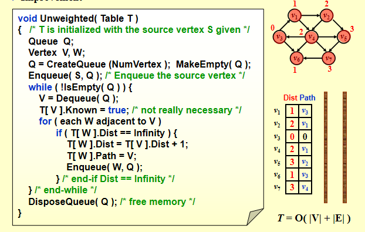

## DS1
### Algorithm Analysis
input, output, definiteness确定性（每条指令都是清晰的没有歧义的）, finiteness有限性（经过一定的代码这个算法一定会停下来terminate）, effectiveness（基本的->可行的,足够基本）
- 与程序不同program，程序可以一直跑下去（比如做任务规划）
- 算法可以有多种描述方式，实际的编程语言，自然语言，伪代码。不一定要具体实现才能分析

### Selection Sort选择排序
自然语言：find the smallest from the unsorted and place it next in the sorted lists

### what to analysis
- Machine and complier-dependent run times
  - run times由机器和编译器决定->太抽象
- Time and space complexities时间空间复杂度，和machine and compliers无关
  - 我们假设：指令都是单线程运行的；每条指令都是简单的，都只占据一个  时间单位；整数的规模是有限的且我们有无限内存
  
### 复杂度计算
- 声明的复杂度：0；每条赋值的复杂度：1；每条判断的复杂度：1；判断分支：计算所有情况中复杂度较大者；return返回的复杂度：1
- 递归的复杂度：如T(n) = T(n-1) + 2解得T(n) = 2n + 2
- 循环的复杂度：注意退出循环的 时候还有一次判断但不运行
  - 总执行次数 = n+1+n*(循环体中语句执行次数)
  ```
  void  add ( int  a[ ][ MAX_SIZE ], 
                   int  b[ ][ MAX_SIZE ], 
                   int  c[ ][ MAX_SIZE ],
                   int  rows,  int  cols )
  {
    int  i,  j ;//声明复杂度无
    for ( i = 0; i < rows; i++ )//对于该循环体，复杂度为rows+1+rows(i的内部)
          for ( j = 0; j < cols; j++ )//对于i的内部，复杂度为cols+1+cols(j的内部)
                c[ i ][ j ] = a[ i ][ j ] + b[ i ][ j ];//j的内部=1
  }
  ```
- 

### 一些碎碎念的复杂度

- 数组
  - 插入元素到末尾：O(1)
  - 找到最大或最小的元素：O(n), 删除元素移动数组O(n)
- 链表
  - 插入元素到链表开头或结尾：O(1)
  - 找到最大或最小元素：O(n), 删除元素O(1)
- 有序数组
  - 插入找到合适位置O(n), 移动数组并插入元素O(n)
  - 删除开头或末尾元素O(1)
- 有序链表
  - 插入找到合适的位置O(n), 插入元素O(1)
  - 删除开头或末尾元素O(1)

## Tree

- 一个 node 的 degree 是这个 node 的 child 个数，一棵树的 degree 是这棵树里面所有 node 的 degree 的最大值。
- 从节点 n<sub>1</sub>, n<sub>k</sub> 的路径定义为一个一个序列，这条路径是唯一的。
- deep：从跟到该节点唯一路径的长度
- height：从该节点到一片树叶的最长路径的长度

### binary tree

对每一个二叉树：
- 深度 k 的二叉树最多有 2<sup>k</sup> - 1 个节点
- 对任何非空二叉树有 n<sub>0</sub> = n<sub>2</sub> + 1

- preorder
```c
void preorder(tree* tree){
  if(tree){
    visit(tree);
    for(each child of the tree) preorder(child);
  }
}
```
- postorder
```c
void postorder(tree* tree){
  if(tree){
    for(each child in the tree) postorder(child);
    visit(tree);
  }
}
```
- levelorder
```c
void leveorder(tree* tree){
  enqueue(tree);
  while(queue is not empty){
    visit(T = dequeue());
    for(eaach child in the tree) enqueue(child);
  }
}
```
- inorder
```c
void inorder(tree* tree){
  if(tree){
    inorder(tree->left);
    visit(tree->element);
    inorder(tree->right);
  }
}
```

#### Threaded binary tree 线索二叉树


#### Binary serach tree 二叉搜索树

- 所有节点 element 不相同
- 左子树的 element < element < 右子树的 element

### stack

对于我们来说只有pop，push的操作，只有头结点可见

struct里面，总容量（用于判断），目前容量，头结点

### Heap (Priority Queue)

#### Binary heap

n nodes, height h

height 从 0 开始，下图中 height 是 3.


一个高度 h 的完全二叉树 complete binary tree 可以有 2<sup>h</sup> 到 2<sup>h+1</sup>-1 个节点。

#### max/min heap

> A min tree is a tree in which the key value in each node is no larger than the key values in its children (if any).  

min heap：父节点的值小于等于子节点的值

#### Insertion

```c
void insert(elementype x, heap h)
{
  int i;
  if(isfull(h)){
    return;/报错输出
  }
  for(i = ++h->size; h->element[i/2] > x; i /= 2){
    h->elemnt[i] = h->element[i/2];
  }
  h->element[i] = x;
}
```

#### DeleteMin

先把最后一个 element 放到首位，然后进行 percolate up down

```c
elementype DeleteMin(heap h)
{
  elementype minelement, lastelement;
  if(isempty(h)){
    return h->element[0];//
  }
  minelement = h->element[1];
  lastelemnt = h->element[h->size--];
  for(int i = 2; i * 2 <= h->size; i = child){
    child = i * 2;
    if(child != h->size && h->element[child+1] < h->element[child]){
      child++;//找到一个smaller的child节点
    }
    if(lastelement > h->element[child]){
      h->element[i] = h->element[child];//percolate一层
    }else break;//找到了一个合理的位置
  }
  h->element[i] = lastelement;
  return minelement;
} 
```

**Theorem: 对于一个高度为 h 的完美二叉树 perfect binary tree，他有 2<sup>h+1</sup>-1 nodes，所有 nodes 的 height 之和为 2<sup>h+1</sup>-1-(h+1)**

#### d-Heaps (all nodes have d children)


注意我们不能将 d 设置过大。对binary(2)的乘除只是一个 bit shift，但对 d 的操作不是；DeleteMin will take d - 1 comparisons to find the smallest child.  Hence the total time complexity would be O(d logd N).

### Union find

#### Union-by-Size

总是选择smaller tree

S [ Root ] = – size;  /* initialized to be –1 */

时间复杂度：N Union 和 M Find 的操作需要O(N + Mlog<sub>2</sub>N)

#### Union-by-height

总是选择 shallow tree

#### Path Compression 路径压缩

```c
setype find(elementype x, disset s)
{
  for(root = x; s[root] > 0; root = s[root]);
  for(tail = x; tail != root; root = lead){
    lead = s[trail];
    s[trail] = root;
  }
  return root;

}
```

## Graph

- 连通分量 component of an undirected G
- 强连通分量 strongly connected directed graph
- i is a predeceddor of j:= there is a path from i to j, j is called a successor
- partial order偏序 transitive and irreflective

### Euler circuits

- Euler tour: 不间断一笔连
  - 一张图里正好有两个有奇数度的节点，必须由奇数度数出发并且终止与奇数度数
- Euler circuit：不间断一笔连但是要求要回到起点
  - 这是一个连通图，并且这张图的所有节点都偶数度数

### Hamilton circle

一个简单circle经过所有的节点


### topological sort

```c
void topsort(graph g){
  int counter;
  vertex v, w;
for(counter = 0; counter < numvertex; counter ++){
  v = findnewvertexofdegreezero();
  if(v == notavertex){

  }
  topnum[v] = counter;
  for(each w adjacent to v){
    indegree[w]--;
  }
}
}
```


### shortest path algorithm

#### unweighted

一层一层，深度优先

需要变量，known，path，dist




#### weighted

dijkstra's algorithm


## Sort

### ShellSort

```c
//希尔排序
void ShellSort(SqList *L)
{
    int i, j, increment = L->last;
    do
    {
        increment = increment / 3 + 1;
        for (i = increment + 1; i <= L->last; i++)
        {
            if (L->arr[i] < L->arr[i - increment])
            {
                L->arr[0] = L->arr[i];
                for (j = i - increment; j > 0 && L->arr[0] < L->arr[j]; j -= increment)
                    L->arr[j + increment] = L->arr[j];
                L->arr[j + increment] = L->arr[0];
            }
        }
 
    } while (increment > 1);
}
```
希尔排序交换不相邻的数据对数组进行局部排序，最终用插入排序将局部有序的数组排序。

最初我们选择增量gap=length/2, 循环时gap=gap/2, 最后运行至gap=1。

### QuickSort

```c
void quick_sort(int *num,int l,int r){
	//如果小于等于1个数据元素·直接返回结束快排函数 r为数组元素总个数
	if(l+1>=r){
		return ;
	}
	int first=l,last=r-1,key=num[first];
	while(first<last){
		while(first<last&&num[last]>=key){
			--last;
		}
		//如果值小于 key分界值 交换 
		num[first]=num[last];
		while(first<last&&num[first]<key){
			++first;
		}
		//如果值大于key分界值 交换 
		num[last]=num[first];
	}
	num[first]=key;
	//递归左右部分进行快排 
	quick_sort(num,l,first);
	quick_sort(num,first+1,r);
}
```
以first为区间左端，以last为区间右端，以key作为基准值。

这里key取num[last]:（说明了last的位置可以被覆盖）

key和区间左端比较，如果左端 <key（符合条件），则区间左端右移；如果左端 >=key（不符合条件），则将区间左端放到last的位置上去。

key和区间右端比较，如果右端 >key（符合条件），则区间右端左移；如果右端 <=key（不符合条件），则将区间右端放到first的位置上去。

当区间左右端重合时一轮排序结束，重合位置就是key应当被放置的位置。

对这个位置的左右两个子段进行相同的操作，直到子段内元素个数为1，说明整个数列已经完全有序。

注意，如果是key取num[first]，（说明first的位置可以被覆盖），那么key的比较应当从区间右端开始，再左端，再往复循环。

#### 复杂度分析


### Merge Sort

分左右部分分别 mergesort

- 递归归并排序算法：
```c
function merge_sort(arr, start, end):
    if start >= end:
        return arr

    mid = (start + end) / 2

    merge_sort(arr, start, mid)
    merge_sort(arr, mid+1, end)
    merge(arr, start, mid, end)

    return arr
```
```c
void MergeSort(int Arr[], int N) {
    int *Temp = (int *)malloc(N * sizeof(int));
    if (Temp != NULL) {
        Sort(Arr, Temp, 0, N-1);
        free(Temp);
    } else {
        printf("No space for temp array!!!");
    }
}
// 递归排序
void Sort(int Arr[], int Temp[], int left, int right) {
    if (left < right) {
        int mid = (left + right) / 2;
        Sort(Arr, Temp, left, mid);
        Sort(Arr, Temp, mid+1, right);
        Merge(Arr, Temp, left, mid, right);
    } else {
        return ;
    }
}
// 归并
void Merge(int Arr[], int Temp[], int left, int mid, int right) {
    int l_pos = left;
    int r_pos = mid+1;
    int i = left;

    while (l_pos <= mid && r_pos <= right) {
        if (Arr[l_pos] <= Arr[r_pos]) {
            Temp[i] = Arr[l_pos];
            i++;
            l_pos++;
        } else {
            Temp[i] = Arr[r_pos];
            i++;
            r_pos++;
        }
    }

    while (l_pos <= mid) {
        Temp[i++] = Arr[l_pos++];
    }
    while (r_pos <= right) {
        Temp[i++] = Arr[r_pos++];
    }

    while (left <= right) {
        Arr[left] = Temp[left];
        left++;
    }
}
```

- 迭代算法
```c
function merge_sort(arr):
    length = 1
    n = length(arr)
    sorted = new array of size n

    while length < n:
        for start = 0 to n - length step 2 * length:
            mid = start + length - 1
            end = min(start + 2 * length - 1, n - 1)
            merge(arr, sorted, start, mid, end)

        copy sorted to arr

        length = 2 * length

    return arr
```
```c
void  merge_sort( ElementType list[],  int N )
{
    ElementType extra[MAXN];  /* the extra space required */
    int  length = 1;  /* current length of sublist being merged */
    while( length < N ) {
        merge_pass( list, extra, N, length ); /* merge list into extra */
        length *= 2;
    }
}
void merge_pass(ElementType list[], ElementType sorted[], int N, int length) {
    int i, j, k = 0;

    for (i = 0; i <= N - 2 * length; i += 2 * length) { // complete 2 equal length
        int left = i;
        int right = i + 2 * length - 1;
        int mid = (right + left) / 2;
        int l_pos = left;
        int r_pos = mid + 1;

        if (right >= N) {
            right = N - 1;
        }

        while (l_pos <= mid && r_pos <= right) { //
            if (list[l_pos] < list[r_pos]) {
                sorted[k++] = list[l_pos++];
            } else {
                sorted[k++] = list[r_pos++];
            }
        }

        while (l_pos <= mid) {
            sorted[k++] = list[l_pos++];
        }
        while (r_pos <= right) {
            sorted[k++] = list[r_pos++];
        }

    }

    /* 最后进行一次归并剩余元素 */
    int left = i;
    int mid = i + length - 1;
    int right = N - 1;

    /* 归并操作 */
    k = left;  /* k 用于遍历 sorted[] 数组 */
    int l = left;  /* l 用于遍历左半边子序列 list[left:mid] */
    int r = mid + 1;  /* r 用于遍历右半边子序列 list[mid+1:right] */

    while (l <= mid && r <= right) {
        if (list[l] <= list[r]) {
            sorted[k++] = list[l++];
        } else {
            sorted[k++] = list[r++];
        }
    }

    while (l <= mid) {
        sorted[k++] = list[l++];
    }

    while (r <= right) {
        sorted[k++] = list[r++];
    }

    for (j = 0; j < N; j++) {
        list[j] = sorted[j];
    }
}
```

## Search

### Hashing

二分查找树时间复杂度NlogN建树+logN查找，对于大数据来说太慢，而hash对于大量的数据，查找复杂度一直是O(1).（无冲突）

hash: 知道key找到index，由key映射index。(函数)

- collision：一个key查找到了两个index。
- overflow：溢出，桶放满了。
- 当一行只有1个桶的时候，overflow和collision同时发生。

**hash：选择合适的bucket和slot大小+设计key映射index的函数+桶排序+一个桶内链表**

#### 如何构造一个哈希函数

ascii 码，平方取中法（但是我感觉这个很随意吧）

#### 如何处理一次 collision

- 线性寻址open addressing：当这个位置冲突了就往后寻址，直到找到空的格子放进去
  - 平方探测： 
    - size = 4k + 3 且 size 是素数，平方探测可以探测到整个空间
  - 双散列double hashing

以H2为步长往后移，
  - rehashing
    - 影响（装填因子）arpha = identifier density = total number of identifiers in ht[ ] / total number of distinct possible values for x. 已占有空间除以全部空间
    - 当 arpha 在范围 [0.5,0.85] 的时候必须要使用rehashing（在一个更大的空间里面重开hash）
    - 重开，空间范围要扩大，扩大的空间是原来的空间乘2然后往上取最近一个素数
    - 重开是在第一次hash之后的小数组基础上进行的，不在小数组内的数字按照原数组里面的顺序取
  - seperate chaining
    - 复杂度不再是 O（1）
    - 