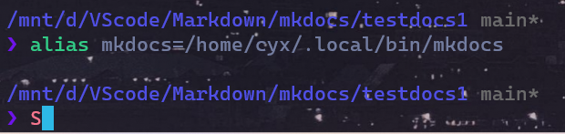

## Git

### git init

- `git init` 在新建文件夹下进行，使变成一个Git仓库

### git config

- `git config --global user.name "name"` 
- `git config --global user.email "email"`

### git ssh

- `git remote add add origin git@github.com:xxx` ssh认证
- `git remote -v` 检查是否连上

### github update

- `git add .`将整个仓库内容上传至暂存区
- `git status` 可以看看你要上传的需要修改的是否正确
- `git commit -m "xxx"` 要跟上更新理由
- `git push -u origin master`使用空仓库，或者`git push origin master`当仓库非空

### git clone
 
- `git clone xxx` 

## ssh 端口 22 connection time out

换端口443，具体操作：

```
$ git clone git@github.com:xxxxx/xxxx.git my-awesome-proj
Cloning into 'my-awesome-proj'...
ssh: connect to host github.com port 22: Connection timed out
fatal: Could not read from remote repository.

$ # This should also timeout
$ ssh -T git@github.com
ssh: connect to host github.com port 22: Connection timed out

$ # but this might work
$ ssh -T -p 443 git@ssh.github.com
Hi xxxx! You've successfully authenticated, but GitHub does not provide shell access.
$ # Override SSH settings
$ vim ~/.ssh/config
$ # Add section below to it
Host github.com
  Hostname ssh.github.com
  Port 443
$ ssh -T git@github.com
Hi xxxxx! You've successfully authenticated, but GitHub does not
provide shell access.

$ git clone git@github.com:xxxxxx/xxxxx.git my-awesome-proj
Cloning into 'my-awesome-proj'...
remote: Enumerating objects: 15, done.
remote: Counting objects: 100% (15/15), done.
remote: Compressing objects: 100% (14/14), done.
remote: Total 15 (delta 0), reused 15 (delta 0), pack-reused 0
Receiving objects: 100% (15/15), 22.90 KiB | 4.58 MiB/s, done.
```


## zsh中运行mkdocs报错`command not found`

设置alias

- ubuntu `bash`
    - 
- `chsh -s /bin/bash`
  - 密码：********
- 打开一个新的ubuntu窗口，输入`whereis mkdocs`
  - 
  - 复制路径
- 回到最初的窗口（zsh）中输入
  -  ##在zsh中添加路径设置别名
- 返回到zsh的bash里面：`chsh -s /bin/zsh`

*注意这是单次终端，这意味着每次打开ubuntu运行mkdocs的时候都需要重新一次设置别名。*