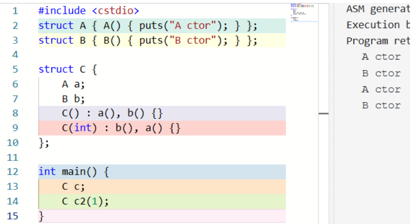
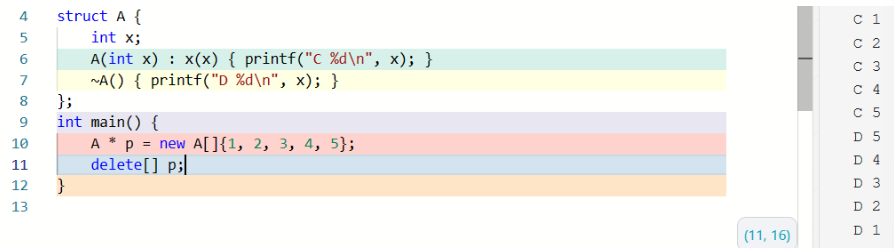

# OOP czp

## Class

### 定义与声明

- 可以仅声明而不定义，只要这个函数没有被使用
- 成员函数不能重新声明

### using

(`using`的引入是为了支持模版`<template>`)

c++引入`using`来声明类型别名，用途和`typedef`类似，如`typedef struct arraylist_* arraylist;`可以写作`using arraylist = struct arraylist_ *;`

```cpp
struct Foo {
    using elem = int;
    elem x;     // OK, x has type int
    elem add(elem v) { x += v; return x; }
private:
    using type = char;
    type c;     // OK, c has type char
};

// elem y;      // Error: unknown type name 'elem'
Foo::elem z;    // OK, z has type int
// Foo::type c; // Error: 'type' is a private member of 'Foo'   
```

### this 指针

在成员函数的函数体中，访问任何成员时都会被自动添加 `this->`，例如 `void Foo::bar(int v) { x += v; } `中的 `x += v`; 实际是 `this->x += v`;

### inline

- 内联函数减少函数调用的开销
- 内联函数的代价：内联函数会在每处被调用的地方展开，因此，如果被内联的函数太大会导致目标代码太大，对代码空间和性能都会有一定影响
- 只有**函数体**写在类的定义中的**成员函数**才会被内联

### constructor 构造函数 (ctor/c'tor)

构造函数与一般成员函数的区别是，他不写返回值类型，而且直接使用类的名字（构造函数没有名字）。他使程序员能够建立起某种保证，其他成员函数都能依赖这个保证。

```cpp
class Container {
    elem* val;
public:
    Container() {
        val = nullptr;
    }
};
```
`Conrainer` 是一个构造函数，`val = nullptr` 就是前面提到的「保证」，即 val 的值要么是 `nullptr`，要么是其他成员函数赋的值，而不会是个随机的值。

这样，就可以使用 `Container c = Container();` 构造一个对象了。

或者一个构造函数也可以带参数：（注意无参构造时候不能加 `()` ）

```cpp
class Container {
    elem* val;
public:
    Container(unsigned size) {
        val = (elem*)malloc(sizeof(elem) * size);
    }
};
```
这样，就可以使用 `Container c2 = Container(64);` 构造一个自定义大小的容器了。

**Note**
c++ 还有另外一种初始化方式：

`int a = 4;` 等价于 `int a(4);`, `Container c2 = Container(64);` 等价于 `Container c2(64);`

```cpp
class User {
    int id, age, failTimes;
    char* password;
public:
    User(int id, int age, char* pw) {
        this->id = id;
        this->age = age;
        failTimes = 0;
        password = copyStr(pw); // assume that `copyStr` gets a string and allocate some space and copy it
    }
};
```
这样写很麻烦，于是c++允许：
```cpp
class User {
    int id, age, failTimes;
    char* password;
public:
    User(int id, int age, char* pw) : id(id), age(age), failTimes(0), password(copyStr(pw)) {}
    // ...
};
```
在一些情况下，member initializer lists 是必要的。例如：
```cpp
class Point {
    int x, y;
public:
    Point(int x, int y) : x(x), y(y) {}
};

class Circle {
    Point c;
    int r;
public:
    Circle(int cx, int cy, int r) : c(cx, cy), r(r) {}
};
```

member initializer list 的顺序不影响成员被初始化的顺序，它们按照在类定义中的顺序初始化。例如：


member initializer list 可以将构造**委托**给同一类型的另一个构造函数，做出这一委托的构造函数称为 delegating constructor:

```cpp
struct C{
    C(int){puts("ctor1 called");}
    C() : C(42){puts("ctor2 called");}
};
int main(){
    C c;
}
```
我们输出：
```cpp
ctor1 called
ctor2 called
```
### 内存空间分配 `new` 和 `delete`

**New: 申请内存 + 调用构造函数**

new 返回的是一个指针。

创建对象 `int * p1 = new int;` 创建数组 `int * pa = new int[n];`

如果 new 的是一个类的对象，那么构造函数就会被直接调用：

```cpp
struct Foo{ Foo(){ puts("ctor called");}};

int main(){
    Foo *p = new Foo;
    puts("=======");
    Foo *p = new Foo[5];
}
```
我们可以得到输出：
```
ctor called
=======
ctor called
ctor called
ctor called
ctor called
ctor called
```

Note: `new` or `malloc`

- new 分配成功返回的是对象类型指针，与对象严格匹配，无类型转换，所以 new 是符合类型安全性操作符；malloc 返回值类型是 void* ，一般需要接强制类型转换成我们需要的类型。
- new 可以在内存分配的时候通过调用构造函数来初始化变量，但 malloc 不行。

**Delete: 调用析构函数 + 释放内存**

如果 p 在 new 的时候创建的是单个对象，则应该用 `delete p`; 的形式 (single-object delete expression) 回收；如果 p 在 new 的时候创建的是数组，则应该用 `delete[] p`;

```cpp
struct Foo{ ~Foo(){ puts("dtor called");}};

int main()
{
    Foo *p = new Foo;
    delete p;
    puts("=====");
    Foo *p = new Foo[5];
    delete[] p;
}
```

我们能够得到输出：
```cpp
dtor called
=====
dtor called
dtor called
dtor called
dtor called
dtor called
```

### 函数默认参数

```cpp
void point(int x = 3, int y = 4);

point(1, 2); // calls point(1, 2)
point(1);    // calls point(1, 4)
point();     // calls point(3, 4)
```

因此，对构造函数：
```cpp
class Container {
    elem* val;
public:
    Container(unsigned size = 512) {
        val = (elem*)malloc(sizeof(elem) * size);
    }
};
```
这样，就可以使用 `Container c1`; 构造一个默认大小 (512) 的容器，或者用 `Container c2(64);` 构造一个自定义大小的容器了。前者实际上是 `Container(512)`，而后者是 `Container(64)`。

### 函数重载

用传入的参数来选择不同的构造函数

```cpp
double abd(double);
int abs(int);

abs(1.0);//calls abs(double)
abs(1);//calls abs(int)
```

两个只有返回值类型不同的函数不是合法的重载，因为调用时不能完成重载解析。如：
```cpp
int f(int);
void f(int);//error
```
*要注意函数重载和默认参数的使用：*
```cpp
void f(int i = 1);
void f();

void foo() {
    f(1);   // OK, call the first one
    f();    // Error: ambiguous
}
```
我们能够看到，函数重载能够完全覆盖函数默认参数的作用.


### destructor 析构函数(dtor/d'tor)

自 C++11 起，我们仍然可以通过 = default; 或者 = delete; 来生成默认的析构函数，或者删除 implicitly-declared destructor。例如：
```cpp
class Foo{
private:
    ~Foo() = default;
};
```
这里我们告诉编译器在`private`范围内显式生成了默认的构造函数。

```cpp
struct Foo {
    ~Foo() = delete;
};
```
这里我们将 implicitly-declared destructor 标记为 deleted。

如果 Foo 的析构函数是 deleted 的，或者在当前位置不可访问 (如当前在类外，但是析构函数是 private 的)，那么类似 Foo f; 的全局变量、局部变量或者成员变量定义是非法的。但是，这种情况下，可以通过 new 来创建一个动态的对象，因为这样创建的对象并不隐式地在同一个作用域内调用析构函数。

数组元素的析构函数调用顺序与其构造顺序相反。



### 拷贝赋值运算符

```cpp
class Container {
    elem* val;
    unsigned size = 0, capa;
public:
    Container(unsigned capa) : val(new elem[capa]), capa(capa){}
    ~Container() { delete[] val; }

    void operator=(Container from) {
        if (from->val != val) { // avoid self-assignment
            if (from->capa != capa) { //如果 capa 和 from->capa 的值相同，那就没必要重新开一份空间了
                delete[] val;
                val = new elem[from->capa];
            }
            for (unsigned i = 0; i < from->size; i++) {
                val[i] = from->val[i];
            }
            size = from->size;
            capa = from->capa;
        }
    }
};
```

用户也可以将 operator= 设置为 = default; 或者 = delete;。如果 operator= 在当前上下文不可见，那么 a = b; 这样的表达式非法：
```cpp
class Foo { 
    void operator=(Foo){} // private operator=
    void foo() {
        Foo a, b;
        a = b;      // OK, private function available here
    }
};
struct Bar { 
    void operator=(Bar) = delete; // deleted operator=
    void foo() {
        Bar c, d;
        c = d;      // error: use of deleted function 
                    // 'void Bar::operator=(Bar)'
    }
};

void foo() {
    Foo a, b;
    a = b;      // error: 'void Foo::operator=(Foo)' 
                // is private within this context
    Bar c, d;
    c = d;      // error: use of deleted function 
                // 'void Bar::operator=(Bar)'
}
```

### 运算符重载

先考虑一个存放 M * M 大小矩阵的类 Matrix：
```cpp
const int M = 100;
class Matrix {
    int data[M][M]
    // ...
};
```
于是我们需要处理函数重载：
```cpp
const int M = 100;
class Matrix {
    int data[M][M];
public:
    Matrix operator+(Matrix mat) { /* */ }
    Matrix operator*(int x) { /* */ }
    Matrix operator*(Matrix mat) { /* */ }
};
```

此时，如果我们写 `m1 * m2`，其实就等价于 `m1 operator*(m2)`，就调用我们写的重载了！

这样的实现方式确实能够实现上述操作，但是它限制了我们只能写出 `Matrix * int` 而不能写出 `int * Matrix`，因为后者被解释为 `int::operator*(Matrix)`，但是 int 中并没有这样的重载（C++ 也不希望支持给内部类型增加新的运算2）

因此我们要考虑把运算符重载放在全局：
```cpp
const int M = 100;
class Matrix {
    int data[M][M];
public:
    Matrix operator+(Matrix mat) {puts("func 1"); return *this;}
    Matrix operator+(int x) { puts("func 2"); return *this; }
    Matrix operator*(Matrix mat) { puts("func 3"); return *this; }
};
Matrix operator+(int x, Matrix mat) { puts("func 4"); return *this; }

int main()
{
    Matrix a, b;
    a + b;
    a + 1;
    1 + a;
    a * b;
}
```
我们可以输出：
```cpp
func 1
func 2
func 4
func 3
```

### friend 友元函数

c++允许一个类的定义授予一个外部的函数访问他的private成员，做法就是，将这个函数在该类的定义中生命为一个友元函数：

```cpp
const int M = 100;
class Matrix {
    int data[M][M];
public:
    Matrix operator+(Matrix mat) { /* */ }
    Matrix operator*(int x) { /* */ }
    Matrix operator*(Matrix mat) { /* */ }
    friend Matrix operator*(int x, Matrix mat); // Designates a function as friend of this class
};
Matrix operator*(int x, Matrix mat) {
    Matrix tmp = mat;   // copy mat
    for (int i = 0; i < M; i++)
        for (int j = 0; j < M; j++)
            tmp.data[i][j] *= x;        // can access private member Matrix::data
    return tmp;
}
```

(如果我们要解决matrix乘法但是受到private限制又不做友元函数处理这个问题时，还有另外一种解法：)
```cpp
const int M = 100;
class Matrix {
    int data[M][M];
public:
    Matrix operator+(Matrix mat) { /* */ }
    Matrix operator*(int x) { /* */ }
    Matrix operator*(Matrix mat) { /* */ }
};
Matrix operator*(int x, Matrix mat) {
    return mat * x;
}
```

### 引用

c语言中我们使用指针来减少不必要的拷贝。例如有函数 `int getSum(Matrix mat);` 就可以改为 `int getSum(Matrix * mat);`，调用时通过 `getSum(&m)`，就可以只传递指针而不必拷贝整个对象了。

一个引用是一个已经存在的对象或者函数的别名。例如：
（**注意引用要在定义时给出初始化）
```cpp
int x = 2;
int & y = x;    // y is an alias for x
```

这样，对 y 的所有操作都和对 x 的操作一样了；y 不是 x 的指针，也不是 x 的副本，而是 x 本身。包括获取它的地址—— &y 和 &x 的值相同。

也是因此，我们无法重新约束一个引用所绑定的变量。因为：
```cpp
int z = 3;
y = z;
```
这里的 `y = z` 是在进行赋值而不是重新绑定。

**在同一个作用域内，给一个变量起一个别名并不会有太多的现实意义。引用最广泛的用法是作为参数传递。**

于是我们让 `Matrix` 去传递引用：
```cpp
const int M = 100;
class Matrix {
    int data[M][M];
public:
    Matrix operator-(const Matrix & mat) {
        Matrix res;
        for (int i = 0; i < M; i++)
            for (int j = 0; j < M; j++)
                res.data[i][j] = data[i][j] - mat.data[i][j];
        return res;
    }
};
```
要注意的是，这里我们使用了 `const Matrix & mat` 而不是 `Matrix & mat`,是因为我们想要声明 `mat` 是只读不可写的。

（我们能感觉到，c++中&这个符号表示的是引用，而*这个符号则表示的是指针。

**引用与重载**

将一个 int 类型的变量传递给 int 类型的参数和 int & 类型的参数的优先级是一样的，将 int 类型的变量传递给 int 类型的参数和 const int & 类型的参数的优先级也是一样的。
```cpp
void f(int x) { puts("int"); }      // Overload #1
void f(int & r) { puts("int &"); }  // Overload #2

int main() {
    int x = 1;
    f(1);       // OK, only #1 valid
    f(x);       // Error: ambiguous overload
}
```
不过，如果有两个重载，它们在某一个参数上的唯一区别是 `int &` 和 `const int &`，而 `int` 类型的变量绑定给这两种参数都是可行的，此时 `int &` 的更优。
```oop
void h(int & r) { puts("int &"); }
void h(const int & r) { puts("const int &"); }

int main() {
    int x = 1;          // Overload #1
    const int y = 2;    // Overload #2

    h(1);   // OK, only #2 valid
    h(x);   // OK, #1 called as x -> 'int&' is better than x -> 'const int&'
    h(y);   // OK, only #2 valid
}
```

**关于引用和const的初始化**

引用和const变量都需要在定义的时候就给出初始化。当在一个类中定义了引用和const变量但又没有直接进行初始化，那么就可以在构造函数中给出初始化。像这样：
```oop
int global = 10;

class Foo {
    const int x = 4;    // OK
    const int y;        // must be initialized by member initializer list
    int & rz = global;  // OK
    int & rw;           // must be initialized by member initializer list
public:
    Foo(int m, int & n) : y(m), rw(n) {}  // OK
    Foo() : y(0), rw(global) {}           // OK
    Foo() : y(0) {}         // Error: uninitialized reference member in 'int&'
    Foo() : rw(global) {}   // Error: uninitialized const member in 'const int'
};
```

### I/O stream

```cpp
#include <iostream>
#include <string>

using std::istream;
using std::ostream;
using std::string;
using std::to_string;

class Complex {
private:
    double real, imaginary;
public:
    // ...
    string toString() const;
    friend istream& operator>>(istream& is, Complex& right);
};

string Complex::toString() const {
    string str = to_string(this->real);
    str += " + ";
    str += to_string(this->imaginary);
    str += 'i';
    return str;
}

ostream& operator<<(ostream& os, const Complex& right) {
    return os << right.toString();
}

istream& operator>>(istream& is, Complex& right) {
    char op;
    is >> right.real >> op >> right.imaginary >> op;
    return is;
}

int main() {
    Complex c;
    std::cin >> c;
    std::cout << c;
}
```

不能解释但是能看懂。。。。。

istream 和 ostream 是类型，分别指输入和输出。

### const 成员

当我们这样定义时，
```cpp
class Complex {
    string toString() const;
};
```
声明为 const 的成员函数（const放在后面）成为 const 成员函数。const 保证不会更改 *this 的值。具体来说，声明为 `const` 的成员函数中，`this` 的类型是 `const Complex *`；而如果没有声明为 `const`，则 `this` 的类型是 `Complex *`。

在 const 成员函数中，试图调用其他非 const 成员函数，或者更改成员变量都是不合法的。

注意，`const int Foo::foo();` 不是 `const` 成员函数，它是个返回值类型为 `const int` 的 non-const 成员函数。

我们回顾之前的对 `operator[]` 的重载。事实上，通常的设计会这样重载：

```cpp
class Container {
    elem * data;
    // ...
public:
          elem & operator[](unsigned index)       { return data[index]; }
    const elem & operator[](unsigned index) const { return data[index]; }
    // ...
}
```
当调用者是 `const Container` 时，第二个重载会被使用，此时返回的是对第 `index` 个元素的 `const` 引用；而如果调用者是 `Container` 时，第一个重载会被使用，此时返回的是对第 `index` 元素的 `non-const` 引用。

### static 成员变量

C++ 规定，在类定义中，用 `static` 声明没有绑定到类的实例中的成员；例如：
```cpp
struct User {
    static int tot;
    int id;
    User() : id(tot++) {}
};
int User::tot = 0;
```
它的生命周期仍然从它的定义 `int User::tot = 0;` 开始，到程序结束为止。由于它是类的成员，因此访问它的时候需要用 `User::tot`。

static 成员不被绑定到类的实例中，也就是上面 User 类的每个实例里仍然只有 id 而没有 tot。(但是语法上仍然允许用一个类的实例访问 static 成员，例如 user.tot)

注意，static 成员不允许使用 default member initializer 和 member initializer list。

在类中的 static 成员变量只是声明。我们必须在类外给出其定义，才能让编译器知道在哪里构造这些成员。

```cpp
class Foo {
    static int a;
    static int b;
};

int Foo::a = 1;
int Foo::b;
```

### inheritance 继承和 derived 派生类

对一个类的继承：public 可以被继承，private 不可以被继承，protected 可以被继承但不能被从外部直接访问。

在派生类内部（成员函数或者友元函数）使用基类成员时，不受继承方式的影响，只看该成员在基类中的属性（因此私有成员不能被访问）；在派生类外部使用基类成员时，继承方式会影响基类成员的访问属性。

三种继承方式：private 继承，protected 继承，public 继承。

- public: 所有基类成员在派生类中保持原有的访问级别
- protected: public->protected，其余不变
- private: 所有基类成员在派生类中变为private成员
  
| 继承方式/基类成员 | public成员 | protected成员 | private成员 |
| --------- | --------- | --------- | --------- |
| public继承 | public | protected | 不可见 |
| protected继承 | protected | protected | 不可见 |
| private继承 | private | private | 不可见 |

派生类拥有基类所有成员，还可以定义自己的成员。派生类成员是指在派生类中包含但不在基类中包含的成员。

友元不是类的成员，因此不能被继承。

```cpp
class Derived : public Base1, private Base2{
// 派生类的成员列表
}
```

### virtual 虚函数

用基类指针指向派生类的时候，能正确调用派生类中的实现函数，从而实现多态。

在成员函数声明的时候，在其前面加上 `virtual` 使其变为虚函数。（定义的时候可以不加）

拥有虚函数的类会自动生成一个虚函数表 `vtbl` （属于类而不是对象），是一个指针数组，里面的元素是虚函数的函数指针创建对象时，对象内部会自动生成一个虚表指针 `*vptr` （通常会在对象内存的最起始位置），指向类的虚表 `vtbl` 在调用虚函数时，会经由 `vptr` 找到 `vtbl` ，再通过 `vtbl` 中的函数指针找到对应虚函数的代码并进行调用。

### override 重写

在继承时，派生类会继承基类的虚表，虚函数继承之后仍是虚函数（不用加 `virtual` ）

也可以重写虚函数：

**注意，非虚函数不能重写！（不是override）**

```cpp
class A {
public:
virtual void vfunc1();
virtual void vfunc2();
void func1();
void func2();
private:
int m_data1, m_data2;
};
class B : public A {
public:
void vfunc1() override; // 最好用override表达这个函数是继承而来的
void func1();
private:
int m_data3;
};
class C: public B {
public:
void vfunc2() override;
void func2();
private:
int m_data1, m_data4;
};
B bobject; // 类B的一个对象
A* p = &bobject; // 通过基类指针*p指向派生类B的对象
```

### 静态绑定与动态绑定

静态绑定(static/early binding)，在**编译**阶段决定函数是哪个类的函数（此时对象还未创建）适用于普通成员函数，根据指针自身的类型来决定

动态绑定(dynamic/late binding)，在**运行**阶段决定函数是哪个类的函数，适用于虚函数，根据指针指向的对象的实际类型来决定（必须在指针指向的对象创建出来后才能决定，因此只能在运行阶段判断）。对于很多其它语言，默认为动态绑定

```cpp
class animal {
public:
void print() { cout << "I'm an animal." << endl; }
virtual void vprint() { cout << "I'm an animal." << endl; }
virtual ~animal() = default;
};
class dog : public animal {
public:
void print() { cout << "I'm a dog." << endl; } // 这是overwrite，不好
void vprint() override{ cout << "I'm a dog." << endl; } // override
virtual ~dog() = default;
};
int main() {
dog D;
animal* p = &D; // 基类指针指向派生类对象
p->print(); // early binding，指针p为animal*类型，直接采用基类animal中的print()，
跟派生类dog无关，无法做到多态
// 被翻译为animal::print(p);
p->vprint(); // late binding，指针p指向的对象为dog类型，故采用派生类dog中的
vprint()而不是基类animal中的vprint()
// 被翻译为( *(p->vptr)[0] )(p)，即( p->vtbl[0] )(p)
// 原理：先通过指针p找到对象D，再通过对象D中的虚指针找到类dog的虚表，再到虚表里找到
vprint()的函数指针
return 0;
}
```

### 纯虚函数

在虚函数后加 `=0` ，如 `virtual void func()=0`，子类必须提供纯虚函数的个性化实现。

定义纯虚函数是为了实现一个接口，起到一个规范的作用，规范继承这个类的派生类必须实现这个函数。

使用纯虚函数，一般发生在基类无法提供合理的缺省实现的时候（否则用虚函数就行了）。

纯虚函数没有body，只有声明，因此纯虚函数不能被直接调用；纯虚函数必须被override，若派生类没有给出实现，则其仍然为纯虚函数

### abstract 抽象类

只要类中有一个纯虚函数，那么就是抽象类，不能创建该类的对象，但可以创建指针；只能当做基类，是一个概念化的东西

### 协议类

类里没有非静态成员变量，而且所有成员函数都是纯虚函数，则称为协议类，可以安全地实现多继承

### template 模版

#### 


# Others
## Template

```c++
// C++ Program to demonstrate
// Use of template
#include <iostream>
using namespace std;
 
// One function works for all data types.  This would work
// even for user defined types if operator '>' is overloaded
template <typename T> T myMax(T x, T y)
{
    return (x > y) ? x : y;
}
 
int main()
{
    // Call myMax for int
    cout << myMax<int>(3, 7) << endl;
    // call myMax for double
    cout << myMax<double>(3.0, 7.0) << endl;
    // call myMax for char
    cout << myMax<char>('g', 'e') << endl;
 
    return 0;
}
```

比如说，用c++的template完成一个bubble sort

```c++
// C++ Program to implement
// Bubble sort
// using template function
#include <iostream>
using namespace std;
 
// A template function to implement bubble sort.
// We can use this for any data type that supports
// comparison operator < and swap works for it.
template <class T> void bubbleSort(T a[], int n)
{
    for (int i = 0; i < n - 1; i++)
        for (int j = n - 1; i < j; j--)
            if (a[j] < a[j - 1])
                swap(a[j], a[j - 1]);
}
 
// Driver Code
int main()
{
    int a[5] = { 10, 50, 30, 40, 20 };
    int n = sizeof(a) / sizeof(a[0]);
 
    // calls template function
    bubbleSort<int>(a, n);
 
    cout << " Sorted array : ";
    for (int i = 0; i < n; i++)
        cout << a[i] << " ";
    cout << endl;
 
    return 0;
}
```

也可以是class templates
```c++
// C++ Program to implement
// template Array class
#include <iostream>
using namespace std;
 
template <typename T> class Array {
private:
    T* ptr;
    int size;
 
public:
    Array(T arr[], int s);
    void print();
};
 
template <typename T> Array<T>::Array(T arr[], int s)
{
    ptr = new T[s];
    size = s;
    for (int i = 0; i < size; i++)
        ptr[i] = arr[i];
}
 
template <typename T> void Array<T>::print()
{
    for (int i = 0; i < size; i++)
        cout << " " << *(ptr + i);
    cout << endl;
}
 
int main()
{
    int arr[5] = { 1, 2, 3, 4, 5 };
    Array<int> a(arr, 5);
    a.print();
    return 0;
}
```

## nullptr 与 NULL 的区别

`nullptr` 表示空指针，c中 `NULL` 也可以引入 C++ 中使用。

c++中，`int *p = NULL;` 会引发错误；因此我们将NULL 定义为0，使`int *p = 0;` 合法

函数重载时，
```cpp
void f(int *);
void f(int);

f(nullptr);   // f(int *) is called
```