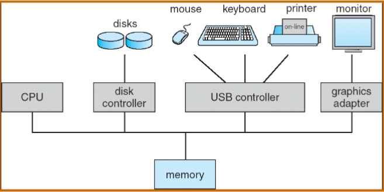
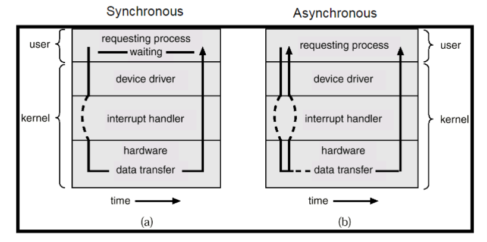
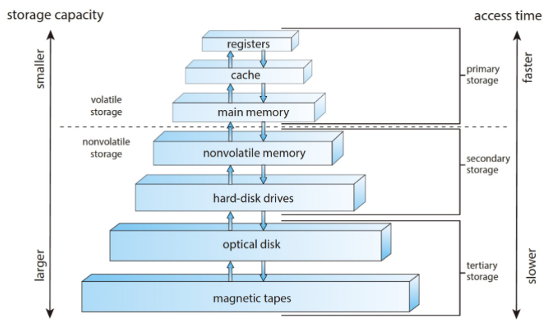
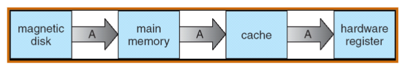
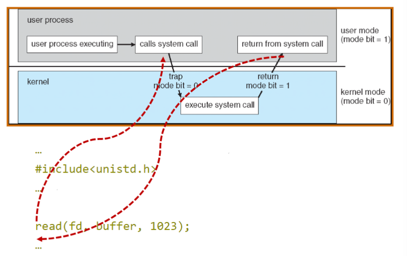
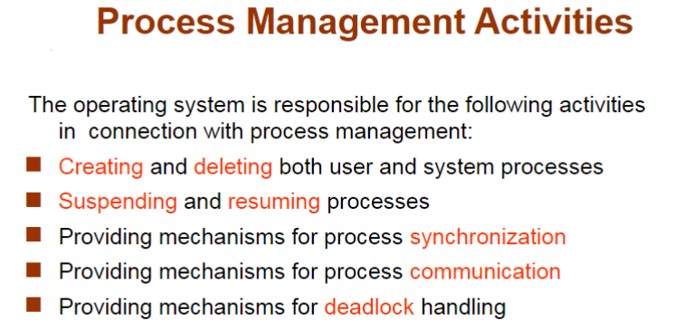

# Operating System

## CH1 released version

- Computer startup
  - bootstrap program
    - stored in ROM, loads os kernel and starts execution
- 冯诺依曼架构中最重要的部分是 main memory

### Interrupt
- Computer system Operation
  - 
  - IO 和 CPU 可以并发执行 concurrently
  - 每一个 device controller 都有一个 local buffer，执行前 CPU 将主内存中的数据移到 local buffer
  - local buffer 的作用是解决 CPU 和 controller 速度不适配speed mismatch的问题，因此controller 完成 operation的时候会告诉 CPU 一下，interrupt (通过 system bus)
  - IO 是 device 和 local buffer 之间的传输
- Interrupt
  - Interrupt 的请求会通过 interrupt vector（含有所有 service routine 地址） 传给 ISR（interrupt service routine）
  - incoming interrupt are disabled 当另外有interrupt在处理中，防止 lost interrupt
- interrupt 分为 IO 中断 和 trap 中断
  - Trap：软件引起的引发系统关注的中断（软中断）
    - 主动发出：user request 要去读一些内容
    - 被动发出：error
- interrupt handling
  - 操作系统通过存储寄存器 registers 和程序计数器 program counter 来保存CPU的状态
  - 如何知道是哪种 interrupt
    - 用一个通用例程进行轮询 polling
    - 向量中断系统 vectored interrupt system
    - 单独的代码段确定对每种类型的中断应采取什么操作
- IO structure：两种方式
  - 只有在 IO 完成后 返回 user program 同步 synchronous
  - user program 不等待 IO 处理 异步 asynchronous（一个进程里有多个线程，非阻塞式
  - 
- Direct Memory Access Structure（DMA）
  - 用于能够以接近内存速度传输信息的高速 I/O 设备
  - 每个块 block 仅生成一个中断，而不是一个中断每字节中断
  - 不需要 CPU 干预，控制力度降低

### Storage
- Storage structure
  - Main memory：被看作是last cache for secondary storage
  - Secondary storage
  - Magnetic disks
  - 
- speed，cost，volatility易失性
- caching
  - faster storage，解决速度适配的问题，用中的信息暂时从较慢的存储复制到较快的存储 
  - cache 小于被 caching 的内存
- data migration
  - 

### Operating System Structure
- Operating System Structure
  - **multiprogramming**：efficiency （**CPU utilization**）
    - user 不能让 CPU 和 IO 一直 busy
    - multiprogramming 组织代码和数据，CPU 始终有一个要执行
    - One job selected and run via **job scheduling**
    - 当 job 在等待时，OS 做其他工作
  - **Timesharing (multitasking)**：Response time should be < 1 second（**interactivity**）
    - *process* 进程：at least one program executing in memory
    - *CPU scheduling* 调度: several jobs ready to run at the same time
    - *swap*: 如果进程不适合内存，交换会将它们移入和移出，来保证重要的 process 进行
    - *Virtual memory*：允许不完全在内存中执行进程
- Operating-System Operations
  - 来自外部硬件中断 interrupt
  - 来自软件的中断 trap: user request / error
  - 其他进程问题包括无限循环、进程相互修改或操作系统修改
- Protection for Operating-System Operations
  - **dual mode**: user mode / kernel mode(like `sudo`)
    - **Mode bit** provided by hardware 提供区分系统何时运行用户代码或内核代码的能力
  - kernel mode: **privileged**
  - **system calls** 将模式更改为内核，从调用返回将其重置为用户

### Resource Management

- Timer & Interrupt: to prevent infinite loop / process hogging resources
  - 在调度进程之前设置特定时间后中断。操作系统递减计数器，当计数器为零时产生中断，让 CPU 重新获得控制权或终止超出分配时间的程序
- Process Management：进程是操作系统中对于资源的抽象
  - **process** 进程: a program in execution. program 是被动 passive 实体，process 是主动 active 实体
  - 需要的 resource：CPU, memory，I/O，files，Initialization data
  - 进程终止要回收所有可重用资源
  - **Single-threaded process** 有一个程序计数器指定下一条要执行的指令的位置，进程按顺序执行指令，一次一个，依次完成
  - **Multi-threaded process** 每个线程有一个程序计数器
  - 通常系统有许多进程、一些用户、一些操作系统在*一个或多个* CPU 上同时运行
    - 通过在进程/线程之间复用 CPU 实现并发 Concurrency by **multiplexing the CPUs** among the processes / threads
- 
- Memory Management
  - data：进程前或完成后必须在内存中
  - instructions：必须放在内存中来运行
  - Memory Management决定内存中的内容，优化CPU利用率和计算机对用户的响应
  - 设计：
    - 记录是谁在用内存分别用了多少内存
    - 分发和回收内存空间
    - 决定将哪些进程（或其部分）和数据移入和移出内存
- Storage Management
  - OS
    - **file**：将物理属性抽象为逻辑存储单元
    - control：每种介质均由设备（即磁盘驱动器、磁带驱动器）控制
  - File-System management
  - directories
  - **access control**：访问权限控制，privelege
- Mass-Storage Management：通常磁盘用于存储主存无法容纳的数据或必须长期保存的数据。
  - 计算机运行的整体速度取决于磁盘子系统及其算法Entire speed of computer operation hinges on disk subsystem and its algorithms
  - 操作系统的作用：storage分配，disk规划，free-space管理
- I/O Subsystem
  - 操作系统的目的之一是向用户隐藏硬件设备的特性——易于使用和编程 hide peculiarities of hardware devices from the user – ease of usage & programming 
  - IO 的内存管理包括了buffering（在传输数据时临时存储数据）caching（将部分数据保存在更快的存储中以提高性能）spooling（一项工作的输出与其他工作的输入重叠）

## CH2 Operating-System Structures
### Operating System Services
- a set of services
  - **user interface (UI)**: Command-Line(CLI), Graphics User Interface(GUI)
  - **program execution**: 系统必须能够将程序加载到内存中并运行该程序，结束执行，无论是正常还是异常（指示错误）
  - **IO operations**
  - **

