# Operating System

## CH1 released version

- Computer startup
  - bootstrap program
    - stored in ROM, loads os kernel and starts execution
- 冯诺依曼架构中最重要的部分是 main memory

### Interrupt
- Computer system Operation
  - 
  - IO 和 CPU 可以并发执行 concurrently
  - 每一个 device controller 都有一个 local buffer，执行前 CPU 将主内存中的数据移到 local buffer
  - local buffer 的作用是解决 CPU 和 controller 速度不适配speed mismatch的问题，因此controller 完成 operation的时候会告诉 CPU 一下，interrupt (通过 system bus)
  - IO 是 device 和 local buffer 之间的传输
- Interrupt
  - Interrupt 的请求会通过 interrupt vector（含有所有 service routine 地址） 传给 ISR（interrupt service routine）
  - incoming interrupt are disabled 当另外有interrupt在处理中，防止 lost interrupt
- interrupt 分为 IO 中断 和 trap 中断
  - Trap：软件引起的引发系统关注的中断（软中断）
    - 主动发出：user request 要去读一些内容
    - 被动发出：error
- interrupt handling
  - 操作系统通过存储寄存器 registers 和程序计数器 program counter 来保存CPU的状态
  - 如何知道是哪种 interrupt
    - 用一个通用例程进行轮询 polling
    - 向量中断系统 vectored interrupt system
    - 单独的代码段确定对每种类型的中断应采取什么操作
- IO structure：两种方式
  - 只有在 IO 完成后 返回 user program 同步 synchronous
  - user program 不等待 IO 处理 异步 asynchronous（一个进程里有多个线程，非阻塞式
  - 
- Direct Memory Access Structure（DMA）
  - 用于能够以接近内存速度传输信息的高速 I/O 设备
  - 每个块 block 仅生成一个中断，而不是一个中断每字节中断
  - 不需要 CPU 干预，控制力度降低

### Storage
- Storage structure
  - Main memory：被看作是last cache for secondary storage
  - Secondary storage
  - Magnetic disks
  - 
- speed，cost，volatility易失性
- caching
  - faster storage，解决速度适配的问题，用中的信息暂时从较慢的存储复制到较快的存储 
  - cache 小于被 caching 的内存
- data migration
  - 

### Operating System Structure
- Operating System Structure
  - **multiprogramming**：efficiency （**CPU utilization**）
    - user 不能让 CPU 和 IO 一直 busy
    - multiprogramming 组织代码和数据，CPU 始终有一个要执行
    - One job selected and run via **job scheduling**
    - 当 job 在等待时，OS 做其他工作
  - **Timesharing (multitasking)**：Response time should be < 1 second（**interactivity**）
    - *process* 进程：at least one program executing in memory
    - *CPU scheduling* 调度: several jobs ready to run at the same time
    - *swap*: 如果进程不适合内存，交换会将它们移入和移出，来保证重要的 process 进行
    - *Virtual memory*：允许不完全在内存中执行进程
- Operating-System Operations
  - 来自外部硬件中断 interrupt
  - 来自软件的中断 trap: user request / error
  - 其他进程问题包括无限循环、进程相互修改或操作系统修改
- Protection for Operating-System Operations
  - **dual mode**: user mode / kernel mode(like `sudo`)
    - **Mode bit** provided by hardware 提供区分系统何时运行用户代码或内核代码的能力
  - kernel mode: **privileged**
  - **system calls** 将模式更改为内核，从调用返回将其重置为用户
  

### Resource Management

- Timer & Interrupt: to prevent infinite loop / process hogging resources
  - 在调度进程之前设置特定时间后中断。操作系统递减计数器，当计数器为零时产生中断，让 CPU 重新获得控制权或终止超出分配时间的程序
- Process Management：进程是操作系统中对于资源的抽象
  - **process** 进程: a program in execution. program 是被动 passive 实体，process 是主动 active 实体
  - 需要的 resource：CPU, memory，I/O，files，Initialization data
  - 进程终止要回收所有可重用资源
  - **Single-threaded process** 有一个程序计数器指定下一条要执行的指令的位置，进程按顺序执行指令，一次一个，依次完成
  - **Multi-threaded process** 每个线程有一个程序计数器
  - 通常系统有许多进程、一些用户、一些操作系统在*一个或多个* CPU 上同时运行
    - 通过在进程/线程之间复用 CPU 实现并发 Concurrency by **multiplexing the CPUs** among the processes / threads
- 
- Memory Management
  - data：进程前或完成后必须在内存中
  - instructions：必须放在内存中来运行
  - Memory Management决定内存中的内容，优化CPU利用率和计算机对用户的响应
  - 设计：
    - 记录是谁在用内存分别用了多少内存
    - 分发和回收内存空间
    - 决定将哪些进程（或其部分）和数据移入和移出内存
- Storage Management
  - OS
    - **file**：将物理属性抽象为逻辑存储单元
    - control：每种介质均由设备（即磁盘驱动器、磁带驱动器）控制
  - File-System management
  - directories
  - **access control**：访问权限控制，privelege
- Mass-Storage Management：通常磁盘用于存储主存无法容纳的数据或必须长期保存的数据。
  - 计算机运行的整体速度取决于磁盘子系统及其算法Entire speed of computer operation hinges on disk subsystem and its algorithms
  - 操作系统的作用：storage分配，disk规划，free-space管理
- I/O Subsystem
  - 操作系统的目的之一是向用户隐藏硬件设备的特性——易于使用和编程 hide peculiarities of hardware devices from the user – ease of usage & programming 
  - IO 的内存管理包括了buffering（在传输数据时临时存储数据）caching（将部分数据保存在更快的存储中以提高性能）spooling（一项工作的输出与其他工作的输入重叠）

## CH2 Operating-System Structures
### Operating System Services
- a set of services
  - **user interface (UI)**: Command-Line(CLI), Graphics User Interface(GUI)
  - **program execution**: 系统必须能够将程序加载到内存中并运行该程序，结束执行，无论是正常还是异常（指示错误）
  - **IO operations**
  - **File-system manipulation**操纵
  - **Communication**：processes交换信息，通过computer（shared memory 或message passing这种需要通过操作系统）或者是在 同一网络环境下 的电脑
  - **Error detection**
  - **Resource allocation**
    - 许多类型的资源 - 一些（例如 CPU 周期、内存和文件存储）可能具有特殊的分配代码，其他（例如 I/O 设备）可能具有通用请求和释放代码
  - **accounting**：记账，跟踪哪些用户使用了多少计算机资源以及何种类型的计算机资源
  - **Protection and security**
    - protection: 确保所有对系统资源的access都是受控制的
    - security：要求user authentication，扩展到保护外部 I/O 设备免受无效访问尝试
### User Operating System Interface
- CLI allows direct command entry
  - Sometimes implemented in *kernel*, sometimes by *systems program*
# 补写！！！！

### System Calls
- Application Program Interface (API)：更为高层的程序接口的封装
  - system calls 低阶，不方便，用high-level language比较多
  
- System Call Implementation
    - 每个系统调用都有一个关联的号码。系统调用接口维护一个根据这些号码索引的表
    - 
    - 
- System Call Parameter Passing
  - simpliest: **registers**
  - 当寄存器个数不够
    - **block**，或者table（linux系统或solaris系统使用这个方式）
    - parameters 被 push 到程序的 **stack** 中，被操作系统 pop 出去（压栈，OS 出栈，栈不一定共享）
- Types of System Calls
  
  
### System Programs系统程序
- File manipulation，Status information，File modification，Programming language support，Program loading and execution，Communications，Application programs

### Operating System Design and Implementation

- 操作系统的设计**not solvable**但是意味着**creative**，但是一些具体的 实现方式被证明是正确的
- Important principle to separate (2.6.2)
  - **Policy**:   What will be done?策略（确定具体做什么事）
  - **Mechanism**:  How to do it? 机制（定义做事方式）
    - Example: timer for CPU protection is a mechanism
- Example: Separation of Mechanism and Policy
  - hotel：card/keys
    - policy：什么人在什么时间可以使用card/keys进入
    - mechanisms：magnetic card readers, remote controlled locks, connections to a security server
  - The matrix data determines a policy, and the switching network is a mechanism
  

## CH3：Processes

### concept

- program
  - batch system 批处理系统：sequence of jobs
  - time-sharing system ：user program or tasks
    - multitasking
    - less turnaround, less CPU idle, user interaction
    
- process: **program in execution**
  - include:
    - text section(code)
    - data section(global vars)
    - stack(function parameters, local vars, return addresses)
    - heap (dynamically allocated memory)
    - program counter 

### process state


### Process Schedule

- Process Scheduling Queues
  - 主流：链表实现
  - **Job queue**任务堆叠 – 系统中所有进程的集合
  - **Ready queue**（最关心 – 等待使用 CPU 的进程序列
  - **Device queues** – 等待使用IO的
- scheduler
  - Long-term scheduler  (or **job scheduler**) 
    - selects which processes should be brought into memory (the ready queue)
  - Short-term scheduler  (or **CPU scheduler**) 
    - selects which process should be executed next and allocates CPU

# CH3 没写完

## CH4：Threads

## CH5：CPU Scheduling

### CPU Scheduling

goal：在 multiprogramming 下使 **CPU 利用率 utilization** 达到最高

（原因：进程在 IO burst 的时候 waiting 会降低 CPU 的使用率，在 IO burst的时候进行 CPU 调度）


histogram of CPU-burst times： CPU 调度非常频繁且大多非常快->**frequently and efficient**

- CPU Scheduler（区分longterm和shortterm）
  - 从内存中选择需要执行的进程，然后将 CPO 分配给其中一个
  - CPU 调度takeplace：
    - 进程从running到waiting（IO 或者 wait()），和反之（IO 完成）
    - 进程从running到ready（interrupt）
    - 进程结束
  - 以上原因发生的 CPU 调度是 **nonpreemptive** 的，非抢占式
  - 其他原因导致的调度是 **preemptive** 的，抢占式
- Dispatcher
  - 使 CPU 可以控制进程（在 short-term 调度下）
    - 转换内容、转入usermode、转入正确的新 user program 的地址
  - **dispatch latency**
    - stop 旧进程和 start 新进程之间的延迟时间
    - 
- 调度法则 Scheduling Criteria
  - CPU utilization 利用率：让 CPU 尽量 busy（*使用到 CPU 的时间 / 全部进程完成的时间*）
  - Thoughtput 吞吐率：在单位时间内完成的进程数量（*进程数 / 全部进程完成的时间*）
  - Turnroundtime 周转时间：运行一个particular process的时间，要包括调度的时间！！（*终止减去起始的时间*）
  - Waitingtime 等待时间：进程在 ready queue里面等待 CPU 的时间（*注意不是等待 IO 的时间*）
  - Responsetime 响应时间：进程提交后第一次跟用户反馈结果第一次响应的时间，不指得到最终结果output
### FCFS SJF SRTF schedule算法
- First-Come, First-Served (FCFS) Scheduling 最常见
  - Arrival order makes difference!
  - 非抢占式
  - **Convoy effect（护航效应）**: 当短进程排在长进程后运行时，平均等待时间会较长，IO 和 CPU 就会很空闲
  - 有利于长作业，不利于短作业；有利于CPU繁忙型，不利于I/O繁忙型
- Shortest-Job-First (SJF) Scheduling
  - 将一个进程与它的下一个 CPU burst综合考虑来调度使得用最短的时间
  - 两种框架
    - 非抢占式：一旦 CPU 给了一个进程，CPU 就不能被抢占给其他进程直到这个进程的 CPU burst 结束
    - 抢占式 **Shortest-Remaining-Time-First (SRTF)**：当一个新的进程来，这个新进程的 CPUburst 时间比当前剩余的 CPU burst
- Determining Length of Next CPU Burst
  - 我们无法知道下一次 burst 的长度，只能使用 estimate 的方式
  - *exponential averaging (指数平均法)*
  - 
  - 
  - 
- SJF better，提供了最短的平均等待时长
  - 进程 startvation
- Priority Scheduling
  - 对每一个进程都有一个 integer 作为它的 **priority number** 与它联系，数字越小优先级越高
  - CPU 会被分配给最高优先级的进程（抢占式/非抢占式）
  - **SJF是优先级调度**，其中优先级是预测的下一个 CPU burst 时间
  - **Static Priority**：static=notchange，在进程创建的时候决定
  - 会出现的问题：**Starvation** - low priority processes may never execute
    - solution：**Dynamic Priority**  
    - 具体方式：**Aging** - 随着时间的推移进程优先级提高

- Highest Response Ratio Next （HRRN）
  - 高响应比优先
  - 算法工作原理
    - 初始化：记录每个进程的到达时间和所需的服务时间
    - 计算响应比：对每一个就绪队列中的进程，计算其响应比
    - 选择高响应比的进程：选择具有最高响应比的进程执行（如果有相同的最高响应比，就按照其他的规则比如FCFS等来选择
    - 更新等待时间和响应比：一次调度后就更新所有就绪队列中进程的等待时间，并重新计算所有进程的响应比
  - HRRN 是 FCFS 和 SJF 的折中
  - 注意计算响应时间本身是需要时间的
- Round Robin (RR) *（emmmm谷歌翻译成《循环赛》）*
  - 每个进程获得一个小的CPU时间单位（time quantum 时间量子），通常是10-100毫秒。经过该时间后，该进程将被抢占并添加到就绪队列的末尾。
  - 比 SJF 有更高的平均周转时间，但 CPU 利用率提高和better交互性不能同时实现
  - 对等待序列中的 n 个进程，时间量子为 q，因此每个进程都会获得1/n的 CPU 时间。
    - 不会有进程的等待时间会超过 (n-1)q。
    - 如果 q 的值大，选择 FCFS 算法 ——**Time-sharing system**
    - 如果 q 的值小，要要求 q 的值不能太小，否则context switch的次数会过高，overhead 开销太大 —— **Multitasking system**
    - 
    - 周转时间由时间量子的大小决定
- Multilevel queue
  - ready queue 被分为两个 queue：foreground（交互性的）和 background（batch）
  - 对每个分开的 queue 使用不同的调度算法：foreground —— RR，background —— FCFS
  - 
  - Multilevel Feedback Queue
    - Aging 可以使用此算法
    - 
    - 设置多个就绪队列，优先级从第一级依次降低
    - 优先级高的队列，进程时间片越短
    - 每个队列都采用FCFS，若在该时间片完成，则撒离系统，未完成，转入下一级级队列
    - 按队列优先级调度，仅当上一级为空时，才运行下一级
  - examples
    - 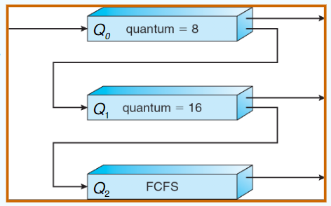
    - 3 queues: RR with 8 单位， RR with 16 单位，FCFS
    - scheduling  
      - 一个新任务进入 Q0。当他获得 CPU 时，任务获得了 8 单位的执行时间，当任务不能在8单位里完成，则进入 Q1
      - 任务在 Q1 中获得了16 单位的 CPU 时间，当任务不能在 Q1 中完成，进入 Q2
  - Asymmetric multiprocessing：only one processor accesses the system data structures, alleviating the need for data sharing; others execute only user code.
  - Symmetric multiprocessing(SMP)：each processor is self-scheduling. Multiple processors might access and 6update a common data structure.
### Real-time Scheduling
  - hard real-time scheduling: 要在一个 guaranteed 时间内完全一个 critical task关键任务
  - soft reall-time scheduling: 要求关键流程优先于不太幸运的流程
  - Earliest Deadline First (最早截止时间优先)
  - Least Laxity First (最低松弛度优先)
    - A 的松弛度 = A 必须完成的时间 - A 运行需要的时间 - 当前时间
    - 有一个任务需要在 400ms 时必须完成，它需要运行 150ms，当前时刻为100ms, 其松弛程度为 400 – 150 – 100 = 150ms
  - Rate Monotonic Scheduling（速率单调调度）
    - 基于任务的周期来分配优先级，周期越短的任务优先级越高
### Thread Scheduling

> 也叫 Contention Scope


### Operating Systems Examples

### Java Thread Scheduling

### Algorithm Evaluation

## CH6: Process Synchronization

> 进程同步：确保多个进程可以按照**一定顺序或在一定条件下**正确访问**共享资源** Concurrent access to shared data may result in **data inconsistency** ，并发访问共享数据可能会导致数据不一致

### 6.1 critical-section problem 临界区问题

- race condition 竞态条件：同一个内存位置被*并发地访问*，且至少有一次访问进行了*写操作*。
- 非抢占式内核也会受到竞态条件的影响：**critical-section problem 临界区问题**
  - 临界资源：在多进程（或线程）中被共享的资源
    - 要使用一定的机制进行保护，来确保同一时刻只有一个进程（或线程）对他访问
    - CPU 不是临界资源
  - 临界区：每个进程中访问临界资源的代码
- Solution 的目标
  - **互斥（Mutual Exclusion）**：在任何时刻，最多只能有一个进程或线程进入临界区。
    
  - **空闲让进（Progress）**：如果没有进程在临界区内且有其他进程想要进入，则应该允许这些进程最终进入临界区，而不能无限等待。
    
  - **有限等待（Bounded Waiting）**：每个进程都有一个有限的等待时间，不会发生饥饿（即一个进程永远不能进入临界区的情况）。

### 6.2 软件同步方式

#### 1 单标志法
  - 设置公共整型变量 turn，允许进入进阶去的进程编号 turn = i，表示允许进程 Pi 进入临界区；进程退出临界区的时候交给新进程 turn = j

(下图，如果 turn 不等于 i，进程 Pi 会等待；退出临界区时，将 turn 设为 j，允许 Pj 进入)


#### 2 双标志后检查法
  - 设置布尔型数组 flag[2]，用来标记各进程进入临界区的意愿 flag[i] = true 表示进程 Pi 想进入
  - 先表达自己进入临界区意愿
  - 再轮询对方是否想进入，确定对方不想进入后再进入
  - 访问结束退出后设置 flag[i] = false，表示不想进入，允许对方进入

（下图，Pi 先表达想进入，轮询问 Pj 想不想进入，等待至 Pj 完成或者 Pj 不想进入，Pi 进入临界区）


可能导致双方都不能进入，违反了空闲让进和有限等待

#### 3 双标志先检查法

- 设置布尔型数组 flag[2]，用来标记各进程进入临界区的意愿 flag[i] = true 表示进程Pi想进入
- 进程进入临界区前先轮询对方是否想进入
- 确定对方不想进入后再进入
- 访问结束退出后设置 flag[i] = false，表示不想进入，允许对方进入

（下图，Pi 先等待 Pj 完成，然后表达想进入，然后进入）

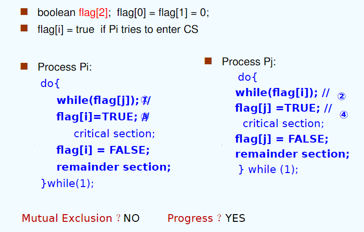

#### 4 Peterson’s Solution

- flag[i] 标记进程 i 为 ready，turn 标记 whose turn it is to enter the critical section.  
- assume load 和 store 操作是不可以被打断的，atomic 原子的
- idea
  - 首先表达自身意愿(flag[]=true)之后设置自身要进入(turn=0/1)；
  - 若双方互相确定对方都想进入时，turn只能等于一个值，因此会谦让对方进入
  - 若一方不想进入，则其flag[i]=false，对方可直接进入

（i 表达意愿，但优先让 j 进行，直到 j 不想进行）

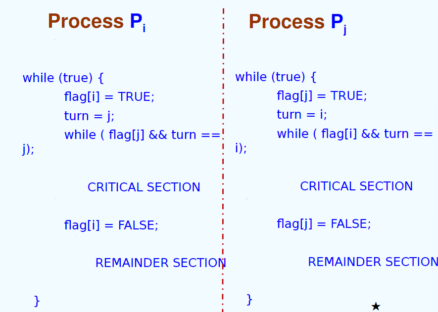

- 存在的问题：不能保证他能解决现代计算机架构上的问题
- 解决方案：**Memory barrier (内存栅栏)**
  - 代码中新增了 `asm("mfence")` 指令，这是一条内存屏障指令，用于防止编译器和CPU对某些内存操作进行重排序。`mfence` 确保在其前后的内存操作按照程序中的顺序执行，从而提供更严格的内存访问顺序控制。


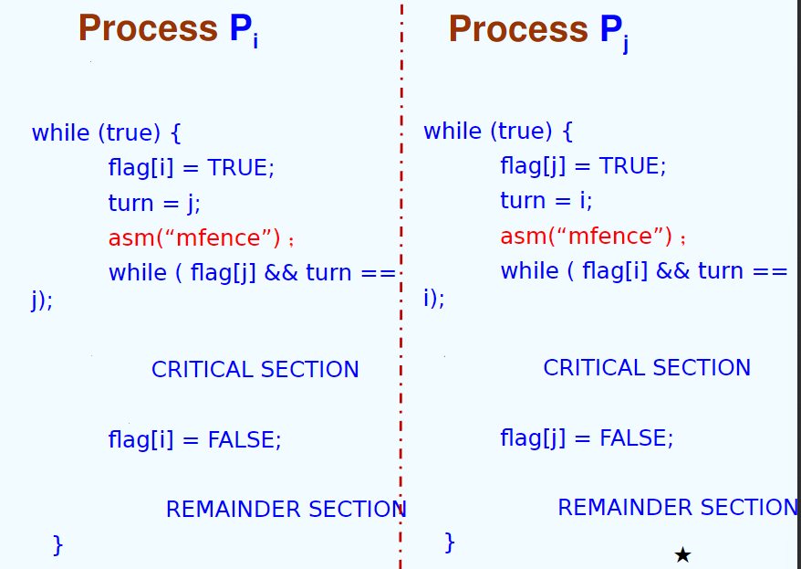

#### 5 Bakery Algorithm (面包房算法) Lamport

- 特点
  - 任何时间只有一个进程进入 critical section
  - 每个进程都最终会进入 critical section
  - 每个进程都能停在 noncritical section
  - 不能对进程的速度做任何假设
- idea
  - 在进入临界区之前会收到一个数字，拿到最小数字的进程进入临界区。
  - 如果进程 Pi 和 Pj 收到相同的编号，如果 i < j，则先服务 Pi；否则首先为 Pj 提供服务。
  - 编号方案始终按递增的枚举顺序生成数字；例如，1、2、3、3、3、3、4、5。
- 结构
  - boolean choosing[n]: 表示进程是否正在取号；初始false，取好号为 false
  - int number[n]: 记录每个进程取到的号码；初始0

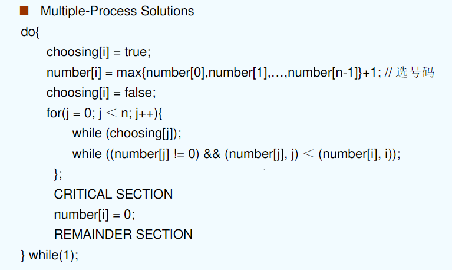

### 6.3 硬件同步方式

- 单处理器 – 可以禁用中断
  - 当前运行的代码将在没有抢占的情况下执行
  - 在多处理器系统上通常效率太低
  - 使用此功能的操作系统不具有广泛的可扩展性
- 现代机器提供特殊的原子硬件指令
  - 原子=不可中断
  - 要么测试内存字并设置值
  - 要么交换两个内存字的内容

#### 1 Disable Interrupts

```c
while (true) {
  Disable Interrupts; 
  Critical section;
  Enable Interrupts;          
  Remainder section;
}
```

- idea
  - 进入临界区前直接屏蔽中断，保证临界区资源顺利使用
- 缺点
  - 可能影响系统效率
    - 滥用关中断会严重影响CPU执行效率
    - 其锁住CPU可能导致原本一些短时间即可完成的需要等待开中断
  - 不适用于多CPU系统
    - 中断屏蔽法只适用于单CPU系统，在多CPU系统中无法有效同步各个CPU的操作
  - 安全性问题
    - 滥用关中断权力可能导致严重后果
    - 例如在关闭中断期间，一些重要的中断请求可能被错过，影响系统的稳定性和可靠性

#### 2 TestAndSet Instruction 

自动测试和修改单词的内容

```c
boolean TestAndSet (boolean *target){
  boolean rv = *target;
  *target = TRUE;
  return rv;
}
```

**Solution using TestAndSet**:

Shared boolean variable lock., initialized to false.

```c
while (true) {
  while ( TestAndSet (&lock ));   // do nothing
  //critical section
  lock = FALSE;
  //remainder section 
}
```

满足互斥和空闲进入，但不满足有限等待

#### 3 Swap Instruction 

- 对每个临界资源，swap设置一个全局bool变量lock(初值为false)，每个进程设置局部变量key(初值为true)
- 进程调用swap()指令访问临界区，会交换key和lock的值，实现上锁，进入访问
- 退出时把lock重置为false

```c
void Swap(boolean *a, boolean *b){
  boolean temp = *a;
  *a = *b;
  *b = *temp;
}
```

满足互斥和空闲进入，但不满足有限等待

# 以下有好多没写完

#### 4 The compare_and_swap (CAS)  Instruction

#### 5 Bounded-waiting with compare-and-swap

Boolean waiting[n]: 排队队列to be initialize to false

当一个进程执行完毕，往后找下一个等待的 进程，防止进程永远得不到执行

### 6.4 Mutex Locks 互斥锁 ppt46

用一个 bool 变量指示 lock

### 6.5 Semaphore 信号量机制

信号量 S（可以理解成 CPU 资源）

只有通过 wait(P) （CPU 被占用）和 signal(V) （CPU 空出来了）操作（atomic）才能对信号量进行操作

```c
wait (S) { 
  while S <= 0; // no-op
  S--;
}
signal (S) { 
  S++;
}
```

#### 1 Semaphore Type

- Counting semaphore （计数型）
  - 可以取任意的整数
- Binary semaphore （二进制型）多用
  - 只能取 0 和 1，也称为互斥锁，是信号量的一种特殊形式
  - 联系计数型：每一个数字都有它的二进制转换
- 其他：AND型信号量（所有资源都要满足才可以，对于解决死锁）、信号量集

#### 2 Usage

##### 1 实现互斥

S 二进制型，因为要先 --，所以初始化 1

```c
Semaphore S;   //initialize to 1
wait (S); //--
Critical Section
signal (S); //++
Remainder Section
```

##### 2 实现同步

两个进程 P1 状态 S1, P2 S2，要求 S1 在 S2 前

```c
//initialize to 0
P1 S1;
Signal(S); 
Wait(S);  //取之前看看有没有item先等
P2 S2; 
```

这里 S 不在同一个进程里

##### 3 实现异步

- 4个房间，4个一样的钥匙，1个信号量就够了
- 4个房间，4个不同钥匙，需要4个信号量
  - 1个信号量导致多个房间之间的访问冲突，无法保证互斥性

#### 3 Implementation

- wait 和 signal 是互斥的，不能同时在相同信号量上执行
- 实现的两种方式：busywaiting
  - 盲等：用 while 等
  - 非盲等

##### 1 busy Waiting

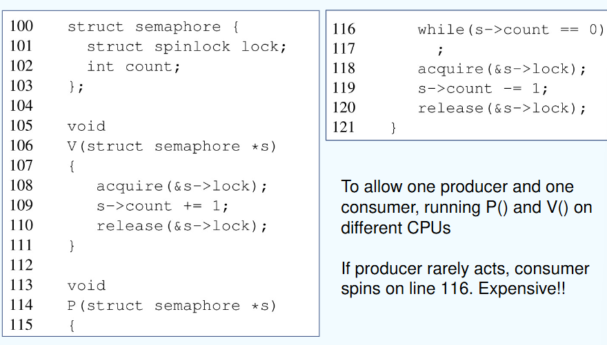

- 为允许一个生产者和一个消费者，P V 必须在在不同的 CPU 上跑
  - 因为 P V 是原子操作，其他进程就必须wait了一直占用
- 如果生产者很少执行，会导致消费者 while 等待的时间很长
  - while 的循环时间由 P 决定

##### 2 no busywaiting

- 新增与信号量对应的 waiting queue，ready queue还是 CPU 调度的
- 新增两个操作：
  - block(sleep)：在盲等中挂起在 waiting queue里面
  - wakeup：唤醒 waiting queue的进程到 ready queue中

```c
wait (S){ 
  value--;
  if (value < 0) { 
    // add this process to waiting queue
    block();  
  }
}
Signal (S){ 
  value++;
  if (value <= 0) { 
    // remove a process P from the waiting queue
    wakeup(P);  
  }
}
```

- S 可以取值负
  - 当 S 取负表示队列里面在等待的进程的个数
  - 只要有进程进入 waiting queue 都会执行 wait S--

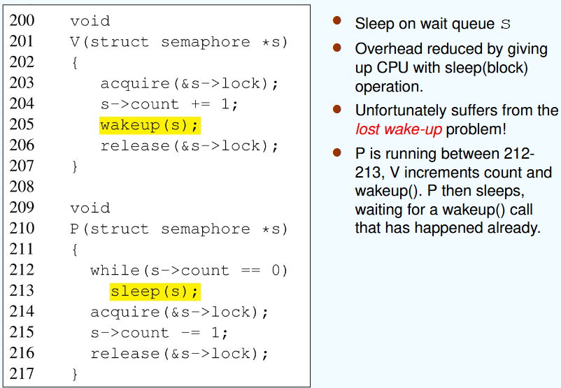

- 可能会出现丢失 wakeup 的进程
  - 轮到它 wakeup 了但它还没有 sleep
  - 在 212 213之间还没执行到 sleep 的时候就执行了 wakeup
  - 根本原因：没有完全互斥
- sleep 等待之前先上锁？？

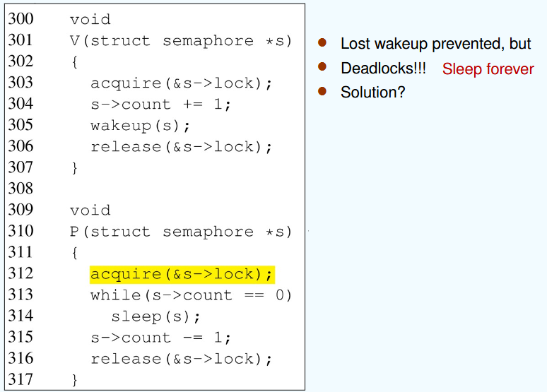

错。上锁之后 s 永远不能被修改了，sleep forever，死锁 deadlock

解决方法？sleep 插入 waitingqueue 后就放锁（设计新的 sleep 函数）

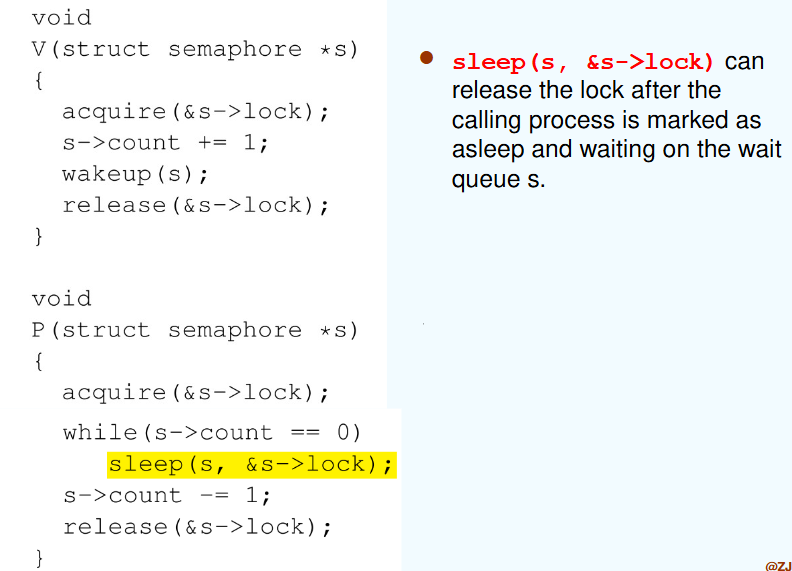

- busywaiting
  - 如果计算机一定要实现 busywaiting，那必须多核；
  - 并且要求 P 执行的时间越短越好，否则 waiting 太久了
- no busywaiting
  - 本质：进程调度
  - 上下文切换的时间应当设计要比 busywaiting 的时间短

#### 4 Deadlock and Starvation

死锁：先 wait 的先 signal

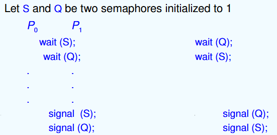

starvation：无限等待

#### 5 实际问题

信号量：临界区临界资源（互斥）

- 信号量的物理含义
  - S.value >0 表示有S.value个资源可用;
  - S.value=0 表示无资源可用或表示不允许进程再进人临界区；
  - S.value<0 则|S.value|表示在等待队列中进程的个数或表示等待进入临界区的进程个数。

- wait、signal操作必须成对出现
  - 当为互斥操作时，它们同处于同一进程;
  - 当为同步操作时，则不在同一进程中出现。

- 两个wait操作相邻，它们的顺序至关重要
  - 两个相邻的signa操作的顺序无关紧要
  - 一个同步wait操作与一个互斥wait操作在一起时，同步wait操作在互斥wait操作前
    - 互斥wait：允许你进入临界区，同步 wait：允许你同步
    - 顺序互换导致死锁

##### 1 Bounded-Buffer Problem

N buffers, each can hold one item

- 分析信号量
  - 互斥mutex需要一个信号量，initialize to 1
  - 生产者判断满不满 full，初始值 0，刚开始没有 item
  - 消费者判断有没有 empty，初始值 N，计算空的 Buffer

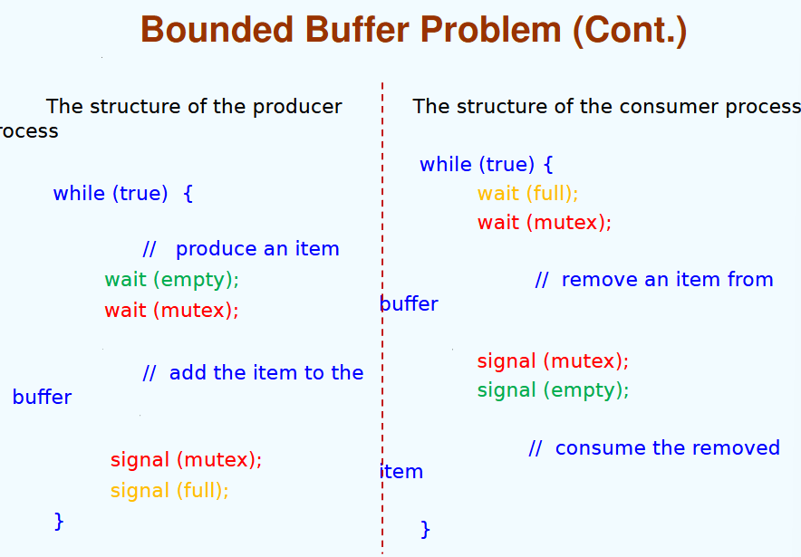

##### 2 Readers-Writers Problem

读者对 dataset 只读，写者对 dataset 可读可写

允许多个读者读取，但同一时间只能允许一个写者进行写作

读者有限问题：当有很多读者都读取，当且仅当所有读者都读完后才允许进行写的操作

- 信号量分析
  - 读者与写者互斥 mutex（注意这里不涉及同步
  - 写者写的时候判断有没有读者在用 readcount（初始化 0
  - 信号量写者 wrt（初始化 1

写者：

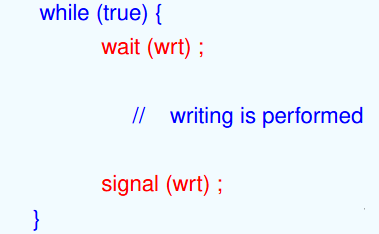

读者：

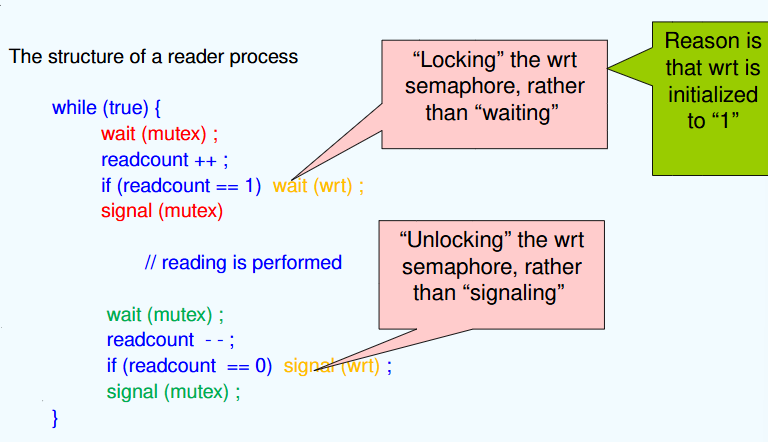

- 我要读了（readcount == 1），写者不允许写了，置 wait
- 读者读完了（readcount == 0），写者可以写了，置 Signal

第一个进来的读者对写进行上锁，最后一个读者对写进行放锁

##### 3 Dining-Philosophers Problem

哲学家可以吃饭和思考，必须拿起左右两边的筷子（分别1根）才可以吃饭。

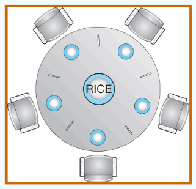

- Shared data 
  - Bowl of rice (data set)
  - 信号量 chopstick [5] initialized to 1

i 表示左右的筷子， i + 1 表示右边的筷子

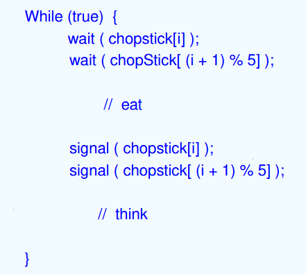

代码死锁。当所有人都把左边拿起来了就没有筷子了，但没有人会放下筷子所以所有人都等。

- 解决问题的方式
  - 改变其中一个哲学家拿筷子方向的先后顺序
  - 一个时刻只允许一个哲学家拿筷子
  - 奇数 ID 和偶数 ID 的哲学家设置相反拿筷子的顺序

### 6.6 Monitors 管程

一种高级抽象，为进程同步提供方便有效的机制

一个时间只允许一个进程在管程里执行相应操作（active

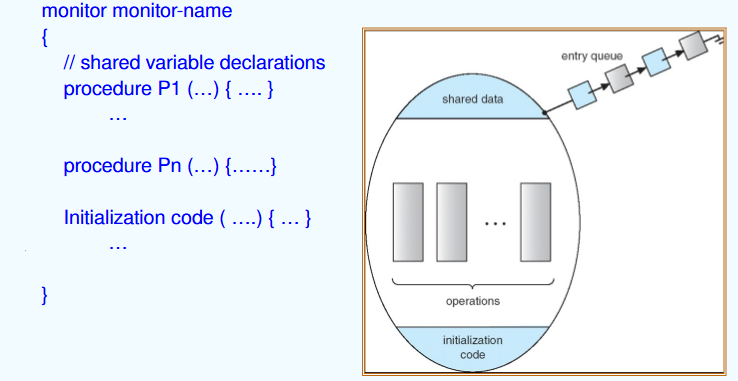

#### 1 Condition Variables

condition x, y;

- x.wait () ： a process that invokes the operation is suspended.
- x.signal () ： resumes one of processes(if any)that invoked x.wait ()

#### 2 哲学家问题

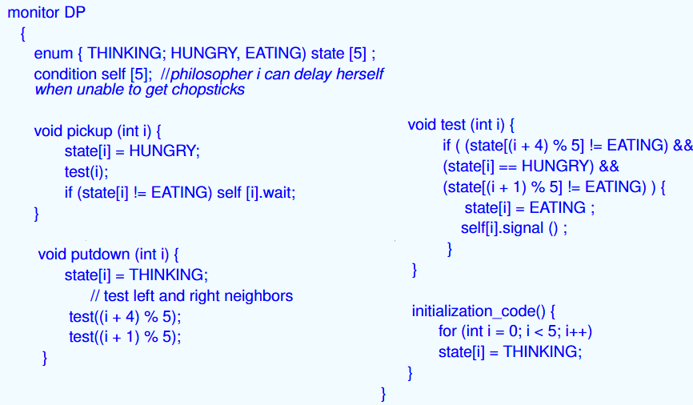

当左右哲学家 `self[(i+4)%5]` 和 `self[(i+1)%5]` 继续进食时，`self[i]` 可能会 starve

### 6.7 Pthreads 同步

p80 