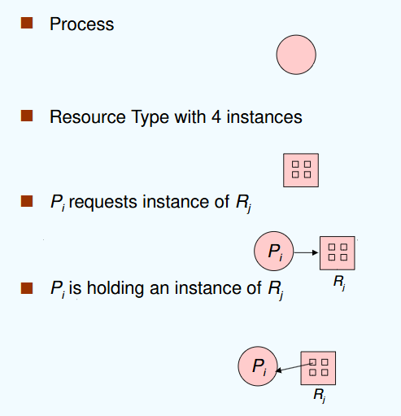
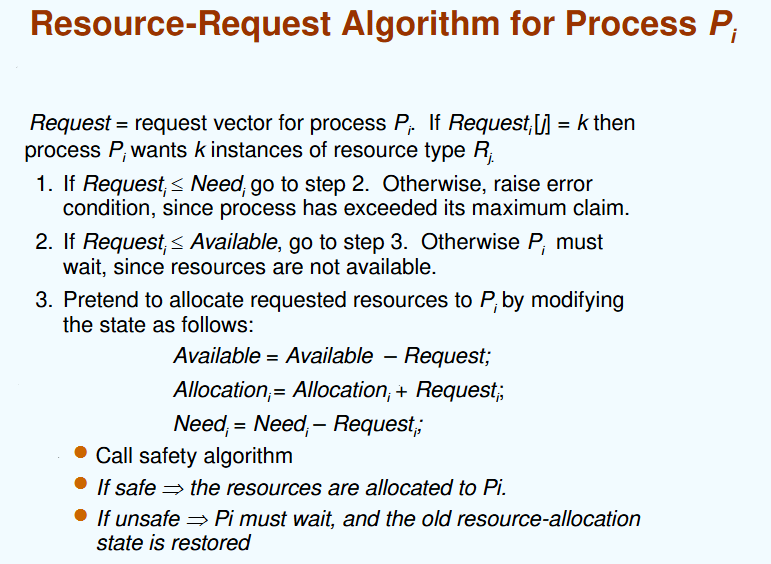
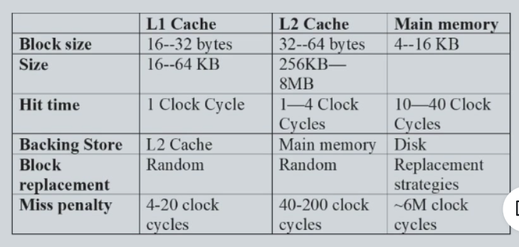
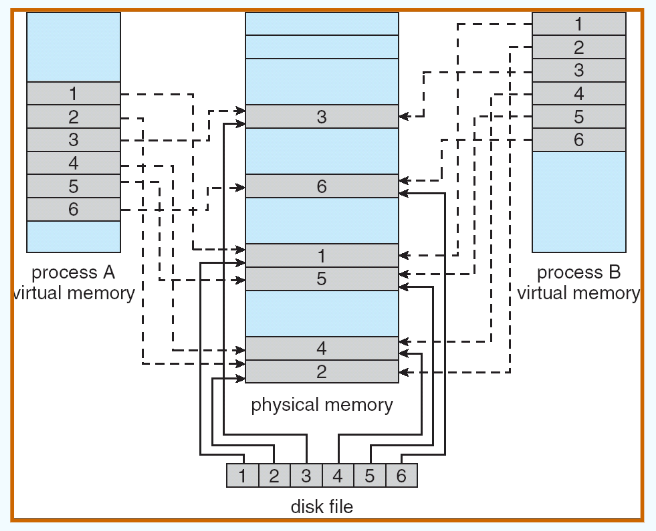
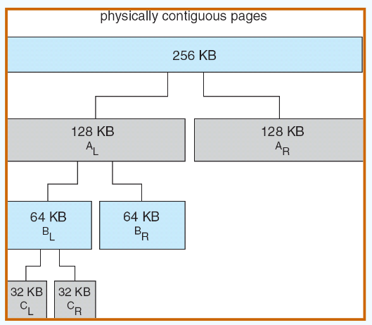

# Operating System

## CH1 released version

- Computer startup
  - bootstrap program
    - stored in ROM, loads os kernel and starts execution
- 冯诺依曼架构中最重要的部分是 main memory

### Interrupt
- Computer system Operation
  - 
  - IO 和 CPU 可以并发执行 concurrently
  - 每一个 device controller 都有一个 local buffer，执行前 CPU 将主内存中的数据移到 local buffer
  - local buffer 的作用是解决 CPU 和 controller 速度不适配speed mismatch的问题，因此controller 完成 operation的时候会告诉 CPU 一下，interrupt (通过 system bus)
  - IO 是 device 和 local buffer 之间的传输
- Interrupt
  - Interrupt 的请求会通过 interrupt vector（含有所有 service routine 地址） 传给 ISR（interrupt service routine）
  - incoming interrupt are disabled 当另外有interrupt在处理中，防止 lost interrupt
- interrupt 分为 IO 中断 和 trap 中断
  - Trap：软件引起的引发系统关注的中断（软中断）
    - 主动发出：user request 要去读一些内容
    - 被动发出：error
- interrupt handling
  - 操作系统通过存储寄存器 registers 和程序计数器 program counter 来保存CPU的状态
  - 如何知道是哪种 interrupt
    - 用一个通用例程进行轮询 polling
    - 向量中断系统 vectored interrupt system
    - 单独的代码段确定对每种类型的中断应采取什么操作
- IO structure：两种方式
  - 只有在 IO 完成后 返回 user program 同步 synchronous
  - user program 不等待 IO 处理 异步 asynchronous（一个进程里有多个线程，非阻塞式
  - 
- Direct Memory Access Structure（DMA）
  - 用于能够以接近内存速度传输信息的高速 I/O 设备
  - 每个块 block 仅生成一个中断，而不是一个中断每字节中断
  - 不需要 CPU 干预，控制力度降低

### Storage
- Storage structure
  - Main memory：被看作是last cache for secondary storage
  - Secondary storage
  - Magnetic disks
  - 
- speed，cost，volatility易失性
- caching
  - faster storage，解决速度适配的问题，用中的信息暂时从较慢的存储复制到较快的存储 
  - cache 小于被 caching 的内存
- data migration
  - 

### Operating System Structure
- Operating System Structure
  - **multiprogramming**：efficiency （**CPU utilization**）
    - user 不能让 CPU 和 IO 一直 busy
    - multiprogramming 组织代码和数据，CPU 始终有一个要执行
    - One job selected and run via **job scheduling**
    - 当 job 在等待时，OS 做其他工作
  - **Timesharing (multitasking)**：Response time should be < 1 second（**interactivity**）
    - *process* 进程：at least one program executing in memory
    - *CPU scheduling* 调度: several jobs ready to run at the same time
    - *swap*: 如果进程不适合内存，交换会将它们移入和移出，来保证重要的 process 进行
    - *Virtual memory*：允许不完全在内存中执行进程
- Operating-System Operations
  - 来自外部硬件中断 interrupt
  - 来自软件的中断 trap: user request / error
  - 其他进程问题包括无限循环、进程相互修改或操作系统修改
- Protection for Operating-System Operations
  - **dual mode**: user mode / kernel mode(like `sudo`)
    - **Mode bit** provided by hardware 提供区分系统何时运行用户代码或内核代码的能力
  - kernel mode: **privileged**
  - **system calls** 将模式更改为内核，从调用返回将其重置为用户
  

### Resource Management

- Timer & Interrupt: to prevent infinite loop / process hogging resources
  - 在调度进程之前设置特定时间后中断。操作系统递减计数器，当计数器为零时产生中断，让 CPU 重新获得控制权或终止超出分配时间的程序
- Process Management：进程是操作系统中对于资源的抽象
  - **process** 进程: a program in execution. program 是被动 passive 实体，process 是主动 active 实体
  - 需要的 resource：CPU, memory，I/O，files，Initialization data
  - 进程终止要回收所有可重用资源
  - **Single-threaded process** 有一个程序计数器指定下一条要执行的指令的位置，进程按顺序执行指令，一次一个，依次完成
  - **Multi-threaded process** 每个线程有一个程序计数器
  - 通常系统有许多进程、一些用户、一些操作系统在*一个或多个* CPU 上同时运行
    - 通过在进程/线程之间复用 CPU 实现并发 Concurrency by **multiplexing the CPUs** among the processes / threads
- 
- Memory Management
  - data：进程前或完成后必须在内存中
  - instructions：必须放在内存中来运行
  - Memory Management决定内存中的内容，优化CPU利用率和计算机对用户的响应
  - 设计：
    - 记录是谁在用内存分别用了多少内存
    - 分发和回收内存空间
    - 决定将哪些进程（或其部分）和数据移入和移出内存
- Storage Management
  - OS
    - **file**：将物理属性抽象为逻辑存储单元
    - control：每种介质均由设备（即磁盘驱动器、磁带驱动器）控制
  - File-System management
  - directories
  - **access control**：访问权限控制，privelege
- Mass-Storage Management：通常磁盘用于存储主存无法容纳的数据或必须长期保存的数据。
  - 计算机运行的整体速度取决于磁盘子系统及其算法Entire speed of computer operation hinges on disk subsystem and its algorithms
  - 操作系统的作用：storage分配，disk规划，free-space管理
- I/O Subsystem
  - 操作系统的目的之一是向用户隐藏硬件设备的特性——易于使用和编程 hide peculiarities of hardware devices from the user – ease of usage & programming 
  - IO 的内存管理包括了buffering（在传输数据时临时存储数据）caching（将部分数据保存在更快的存储中以提高性能）spooling（一项工作的输出与其他工作的输入重叠）

## CH2 Operating-System Structures
### Operating System Services
- a set of services
  - **user interface (UI)**: Command-Line(CLI), Graphics User Interface(GUI)
  - **program execution**: 系统必须能够将程序加载到内存中并运行该程序，结束执行，无论是正常还是异常（指示错误）
  - **IO operations**
  - **File-system manipulation**操纵
  - **Communication**：processes交换信息，通过computer（shared memory 或message passing这种需要通过操作系统）或者是在 同一网络环境下 的电脑
  - **Error detection**
  - **Resource allocation**
    - 许多类型的资源 - 一些（例如 CPU 周期、内存和文件存储）可能具有特殊的分配代码，其他（例如 I/O 设备）可能具有通用请求和释放代码
  - **accounting**：记账，跟踪哪些用户使用了多少计算机资源以及何种类型的计算机资源
  - **Protection and security**
    - protection: 确保所有对系统资源的access都是受控制的
    - security：要求user authentication，扩展到保护外部 I/O 设备免受无效访问尝试
### User Operating System Interface
- CLI allows direct command entry
  - Sometimes implemented in *kernel*, sometimes by *systems program*
# 补写！！！！

### System Calls
- Application Program Interface (API)：更为高层的程序接口的封装
  - system calls 低阶，不方便，用high-level language比较多
  
- System Call Implementation
    - 每个系统调用都有一个关联的号码。系统调用接口维护一个根据这些号码索引的表
    - 
    - 
- System Call Parameter Passing
  - simpliest: **registers**
  - 当寄存器个数不够
    - **block**，或者table（linux系统或solaris系统使用这个方式）
    - parameters 被 push 到程序的 **stack** 中，被操作系统 pop 出去（压栈，OS 出栈，栈不一定共享）
- Types of System Calls
  
  
### System Programs系统程序
- File manipulation，Status information，File modification，Programming language support，Program loading and execution，Communications，Application programs

### Operating System Design and Implementation

- 操作系统的设计**not solvable**但是意味着**creative**，但是一些具体的 实现方式被证明是正确的
- Important principle to separate (2.6.2)
  - **Policy**:   What will be done?策略（确定具体做什么事）
  - **Mechanism**:  How to do it? 机制（定义做事方式）
    - Example: timer for CPU protection is a mechanism
- Example: Separation of Mechanism and Policy
  - hotel：card/keys
    - policy：什么人在什么时间可以使用card/keys进入
    - mechanisms：magnetic card readers, remote controlled locks, connections to a security server
  - The matrix data determines a policy, and the switching network is a mechanism
  

## CH3：Processes

### concept

- program
  - batch system 批处理系统：sequence of jobs
  - time-sharing system ：user program or tasks
    - multitasking
    - less turnaround, less CPU idle, user interaction
    
- process: **program in execution**
  - include:
    - text section(code)
    - data section(global vars)
    - stack(function parameters, local vars, return addresses)
    - heap (dynamically allocated memory)
    - program counter 

### process state


### Process Schedule

- Process Scheduling Queues
  - 主流：链表实现
  - **Job queue**任务堆叠 – 系统中所有进程的集合
  - **Ready queue**（最关心 – 等待使用 CPU 的进程序列
  - **Device queues** – 等待使用IO的
- scheduler
  - Long-term scheduler  (or **job scheduler**) 
    - selects which processes should be brought into memory (the ready queue)
  - Short-term scheduler  (or **CPU scheduler**) 
    - selects which process should be executed next and allocates CPU

# CH3 没写完

## CH4：Threads

## CH5：CPU Scheduling

### CPU Scheduling

goal：在 multiprogramming 下使 **CPU 利用率 utilization** 达到最高

（原因：进程在 IO burst 的时候 waiting 会降低 CPU 的使用率，在 IO burst的时候进行 CPU 调度）


histogram of CPU-burst times： CPU 调度非常频繁且大多非常快->**frequently and efficient**

- CPU Scheduler（区分longterm和shortterm）
  - 从内存中选择需要执行的进程，然后将 CPO 分配给其中一个
  - CPU 调度takeplace：
    - 进程从running到waiting（IO 或者 wait()），和反之（IO 完成）
    - 进程从running到ready（interrupt）
    - 进程结束
  - 以上原因发生的 CPU 调度是 **nonpreemptive** 的，非抢占式
  - 其他原因导致的调度是 **preemptive** 的，抢占式
- Dispatcher
  - 使 CPU 可以控制进程（在 short-term 调度下）
    - 转换内容、转入usermode、转入正确的新 user program 的地址
  - **dispatch latency**
    - stop 旧进程和 start 新进程之间的延迟时间
    - 
- 调度法则 Scheduling Criteria
  - CPU utilization 利用率：让 CPU 尽量 busy（*使用到 CPU 的时间 / 全部进程完成的时间*）
  - Thoughtput 吞吐率：在单位时间内完成的进程数量（*进程数 / 全部进程完成的时间*）
  - Turnroundtime 周转时间：运行一个particular process的时间，要包括调度的时间！！（*终止减去起始的时间*）
  - Waitingtime 等待时间：进程在 ready queue里面等待 CPU 的时间（*注意不是等待 IO 的时间*）
  - Responsetime 响应时间：进程提交后第一次跟用户反馈结果第一次响应的时间，不指得到最终结果output
### FCFS SJF SRTF schedule算法
- First-Come, First-Served (FCFS) Scheduling 最常见
  - Arrival order makes difference!
  - 非抢占式
  - **Convoy effect（护航效应）**: 当短进程排在长进程后运行时，平均等待时间会较长，IO 和 CPU 就会很空闲
  - 有利于长作业，不利于短作业；有利于CPU繁忙型，不利于I/O繁忙型
- Shortest-Job-First (SJF) Scheduling
  - 将一个进程与它的下一个 CPU burst综合考虑来调度使得用最短的时间
  - 两种框架
    - 非抢占式：一旦 CPU 给了一个进程，CPU 就不能被抢占给其他进程直到这个进程的 CPU burst 结束
    - 抢占式 **Shortest-Remaining-Time-First (SRTF)**：当一个新的进程来，这个新进程的 CPUburst 时间比当前剩余的 CPU burst
- Determining Length of Next CPU Burst
  - 我们无法知道下一次 burst 的长度，只能使用 estimate 的方式
  - *exponential averaging (指数平均法)*
  - 
  - 
  - 
- SJF better，提供了最短的平均等待时长
  - 进程 startvation
- Priority Scheduling
  - 对每一个进程都有一个 integer 作为它的 **priority number** 与它联系，数字越小优先级越高
  - CPU 会被分配给最高优先级的进程（抢占式/非抢占式）
  - **SJF是优先级调度**，其中优先级是预测的下一个 CPU burst 时间
  - **Static Priority**：static=notchange，在进程创建的时候决定
  - 会出现的问题：**Starvation** - low priority processes may never execute
    - solution：**Dynamic Priority**  
    - 具体方式：**Aging** - 随着时间的推移进程优先级提高

- Highest Response Ratio Next （HRRN）
  - 高响应比优先
  - 算法工作原理
    - 初始化：记录每个进程的到达时间和所需的服务时间
    - 计算响应比：对每一个就绪队列中的进程，计算其响应比
    - 选择高响应比的进程：选择具有最高响应比的进程执行（如果有相同的最高响应比，就按照其他的规则比如FCFS等来选择
    - 更新等待时间和响应比：一次调度后就更新所有就绪队列中进程的等待时间，并重新计算所有进程的响应比
  - HRRN 是 FCFS 和 SJF 的折中
  - 注意计算响应时间本身是需要时间的
- Round Robin (RR) *（emmmm谷歌翻译成《循环赛》）*
  - 每个进程获得一个小的CPU时间单位（time quantum 时间量子），通常是10-100毫秒。经过该时间后，该进程将被抢占并添加到就绪队列的末尾。
  - 比 SJF 有更高的平均周转时间，但 CPU 利用率提高和better交互性不能同时实现
  - 对等待序列中的 n 个进程，时间量子为 q，因此每个进程都会获得1/n的 CPU 时间。
    - 不会有进程的等待时间会超过 (n-1)q。
    - 如果 q 的值大，选择 FCFS 算法 ——**Time-sharing system**
    - 如果 q 的值小，要要求 q 的值不能太小，否则context switch的次数会过高，overhead 开销太大 —— **Multitasking system**
    - 
    - 周转时间由时间量子的大小决定
- Multilevel queue
  - ready queue 被分为两个 queue：foreground（交互性的）和 background（batch）
  - 对每个分开的 queue 使用不同的调度算法：foreground —— RR，background —— FCFS
  - 
  - Multilevel Feedback Queue
    - Aging 可以使用此算法
    - 
    - 设置多个就绪队列，优先级从第一级依次降低
    - 优先级高的队列，进程时间片越短
    - 每个队列都采用FCFS，若在该时间片完成，则撒离系统，未完成，转入下一级级队列
    - 按队列优先级调度，仅当上一级为空时，才运行下一级
  - examples
    - 
    - 3 queues: RR with 8 单位， RR with 16 单位，FCFS
    - scheduling  
      - 一个新任务进入 Q0。当他获得 CPU 时，任务获得了 8 单位的执行时间，当任务不能在8单位里完成，则进入 Q1
      - 任务在 Q1 中获得了16 单位的 CPU 时间，当任务不能在 Q1 中完成，进入 Q2
  - Asymmetric multiprocessing：only one processor accesses the system data structures, alleviating the need for data sharing; others execute only user code.
  - Symmetric multiprocessing(SMP)：each processor is self-scheduling. Multiple processors might access and 6update a common data structure.
### Real-time Scheduling
  - hard real-time scheduling: 要在一个 guaranteed 时间内完全一个 critical task关键任务
  - soft reall-time scheduling: 要求关键流程优先于不太幸运的流程
  - Earliest Deadline First (最早截止时间优先)
  - Least Laxity First (最低松弛度优先)
    - A 的松弛度 = A 必须完成的时间 - A 运行需要的时间 - 当前时间
    - 有一个任务需要在 400ms 时必须完成，它需要运行 150ms，当前时刻为100ms, 其松弛程度为 400 – 150 – 100 = 150ms
  - Rate Monotonic Scheduling（速率单调调度）
    - 基于任务的周期来分配优先级，周期越短的任务优先级越高
### Thread Scheduling

> 也叫 Contention Scope


### Operating Systems Examples

### Java Thread Scheduling

### Algorithm Evaluation

## CH6: Process Synchronization

> 进程同步：确保多个进程可以按照**一定顺序或在一定条件下**正确访问**共享资源** Concurrent access to shared data may result in **data inconsistency** ，并发访问共享数据可能会导致数据不一致

### 6.1 critical-section problem 临界区问题

- race condition 竞态条件：同一个内存位置被*并发地访问*，且至少有一次访问进行了*写操作*。
- 非抢占式内核也会受到竞态条件的影响：**critical-section problem 临界区问题**
  - 临界资源：在多进程（或线程）中被共享的资源
    - 要使用一定的机制进行保护，来确保同一时刻只有一个进程（或线程）对他访问
    - CPU 不是临界资源
  - 临界区：每个进程中访问临界资源的代码
- Solution 的目标
  - **互斥（Mutual Exclusion）**：在任何时刻，最多只能有一个进程或线程进入临界区。
    
  - **空闲让进（Progress）**：如果没有进程在临界区内且有其他进程想要进入，则应该允许这些进程最终进入临界区，而不能无限等待。
    
  - **有限等待（Bounded Waiting）**：每个进程都有一个有限的等待时间，不会发生饥饿（即一个进程永远不能进入临界区的情况）。

### 6.2 软件同步方式

#### 1 单标志法
  - 设置公共整型变量 turn，允许进入进阶去的进程编号 turn = i，表示允许进程 Pi 进入临界区；进程退出临界区的时候交给新进程 turn = j

(下图，如果 turn 不等于 i，进程 Pi 会等待；退出临界区时，将 turn 设为 j，允许 Pj 进入)


#### 2 双标志后检查法
  - 设置布尔型数组 flag[2]，用来标记各进程进入临界区的意愿 flag[i] = true 表示进程 Pi 想进入
  - 先表达自己进入临界区意愿
  - 再轮询对方是否想进入，确定对方不想进入后再进入
  - 访问结束退出后设置 flag[i] = false，表示不想进入，允许对方进入

（下图，Pi 先表达想进入，轮询问 Pj 想不想进入，等待至 Pj 完成或者 Pj 不想进入，Pi 进入临界区）


可能导致双方都不能进入，违反了空闲让进和有限等待

#### 3 双标志先检查法

- 设置布尔型数组 flag[2]，用来标记各进程进入临界区的意愿 flag[i] = true 表示进程Pi想进入
- 进程进入临界区前先轮询对方是否想进入
- 确定对方不想进入后再进入
- 访问结束退出后设置 flag[i] = false，表示不想进入，允许对方进入

（下图，Pi 先等待 Pj 完成，然后表达想进入，然后进入）


#### 4 Peterson’s Solution

- flag[i] 标记进程 i 为 ready，turn 标记 whose turn it is to enter the critical section.  
- assume load 和 store 操作是不可以被打断的，atomic 原子的
- idea
  - 首先表达自身意愿(flag[]=true)之后设置自身要进入(turn=0/1)；
  - 若双方互相确定对方都想进入时，turn只能等于一个值，因此会谦让对方进入
  - 若一方不想进入，则其flag[i]=false，对方可直接进入

（i 表达意愿，但优先让 j 进行，直到 j 不想进行）


- 存在的问题：不能保证他能解决现代计算机架构上的问题
- 解决方案：**Memory barrier (内存栅栏)**
  - 代码中新增了 `asm("mfence")` 指令，这是一条内存屏障指令，用于防止编译器和CPU对某些内存操作进行重排序。`mfence` 确保在其前后的内存操作按照程序中的顺序执行，从而提供更严格的内存访问顺序控制。


#### 5 Bakery Algorithm (面包房算法) Lamport

- 特点
  - 任何时间只有一个进程进入 critical section
  - 每个进程都最终会进入 critical section
  - 每个进程都能停在 noncritical section
  - 不能对进程的速度做任何假设
- idea
  - 在进入临界区之前会收到一个数字，拿到最小数字的进程进入临界区。
  - 如果进程 Pi 和 Pj 收到相同的编号，如果 i < j，则先服务 Pi；否则首先为 Pj 提供服务。
  - 编号方案始终按递增的枚举顺序生成数字；例如，1、2、3、3、3、3、4、5。
- 结构
  - boolean choosing[n]: 表示进程是否正在取号；初始false，取好号为 false
  - int number[n]: 记录每个进程取到的号码；初始0


### 6.3 硬件同步方式

- 单处理器 – 可以禁用中断
  - 当前运行的代码将在没有抢占的情况下执行
  - 在多处理器系统上通常效率太低
  - 使用此功能的操作系统不具有广泛的可扩展性
- 现代机器提供特殊的原子硬件指令
  - 原子=不可中断
  - 要么测试内存字并设置值
  - 要么交换两个内存字的内容

#### 1 Disable Interrupts

```c
while (true) {
  Disable Interrupts; 
  Critical section;
  Enable Interrupts;          
  Remainder section;
}
```

- idea
  - 进入临界区前直接屏蔽中断，保证临界区资源顺利使用
- 缺点
  - 可能影响系统效率
    - 滥用关中断会严重影响CPU执行效率
    - 其锁住CPU可能导致原本一些短时间即可完成的需要等待开中断
  - 不适用于多CPU系统
    - 中断屏蔽法只适用于单CPU系统，在多CPU系统中无法有效同步各个CPU的操作
  - 安全性问题
    - 滥用关中断权力可能导致严重后果
    - 例如在关闭中断期间，一些重要的中断请求可能被错过，影响系统的稳定性和可靠性

#### 2 TestAndSet Instruction 

自动测试和修改单词的内容

```c
boolean TestAndSet (boolean *target){
  boolean rv = *target;
  *target = TRUE;
  return rv;
}
```

**Solution using TestAndSet**:

Shared boolean variable lock., initialized to false.

```c
while (true) {
  while ( TestAndSet (&lock ));   // do nothing
  //critical section
  lock = FALSE;
  //remainder section 
}
```

满足互斥和空闲进入，但不满足有限等待

#### 3 Swap Instruction 

- 对每个临界资源，swap设置一个全局bool变量lock(初值为false)，每个进程设置局部变量key(初值为true)
- 进程调用swap()指令访问临界区，会交换key和lock的值，实现上锁，进入访问
- 退出时把lock重置为false

```c
void Swap(boolean *a, boolean *b){
  boolean temp = *a;
  *a = *b;
  *b = *temp;
}
```

满足互斥和空闲进入，但不满足有限等待

# 以下有好多没写完

#### 4 The compare_and_swap (CAS)  Instruction

#### 5 Bounded-waiting with compare-and-swap

Boolean waiting[n]: 排队队列to be initialize to false

当一个进程执行完毕，往后找下一个等待的 进程，防止进程永远得不到执行

### 6.4 Mutex Locks 互斥锁 ppt46

用一个 bool 变量指示 lock

### 6.5 Semaphore 信号量机制

信号量 S（可以理解成 CPU 资源）

只有通过 wait(P) （CPU 被占用）和 signal(V) （CPU 空出来了）操作（atomic）才能对信号量进行操作

```c
wait (S) { 
  while S <= 0; // no-op
  S--;
}
signal (S) { 
  S++;
}
```

#### 1 Semaphore Type

- Counting semaphore （计数型）
  - 可以取任意的整数
- Binary semaphore （二进制型）多用
  - 只能取 0 和 1，也称为互斥锁，是信号量的一种特殊形式
  - 联系计数型：每一个数字都有它的二进制转换
- 其他：AND型信号量（所有资源都要满足才可以，对于解决死锁）、信号量集

#### 2 Usage

##### 1 实现互斥

S 二进制型，因为要先 --，所以初始化 1

```c
Semaphore S;   //initialize to 1
wait (S); //--
Critical Section
signal (S); //++
Remainder Section
```

##### 2 实现同步

两个进程 P1 状态 S1, P2 S2，要求 S1 在 S2 前

```c
//initialize to 0
P1 S1;
Signal(S); 
Wait(S);  //取之前看看有没有item先等
P2 S2; 
```

这里 S 不在同一个进程里

##### 3 实现异步

- 4个房间，4个一样的钥匙，1个信号量就够了
- 4个房间，4个不同钥匙，需要4个信号量
  - 1个信号量导致多个房间之间的访问冲突，无法保证互斥性

#### 3 Implementation

- wait 和 signal 是互斥的，不能同时在相同信号量上执行
- 实现的两种方式：busywaiting
  - 盲等：用 while 等
  - 非盲等

##### 1 busy Waiting


- 为允许一个生产者和一个消费者，P V 必须在在不同的 CPU 上跑
  - 因为 P V 是原子操作，其他进程就必须wait了一直占用
- 如果生产者很少执行，会导致消费者 while 等待的时间很长
  - while 的循环时间由 P 决定

##### 2 no busywaiting

- 新增与信号量对应的 waiting queue，ready queue还是 CPU 调度的
- 新增两个操作：
  - block(sleep)：在盲等中挂起在 waiting queue里面
  - wakeup：唤醒 waiting queue的进程到 ready queue中

```c
wait (S){ 
  value--;
  if (value < 0) { 
    // add this process to waiting queue
    block();  
  }
}
Signal (S){ 
  value++;
  if (value <= 0) { 
    // remove a process P from the waiting queue
    wakeup(P);  
  }
}
```

- S 可以取值负
  - 当 S 取负表示队列里面在等待的进程的个数
  - 只要有进程进入 waiting queue 都会执行 wait S--


- 可能会出现丢失 wakeup 的进程
  - 轮到它 wakeup 了但它还没有 sleep
  - 在 212 213之间还没执行到 sleep 的时候就执行了 wakeup
  - 根本原因：没有完全互斥
- sleep 等待之前先上锁？？


错。上锁之后 s 永远不能被修改了，sleep forever，死锁 deadlock

解决方法？sleep 插入 waitingqueue 后就放锁（设计新的 sleep 函数）


- busywaiting
  - 如果计算机一定要实现 busywaiting，那必须多核；
  - 并且要求 P 执行的时间越短越好，否则 waiting 太久了
- no busywaiting
  - 本质：进程调度
  - 上下文切换的时间应当设计要比 busywaiting 的时间短

#### 4 Deadlock and Starvation

死锁：先 wait 的先 signal


starvation：无限等待

#### 5 实际问题

信号量：临界区临界资源（互斥）

- 信号量的物理含义
  - S.value >0 表示有S.value个资源可用;
  - S.value=0 表示无资源可用或表示不允许进程再进人临界区；
  - S.value<0 则|S.value|表示在等待队列中进程的个数或表示等待进入临界区的进程个数。

- wait、signal操作必须成对出现
  - 当为互斥操作时，它们同处于同一进程;
  - 当为同步操作时，则不在同一进程中出现。

- 两个wait操作相邻，它们的顺序至关重要
  - 两个相邻的signa操作的顺序无关紧要
  - 一个同步wait操作与一个互斥wait操作在一起时，同步wait操作在互斥wait操作前
    - 互斥wait：允许你进入临界区，同步 wait：允许你同步
    - 顺序互换导致死锁

##### 1 Bounded-Buffer Problem

N buffers, each can hold one item

- 分析信号量
  - 互斥mutex需要一个信号量，initialize to 1
  - 生产者判断满不满 full，初始值 0，刚开始没有 item
  - 消费者判断有没有 empty，初始值 N，计算空的 Buffer


##### 2 Readers-Writers Problem

读者对 dataset 只读，写者对 dataset 可读可写

允许多个读者读取，但同一时间只能允许一个写者进行写作

读者有限问题：当有很多读者都读取，当且仅当所有读者都读完后才允许进行写的操作

- 信号量分析
  - 读者与写者互斥 mutex（注意这里不涉及同步
  - 写者写的时候判断有没有读者在用 readcount（初始化 0
  - 信号量写者 wrt（初始化 1

写者：


读者：


- 我要读了（readcount == 1），写者不允许写了，置 wait
- 读者读完了（readcount == 0），写者可以写了，置 Signal

第一个进来的读者对写进行上锁，最后一个读者对写进行放锁

##### 3 Dining-Philosophers Problem

哲学家可以吃饭和思考，必须拿起左右两边的筷子（分别1根）才可以吃饭。


- Shared data 
  - Bowl of rice (data set)
  - 信号量 chopstick [5] initialized to 1

i 表示左右的筷子， i + 1 表示右边的筷子


代码死锁。当所有人都把左边拿起来了就没有筷子了，但没有人会放下筷子所以所有人都等。

- 解决问题的方式
  - 改变其中一个哲学家拿筷子方向的先后顺序
  - 一个时刻只允许一个哲学家拿筷子
  - 奇数 ID 和偶数 ID 的哲学家设置相反拿筷子的顺序

### 6.6 Monitors 管程

一种高级抽象，为进程同步提供方便有效的机制

一个时间只允许一个进程在管程里执行相应操作（active


#### 1 Condition Variables

condition x, y;

- x.wait () ： a process that invokes the operation is suspended.
- x.signal () ： resumes one of processes(if any)that invoked x.wait ()

#### 2 哲学家问题


当左右哲学家 `self[(i+4)%5]` 和 `self[(i+1)%5]` 继续进食时，`self[i]` 可能会 starve

### 6.7 Pthreads 同步

p80 

## 7 Deadlocks

指多个进程因竞争共享资源而造成相互等待的一种僵局，若无外力作用，这些进程都将永远不能再向前推进。

- 产生死锁的4个必要条件
  - Mutual exclusion（互斥条件）：对同时的一份资源，两个进程互斥
  - Hold and wait（请求并保持条件）：需要其他资源但得不到所以要等待，等待时候不会把自己已经拥有的资源释放
  - No preemption（不抢占条件）：它在工作的时候你不能把他的资源强行剥夺
  - Circular wait（循环等待/环路等待条件）：一个等下一个，最后一个等第一个

### 7.1 System Model

#### Resource Allocation Graph（RAG） 资源分配图



- 资源分配图没有 cycle：没有死锁
- 有 cycle：
  - （单向箭头首尾相连成环，有死锁）
  - 每个 resource type只有一个，死锁
  - 环路里面 resource type 有很多个，有可能死锁

### 7.2 死锁处理

最常用：Ignore the problem and pretend that deadlocks never occur in the system;

----鸵鸟算法

#### 1 死锁预防

通过破坏产生死锁的必要条件之一来防止死锁的产生。

- 互斥（本质是资源共享）：将所有的资源都设置为不共享的状态
- 请求保持：当一个资源请求的时候就把所有的资源都给他；只有当一个进程完全运行完才释放它所有的共享资源
  - 很低的资源利用率，有可能导致饥饿
- 不抢占条件：如果正在占用某些资源的进程请求另一个无法立即分配给它的资源，则释放当前占用的所有资源。
  - 被抢占的资源将添加到该进程正在等待的资源列表中。
  - 只有当进程能够重新获得旧资源以及它所请求的新资源时，进程才会重新启动。
- 循环等待：impose a total ordering 强制编号顺序执行

#### 2 死锁避免

动态监测资源分配的安全性，来确保系统不会进入不安全状态。

资源分配状态由可用和已分配资源的数量以及进程的最大需求来定义。

- safe state
  - 安全序列：如果存在所有进程的序列<<P1, P2, ...,Pn>，对于每个 Pi，Pi 仍然可以请求的资源可以由当前可用资源+所有Pj(j<i)的进程持有的资源来满足
  - 死锁一定不安全，不安全不一定死锁，安全一定不死锁（deadlock 含于 unsafe）

avoidance：保证系统不会进入不安全状态

这个条件下的死锁：当前的资源满足不了两个进程的需求，两个进程会互相等待；但如果是一个进程的话，就不会互相等待，只会无法进行

##### 死锁避免的算法

**1. Single instance of a resource type：资源分配图**

新增claim edge: 本来是虚线，在进程请求资源的时候变为实线

授予请求：只有当将请求边转换为分配边不会导致资源分配图中环的生成


第二张图就会导致死锁，应当在P2向R2请求的时候就拒绝

**2. Multiple instances of a resource type：银行家算法**


- assumption：
  - 多个资源
  - 每个资源都要 claim 自己的最大使用量
  - 一个进程可能要等才能得到对应的资源
  - 得到所有需要的资源就一定能在有限时间内运行完
- n个进程，m种资源
- available：可使用的资源数
- max：n*m的矩阵，一行表示进程，一列表示资源，Pi最多可能请求k个Rj资源.
- allocation：n*m的矩阵，表示已经分配的资源
- need：n*m，need = max - Allocation

安全算法：


request-request algorithm


#### 3 死锁检测

# 补写！！

## 8 Main Memory

### 8.1 background

- memory hierarchy



- 一个进程的生命周期：编译，链接，装入
  - 编译需要主要的时间


- 地址 Addresses Given in Different Ways
  - Symbolic Address 符号地址：count 变量会代表 count 这个的地址
  - Relocatable Addresses 可重定位地址：编译之后会把可重定位地址和符号地址做绑定，如 地址是 count 地址的后14byte位置
  - Absolute Addresses绝对地址：可以理解为一个物理地址
- 地址绑定映射
  - 编译时刻：已经知道了具体的地址，可以直接把地址写进去不用虚拟地址了
  - 装入时刻：这个时候内存会给一个地址，就可以把相对地址写成物理地址了，使用可重定位地址
  - 执行时刻：实际运用一般采用，要求地址必须要高效绑定，所以一般用硬件来实现快死的物理地址的绑定
    - 如果进程在执行过程中可以从一个内存段移动到另一个，则绑定将延迟到运行时。需要地址映射的硬件支持（例如，基寄存器和限制寄存器）
    - base register基址寄存器和 limit register 限长寄存器
    - 
    - 可以通过这两个寄存器实现对这个内存空间的保护

- Logical vs. Physical Address Space
  - 如果进程在执行过程中可以从一个内存段移动到另一个，则绑定将延迟到内存时，并且徐娅硬件来支持地址映射（如基址寄存器或限长寄存器）
  - 逻辑地址：由 cpu 生成，也叫虚拟地址
  - 物理地址：内存单元看到的地址
  - 逻辑和物理地址在编译时和加载时地址绑定方案中是相同的，但在执行时不同

- Memory-Management Unit (MMU) 内存管理单元
  - 将虚拟地址映射到物理地址的硬件设备
  - In MMU scheme, the value in the relocation register is added to every address generated by a user process at the time it is sent to memory当一个进程装入内存的时候会将重定向寄存器里的地址一起加入地址
  - 进程只处理逻辑地址，不会见到物理地址
- dynamic loading 动态装入
  - 不会一下子全部装入，需要的时候才装入
  - 可以节省空间
  - 不需要其他的支持来实现
- dynamic linking 动态链接
  - 链接的过程被推迟到执行的时候进行
- 程序的链接与装入


- Contiguous Allocation(连续分配)：将一块连续的内存分给一个进程
  - 主存主要有两个部分：
    - 常驻 resident 操作系统，通常用中断向量保存在低内存中
    - 用户进程一般存在高内存中
  - 重定位寄存器用于保护用户进程独立并且防止收到操作系统代码和数据的更改的干扰
    - 重定位寄存器保存了最小的物理地址
    - 限长寄存器保存了逻辑地址的范围——每一个逻辑地址都必须比限长地址要小
    - MMU 动态分配逻辑地址
    - 对重定向和限长寄存器的硬件支持


- (cont.)
  - Single Continuous Allocation 单一连续分配
    - 内存分为系统区和用户区，用户区每次只调入一道程序运行
    - 一次只放一道程序，无并发
  - Multiple-partition allocation多分区分配
    - 将内存划分为若干个连续区域，每个连续区域只能存放一个进程
  - fixed partitioning 固定分区
  - dynamic partitions 动态分区或 Variable partition 可变分区
    - 动态划分内存，在程序装入内存时把可用内存“切出”一个连续的区域分配给该进程，且分区大小正好适合进程的需要。
    - 设计
      - hole：内存里当前可用的区域，内存里可能有很多个hole
      - 一个进程进来的时候，选择一个合适的hole分配给他
      - 操作系统记录已经分配的部分和空的hole
    - 实现动态分区的算法
      - First-fit：从整个list开始找到第一个大小够的第一个hole
        - 不好，前面的hole可能出现很小的空间
      - Next-fit：从上一个选到的hole的下一个hole开始选
        - 很小的空间可能最后会分布的比较均匀
      - Best-fit：找到最小的可以装下的hole
        - 会产生很小很小的碎片hole
      - Worst-fit：找到最大的hole
        - 会产生一些比较大的hole
      - 基于索引的方法：


- fragmentation 碎片 零头
  - external fragmentation：总内存空间存在以满足请求，但它不是连续的
  - internal fragmentation：给一个进程分配了一个比他需要的还大的内存空间；这一部分是分区内部的内存，被分配了但是没有被使用

## 9 Virsual Memory

### Background

- 比物理内存大

- 请求式分页技术

- 局部性原理
  - 时间局部性
  - 空间局部性

### Copy-on-Write 

- 当父进程创造一个子进程的时候，操作系统并不会立即复制父进程的内存地址空间。

- 相反，子进程会共享父进程的内存页面，并标记这些页面为只读。
- 当父进程或子进程仅读取共享页面时，操作系统不会触发缺页中断，读操作可以直接访问共享页面的内容。
- 时间上和空间上都省

### Demand Paging

请求式分页：只有在用到的时候才会Bring a page into memory

方便：Less I/O needed ，Less memory needed ，Faster response

- Valid-Invalid Bit 来表示当前page有没有被load到内存里面
  - v没有，i已经
  - 如果i会产生缺页中断


### Page Fault

操作系统看缺的页是不是合法的，不是的话abort

是的话：

- Get empty frame
- Swap page into frame
- Reset tables
- Set validation bit = v
- Restart the instruction that caused the page fault

### Page Replacement


- why page replacement
  - 一定程度上防止内存过度分配
  - 只有对修改过的page才有必要重新写入磁盘
  - 页替换完成了逻辑内存和物理内存的分离——可以在较小的物理内存上提供大的虚拟内存
- basic page replacement
  
  - 注意写回的时候要对frametable和pagetable的更新


- Algorithm
  - 目标：pagefault的次数尽可能小
  - 通过在特定的内存引用字符串上运行算法并计算该字符串上的页面错误数来评估算法
  - 物理内存的大小和缺页次数的关系：反比例，当物理内存无限大缺页次数会趋于一个固定值（因为前面几页一定是会缺页的） 

### Page replacement Algorithm

- FIFO Algorithm 先进先出

  - 具体实现

  

  - Belady’s Anomaly: more frames => more page faults (not exactly)


- Optimal Algorithm（最佳置换算法）
  - 替换在一段时间里面都不会再使用的page
  - 如何知道？


- LRU 最久未使用置换算法 least recently used

  - 选择内存中最久没有引用的页面被置换
  - 性能接近最佳算法。但由于需要记录页面使用时间，硬件开销太大。

  

  - counter实现
    - 每个page entry都有一个计数器，每次通过entry引用page时，将clock添加到计数器里面
    - 当一个page需要被修改，查看所有的page计数器来做选择
  - stack实现
    - 设置一个特殊的栈，把被访问的页面移到栈顶，于是栈底的是最久未使用页面
    - keep a stack of page numbers in a double link form
  
  
  
  - register实现
    - 使用移位寄存器：
    - 被访问时左边最高位置1，定期右移并且最高位补0，于是寄存器数值最小的是最久未使用页面
    - Additional-Reference-Bits Algorithm 附加引用位算法
  
- Second chance algorithm, clock algorithm

  - 与 LRU 相似
  - 添加 reference bit 引用位
    - 每一个 page 都跟一个 bit 关联，初始化为 0
    - 当这个 page 被引用时，引用位改为 1
    - 进行 page replacement 的时候替换关联位为 0 的 page （srds 我们不知道这个顺序）

  - second chance
    - 引用位
    - clock replacement
    - 在时钟顺序内，如果一个引用位为 1 的 page 要被 replaced
      - 设置引用位为 0
      - 把 page 留在 memory（指补扔掉）
      - 根据相同的规则替换时钟顺序里的下一个 page


  

- Enhanced Second Chance Algorithm

  - 使用引用位和修改位：引用过或修改过设置为 1

  - （引用位，修改位）

    - (0,0)：最佳被replace的位置
    - (0,1)：用来replace不是很好
    - (1,0)：很快就会被使用
    - (1,1):最不合适做来replace的page

  - 淘汰顺序：(0,0)>(0,1)>(1,0)>(1,1)

  - Basic idea

    

- Counting-Based Algorithms

  - 对每一页的引用次数设置一个 counter
  - LFU Algorithm 最不频繁使用算法：每次 replace 最小 count 的 page
  - MFU Algorithm 最频繁使用算法：基于 最小count可能是因为刚进入还没有被使用 的 argument

- Page Buffering Algorithm 页面缓冲算法

  - 通过被置换页面的缓冲，有机会找回刚被置换的页面
  - 被置换页面的选择和处理
    - 用 fifo 算法来选择被置换页，把被置换页放入两个链表之一：
      - 页面未被修改：空闲链表的尾部
      - 被修改：已修改页面链表
  - 需要调入新页面
    - 将 新页面内容读入到空闲页面链表的第一项所指的页面，删除第一项
  - 空闲页面和已修改页面会在内存充停留一段时间，如果被再次访问，这些页面还在内存中
  - 当已修改页面达到一定数目后，再将他们一起调出到外存，归入到已修改页面链表

### Allocation of Frames

- why

  - 每一个进程都需要一个 mininum number of page（具体由计算机架构决定
  - 即一个指令会导致固定数量的缺页

- 框架 1：Fixed Allocation

  - equal allocation：字面意思平均分配
  - Proportional Allocation：根据进程的大小分别分配

  

- 框架 2：Priority Allocation

  - 使用优先级代替进程的 size
  - 当 进程 Pi 产生了缺页
    - 寻找对他的其中一个 frame 的 replacement
    - 从优先级比他更低的进程中寻找一个 frame

- global VS. local Allocation

  - global
    - 进程可以从所有 frames 的set里面去寻找自己 frame 的 replacement
    - 一个进程可以从另一个进程那里拿 frame
  - local
    - 每个进程只能从自己所有的 frame 的set里面挑选
  - global 的问题：不能预测的缺页率，more common
  - local 的问题：空闲的 frame 不可以被其他进程使用，低产出率

### Thrashing 抖动

- why
  - 当一个进程没有足够的 page，缺页率就会很高
  - 会导致低 CPU 使用率


### Operating-System Examples

- Page-Fault Frequency Scheme
  - 对占用frame过多的进程的frame释放给占用frame少的
  
  - 控制pagefault率在一个范围内
  
### Memory-Mapped Files 内存映射文件

  - 系统调用 mmap, unmap
  - 实现进程共享文件
  - 加快对文件的访问
    

### Allocating Kernel Memory

- Buddy System 伙伴系统
  - 2 的 n 次
  
- slab allocator
  - 对所有这种结构来进行分配
  - 是一个预分配的内存池，包含多个相同大小的对象
  - 一个cache有多个slab
  

### other issues

- prepaging 预调页
  - 在引用进程之前预先准备进程所需的全部或部分页面
- page size
  - Fragmentation -> small page size
  - table size -> large page size
  - I/O times -> large page size
  - Locality -> small page size, accurate locality
- TLB Reach tlb范围
  - 指 内存可以访问到的tlb数量
  - TLB Reach = (TLB Size) X (Page Size)
- Program Structure
  - 程序本身会影响到pagefault
  - 在 Each row is stored in one page 的情况下
  
- I/O interlock (I/O 锁定)
  - 当page在进行io操作的时候不能被选择做replacement


## 10 File System Interface

### File Concept

### Access Methods

### Directory Structure

directory: a symbol table 


directory structure 和 files 都放在磁盘上

#### A Typical File-system Organization


该目录记录有关系统中文件的信息，例如名称、位置、大小和类型。

#### Operations Performed on Directory

- search: find /path/to/search -name filename
- create: touch filename
- delete: rm filename
- list: ls /path/to/directory
- rename: mv oldname newname
- Traverse the file system – access every dir and file for backing up.
  - find /path/to/backup -print0 | tar-czvf backup.tar.gz --files-from=-

#### Single-Level Directory

A single directory for all users


problem: naming, grouping

#### Two-Level Directory

为每个 user 分开目录


#### Tree-Structured Directories

Each directory entry contains a bit defining the entry as file(0) or directory(1).


相对路径和绝对路径

#### Acyclic-Graph Directories

也可以叫 aliasing

文件共享的需求，有共享子目录和文件


### File-System Mounting

### File Sharing

### Protection

## 11 File System Implementation

### File-System Structure

layers


### File-System Implementation

### Virtual File System (VFS)

### Directory Implementation

### Allocation Methods

### Free-Space Management 

### Efficiency and Performance
