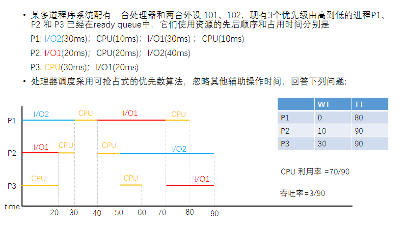
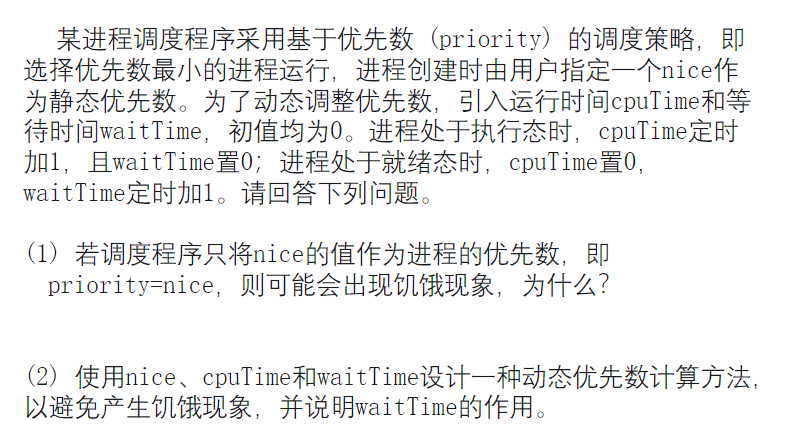

## CH5

#### 1

#### 2

**(1) 若调度程序只将nice的值作为进程的优先数，即priority=nice，则可能会出现饥饿现象，为什么？**

在仅使用`nice`值作为优先数的情况下，优先数较大的进程（即`nice`值较高的进程）将会有较低的调度优先级，进而可能长期无法被调度。这种情况下，优先数较小的进程（即`nice`值较低的进程）会频繁被调度，而优先数较大的进程可能始终无法获得执行机会，导致这些进程一直处于等待状态。这种现象就是所谓的**饥饿**现象，即某些进程由于调度优先级低而长期无法获得运行机会。

**(2) 使用nice、cpuTime和waitTime设计一种动态优先数计算方法，以避免产生饥饿现象，并说明waitTime的作用。**

为了避免饥饿现象，可以设计一种**动态优先数**计算方法，将`cpuTime`和`waitTime`引入到优先数计算中。一个合理的动态优先数计算方法可以是：

$priority=nice+α×cpuTime−β×waitTime\text{priority} = \text{nice} + \alpha \times \text{cpuTime} - \beta \times \text{waitTime}priority=nice+α×cpuTime−β×waitTime$

其中：

- `nice`：进程创建时指定的静态优先数，表示进程的基本优先级。
- `cpuTime`：进程的运行时间，表示进程已经消耗的CPU时间，可以防止某个进程长期占用CPU资源。`cpuTime`值越大，意味着该进程已经执行较长时间，优先级应该逐渐降低，从而给其他进程提供更多的调度机会。
- `waitTime`：进程的等待时间，表示该进程自上次被调度以来等待了多长时间。`waitTime`值越大，表示该进程长期没有被调度，优先级应该提升，以确保该进程不长期处于饥饿状态。

**waitTime的作用**在于：通过增加等待时间来提升进程的优先级，确保那些长期等待的进程能够在一定时间后得到调度，避免饥饿现象。随着`waitTime`的增加，优先数逐渐变小，从而增加该进程被选中的可能性。

- `\alpha` 和 `\beta` 是两个常数，用于调节 `cpuTime` 和 `waitTime` 对优先数的影响程度。通常，设置`β`较大以确保等待时间较长的进程能够优先被调度。

通过这种方法，调度程序可以兼顾`nice`值所反映的进程的重要性和`cpuTime`、`waitTime`所反映的动态因素，从而有效避免饥饿现象。
