<font face='SimSun'>

# <span id="jump0"></span><center>摘要</center>

<p style="text-indent:2em">本次课程设计题目为 "2048" ，由传统的 2048 游戏移至 FPGA 板设计而成。这款游戏极好地还原了网页版 2048 游戏的基本特征和游戏规则，使用 vga 显示游戏界面，使用 sword 板七段数码管显示得分，使用 PS2 键盘操作左移、右移、上移和下移，具有很强的可玩性。

关键词：数字逻辑，游戏，2048，Verilog，IP Core，FPGA

<div STYLE="page-break-after: always;"></div>

# 目录

## [摘要](#jump0)
## [第一章 绪论](#jump1)
### [1.1 基于 FPGA 的游戏设计背景](#jump2)
### [1.2 主要内容和难点](#jump3)
## [第二章 2048 游戏设计思路与原理](#jump4)
### [2.1 基于 FPGA 的游戏设计相关内容](#jump5)
### [2.2 基于 FPGA 的 2048 游戏设计方案](#jump6)
## [第三章 2048游戏设计实现](#jump7)
### [3.1 实现过程](#jump8)
### [3.2 调试过程](#jump9)
## [第四章 结果分析与用户反馈](#jump10)
### [4.1 结果检验与功能测试](#jump11)
### [4.2 操作说明与游戏演示](#jump12)
### [4.3 用户体验与反馈](#jump13)
## [第五章 总结与致谢](#jump14)
### [5.1 总结](#jump15)
### [5.2 致谢](#jump16)
## [第六章 小组成员分工](#jump17)

<div STYLE="page-break-after: always;"></div>

# <span id="jump1">第一章 绪论</span>

## <span id="jump2">1.1 基于 FPGA 的游戏设计背景</span>

<p style="text-indent:2em">Verilog HDL 是一种用于数字系统设计的语言。用 Verilog HDL 描述的电路设计就是该电路的 Verilog HDL 模型也称为模块。Verilog HDL 既是一种行为描述的语言也是一种结构描述的语言。这也就是说，无论描述电路功能行为的模块或描述元器件或较大部件互连的模块都可以用 Verilog 语言来建立电路模型。如果按照一定的规矩编写，功能行为模块可以通过工具自动地转换为门级互连模块。Verilog 模型可以是实际电路的不同级别的抽象。一个复杂电路系统的完整 Verilog HDL 模型是由若干个 Verilog HDL 模块构成的，每一个模块又可以由若干个子模块构成。其中有些模块需要综合成具体电路，而有些模块只是与用户所设计的模块有交互联系的现存电路或激励信号源。利用 Verilog HDL 语言结构所提供的这种功能就可以构造一个模块间的清晰层次结构来描述极其复杂的大型设计，并对所作设计的逻辑电路进行严格的验证。Verilog HDL 作为一种高级的硬件描述编程语言，与 C 语言的风格有许多类似之处。其中有许多语句如：if 语句、case 语句等和 C 语言中的对应语句十分相似。

<p style="text-indent:2em">FPGA 即现场可编程门阵列，它是在 PAL、GAL、CPLD 等可编程器件的基础上进一步发展的产物。它是作为专用集成电路（ASIC）领域中的一种半定制电路而出现的，既解决了定制电路的不足，又克服了原有可编程器件门电路数有限的缺点。以硬件描述语言（Verilog或VHDL）所完成的电路设计，可以经过简单的综合与布局，快速地烧录至FPGA上进行测试。这些可编程元件可以被用来实现一些基本的逻辑门电路或者更复杂的一些的组合功能。Xilinx的SWORD实验板为可编程的实验板，而且实验板还可以和许多外部设备进行连接，例如PS2、鼠标或者显示器，从而可以在FPGA的基础上设计使用PS2、鼠标的调用，或者显示器上显示图片。


## <span id="jump3">1.2 主要内容和难点</span>

### 1.1.1 主要内容

<p style="text-indent:2em">2048 是一款数字益智游戏。在一个 4x4 的方格中，每一轮都会出现一个数值为 2 或 4 的方块。玩家通过控制键盘上的 WADS 滑动方块，当两个相同数值的方块在移动的过程中碰撞到一起时，它们会合并成一个数值加倍的方块，直到获得一个总值为 2048 的方块，游戏获胜。每次合并得到一个数值加倍的方块时，玩家可以相应地获得方块上的分数。玩家可以在合并过程中，尝试获得更高的分数。当无法进行有效的合并操作并且无法再移动方块时，游戏结束。游戏结束后，七段数码管显示玩家的最高分数。玩家可以选择按键 P 来重复尝试，获得更高的分数。游戏的难度在于，在每一次滑动过后，系统会在随机空白位置产生新的随机数方块，玩家需要考虑每一步的移动，以避免方块填满整个方格且无法继续合并的情况。

### 1.1.2 技术要求

<p style="text-indent:2em">熟练掌握 Verilog 语言设计；掌握 SWORD 板的使用方法；掌握 VGA 显示原理和 PS2 键盘输入原理，理解并掌握状态机的设计。

### 1.1.3 实验目的

<p style="text-indent:2em">加深对模块化编程的理解，加强对硬件编程语言 Verilog 的掌握。

### 1.1.4 实验重点与难点

<p style="text-indent:2em">Coe 文件的生成与 IP 核的制作；键盘的输入；VGA 的正常显示； 游戏交互逻辑的设计。

# <span id="jump4">第二章 2048游戏设计思路与原理</span>

## <span id="jump5">2.1 基于 FPGA 的游戏设计相关内容</span>

### 2.1.1 VGA 显示

<p style="text-indent:2em">VGA(Video Graphics Array)，信号类型为模拟类型，显示卡端的接口为 15 针母插座。VGA( Video Graphics Array)作为一种标准的显示接口得到了广泛的应用。VGA 在任何时刻都必须工作在某一显示模式之下，其显示模式分为字符显示模式和图形显示模式。而在应用中，讨论的都是图形显示模式。

<p style="text-indent:2em">VGA 接口是一种 D 型接口，上面共有 15 针孔，分成三排，每排五个。其中比较重要的是 3 根 RGB 彩色分量信号和 2 根扫描同步信号 HSYNC 和 VSYNC 针。其引脚编号图如下图所示：


<p style="text-indent:2em">VGA 显示器扫描方式从屏幕左上角一点开始，从左向右逐点扫描，每扫描完一行,电子束回到屏幕的左边下一行的起始位置，在这期间，CRT 对电子束进行消隐，每行结束时，用行同步信号进行同步；当扫描完所有的行，形成一帧，用场同步信号进行场同步，并使扫描回到屏幕左上方，同时进行场消隐,开始下一帧。完成一行扫描的时间称为水平扫描时间，其倒数称为行频率；完成一帧（整屏）扫描的时间称为垂直扫描时间，其倒数称为场频率，即屏幕的刷新频率，常见的有 60Hz，75Hz 等等，但标准的 VGA 显示的场频 60Hz。其扫描示意图如下图所示：


VGA 的详细时序如下图所示：


总的来说，VGA 的时序主要包括行时序与场时序两个部分。

其中行时序主要包括：行同步(Hor Sync)、行消隐(Hor Back Porch)、行视频有效(Hor Active Video)和行前肩(Hor Front Porch)这四个参数，行时序的时序图如下图所示：


而场时序主要包括：场同步(Ver Sync)、场消隐(Ver Back Porch)、场视频有效(Ver Active Video)和场前肩(Ver Front Porch)这四个参数，场时序的时序图如下图所示：


需要注意的有三点：
- 行时序是以”像素”为单位的，场时序是以”行”为单位的。
- VGA 工业标准显示模式要求：行同步，场同步都为负极性，即同步脉冲要求是负脉冲。
- VGA 行时序对行同步时间、消隐时间、行视频有效时间和行前肩时间有特定的规范，场时序也是如此。常用 VGA 分辨率时序参数如下表所示：


### 2.1.2 PS2 键盘输入

<p style="text-indent:2em">PS/2 通信协议是一种双向同步串行通信协议。通信的两端通过 CLOCK(时钟脚)同步，并通过国 DATA(数据脚)交换数据。一般两设备间传输数据的最大时钟频率是 33kHz，大多数 PS/2 设备工作在 10--20kHz。推荐值在 15kHz 左右，也就是说，CLOCK 高、低电平的持续时间都为 40us。每一数据帧包含 11-12 位，具体含义如下图所示：

| 数据 | 含义 |
| --------- | ------------ |
| 1个起始位 | 总是逻辑0 |
| 8个数据位 | (LSB)低位在前 |
| 1个奇偶检验位 | 奇校验 |
| 1个停止位 | 总是逻辑1 |
| 1个应答位 | 仅用在主机对设备的通信中 |

<p style="text-indent:2em">数据在 PS/2 时钟的下降沿读取，PS/2 的时钟频率为 10—16.7kHz。对于 PS/2 设备，一般来说从时钟脉冲的上升沿到一个数据转变的时间至少要有 5us；数据变化到下降沿的时间至少要有 5us，并且不大于 25us，这个时序非常重要应该严格遵循。主机可以再第 11 个时钟脉冲停止位之前把时钟线拉低，使设备放弃发送当前字节，当然这种情况比较少见。在停止位发送后设备在发送下个包前应该至少等待 50us，给主机时间做相应的处理。不过主机处理接收到的字节时一般会抑制发送(主机在收到每个包时通常自动做这个)。在主机释放抑制后，设备至少应该在发送任何数据前等 50us。

### 2.1.3 可编辑阵列逻辑

<p style="text-indent:2em">PAL 器件由可编程的与阵列、固定的或阵列和输出反馈单元组成。不同型号 PAL 器件有不同的可编程阵列逻辑输出和反馈结构，适用于各种组合逻辑电路和时序逻辑电路的设计，是一种可程式化的装置。PLA 具有一组可程式化的 AND 阶，AND 阶之后连接一组可程式化的 OR 阶，如此可以达到：只在合乎设定条件时才允许产生逻辑讯号输出。

<p style="text-indent:2em">PLA 如此的逻辑闸布局能用来规划大量的逻辑函式，这些逻辑函式必须先以积项（有时是多个积项）的原始形式进行齐一化。在 PLA 的应用中，有一种是用来控制资料路径，在指令集内事先定义好逻辑状态，并用此来产生下一个逻辑状态（透过条件分支）。举例来说，如果目前机器（指整个逻辑系统）处于二号状态，如果接下来的执行指令中含有一个立即值（侦测到立即值的栏位）时，机器就从第二状态转成四号状态，并且也可以进一步定义进入第四状态后的接续动作。因此 PLA 等于扮演（晶片）系统内含的逻辑状态图（state diagram）角色。

### 2.1.4  状态机的设计 

<p style="text-indent:2em">有限状态机（Finite State Machine FSM）是时序电路设计中经常采用的一种方式，尤其适合设计数字系统的控制模块，在一些需要控制高速器件的场合，用状态机进行设计是一种很好的解决问题的方案，具有速度快、结构简单、可靠性高等优点。有限状态机非常适合用 FPGA 器件实现，用 Verilog HDL 的 case 语句能很好地描述基于状态机的设计，再通过 EDA 工具软件的综合，一般可以生成性能极优的状态机电路，从而使其在执行时间、运行速度和占用资源等方面优于用 CPU 实现的方案。

<p style="text-indent:2em">有限状态机一般包括组合逻辑和寄存器逻辑两部分，寄存器逻辑用于存储状态，组合逻辑用于状态译码和产生输出信号。根据输出信号产生方法的不同，状态机可分为两类： 米里型(Mealy)和摩尔型(Moore)。摩尔型状态机的输出只是当前状态的函数。米里型状态机的输出是在输入变化后立即变化的，不依赖时钟信号的同步，摩尔型状态机的输入发生变化时还需要等待时钟的到来，必须在状态发生变化时才会导致输出的变化，因此比米里型状态机要多等待一个时钟周期。

### 2.1.5 硬件描述语言

<p style="text-indent:2em">Verilog HDL 是一种用于数字系统设计的语言。用 Verilog HDL 描述的电路设计就是该电路的 Verilog HDL 模型也称为模块。Verilog HDL 既是一种行为描述的语言也是一种结构描述的语言。这也就是说，无论描述电路功能行为的模块或描述元器件或较大部件互连的模块都可以用 Verilog 语言来建立电路模型。如果按照一定的规矩编写，功能行为模块可以通过工具自动地转换为门级互连模块。Verilog 模型可以是实际电路的不同级别的抽象。一个复杂电路系统的完整 Verilog HDL 模型是由若干个 Verilog HDL 模块构成的，每一个模块又可以由若干个子模块构成。其中有些模块需要综合成具体电路，而有些模块只是与用户所设计的模块有交互联系的现存电路或激励信号源。利用 Verilog HDL 语言结构所提供的这种功能就可以构造一个模块间的清晰层次结构来描述极其复杂的大型设计，并对所作设计的逻辑电路进行严格的验证。Verilog HDL 作为一种高级的硬件描述编程语言，与 C 语言的风格有许多类似之处。其中有许多语句如：if 语句、case 语句等和 C 语言中的对应语句十分相似。

### 2.1.6 技术工具

#### 1. ISE 软件

<p style="text-indent:2em">ISE 是使用 XILINX 的 FPGA 的必备的设计工具。它可以完成 FPGA 开发的全部流程，包括设计输入、仿真、综合、布局布线、生成 BIT 文件、配置以及在线调试等，功能非常强大。ISE 除了功能完整，使用方便外，它的设计性能也非常好，以集成的时序收敛流程整合了增强性物理综合优化，提供最佳的时钟布局、更好的封装和时序收敛映射，从而获得更高的设计性能。

#### 2. SWORD 板

<p style="text-indent:2em">采用开放式体系构架和 32 位存储层次结构，通用性强，适用性灵活。实验方法采用基于 FPGA 实体的虚拟实验箱和 SOC 集成技术，支持个性化开发、课程设计和创新实践。系统资源可很好地支持数字电路、计算机组成、计算机体系结构、接口通讯、编译技术、操作系统、计算机网络、基于 IP 核的嵌入式系统和多媒体等课程的教学实践。

#### 3. 计算机
<p style="text-indent:2em">搭载有ISE14.7开发环境，安装有必要的软件，能进行Verilog代码的综合、综合、布局布线和比特流的烧录。

#### 4. WPS Office

<p style="text-indent:2em">用于对图片进行美术处理和加工，同时对图片像素进行适当裁剪以适应 VGA 显示。

#### 5. Python

<p style="text-indent:2em">通过编写 Python 爬虫程序，爬取 https://play2048.co/ 上相关资料与图片素材，以便后续处理使用。

<p style="text-indent:2em">通过编写 Python 程序，把 png 图片转为 3 位 16 进制 coe 文件，使之与 VGA 显示相适应。

### 2.1.7 课程设计方法

<p style="text-indent:2em">通过 WPS 设计游戏游戏画面和贴画，通过 Python 编写程序实现素材爬取和 coe 文件生成，利用 Verilog HDL 硬件描述语言设计游戏，实现用 PS2 键盘输入数据，用 VGA 输出显示数据，使用 ISE 软件生成 bit 文件，利用可编程阵列逻辑烧在 SWORD 实验电路板上，最终实现人机互动游戏。

## <span id="jump6">2.2 基于 FPGA 的 2048 游戏设计方案</span>

### 2.2.1 技术需求

<p style="text-indent:2em">VGA 扫描显示开始界面，游戏界面以及结束界面；PS2 键盘输入数据处理为控制方块移动方向信号、界面切换信号；核心模块对输入信号用状态机进行逻辑处理，输出。

### 2.2.2 设计方案

#### 1. 输入和输出

<p style="text-indent:2em">本游戏用外接键盘或开关进行输入，采用四个方向按键，分别控制方块进行上下左右的移动；P键控制游戏从重新开始；开关AF13控制游戏重新回到开始界面。输出由两部分组成，一部分为 VGA 模块的显示器游戏界面输出；另一部分为主板上七段数码管显示的游戏得分。

#### 2. 整体设计方案

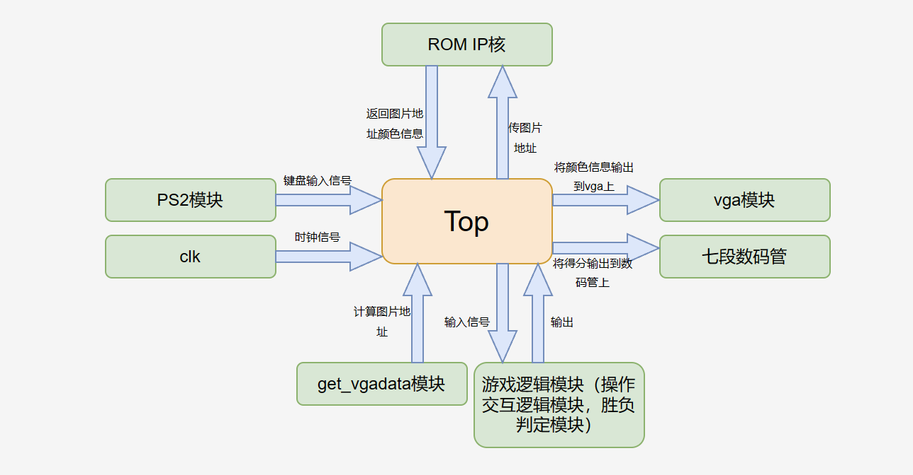

分析说明：VGA 接口负责 VGA 显示屏与核心模块之间的数据传输；PS2 接口负责键盘与核心模块之间的数据传输，实现丰富的人机交互；主板开关 sw[3:0]、rst作为控制与操作信号；get_vgadata模块获取当前图片地址信息；ROM 存储需要显示的图片颜色信息，使画面更加精美；2048游戏逻辑核心模块处理输入数据，进行主逻辑的状态机运行，并进行输出。

#### 3. 游戏整体流程

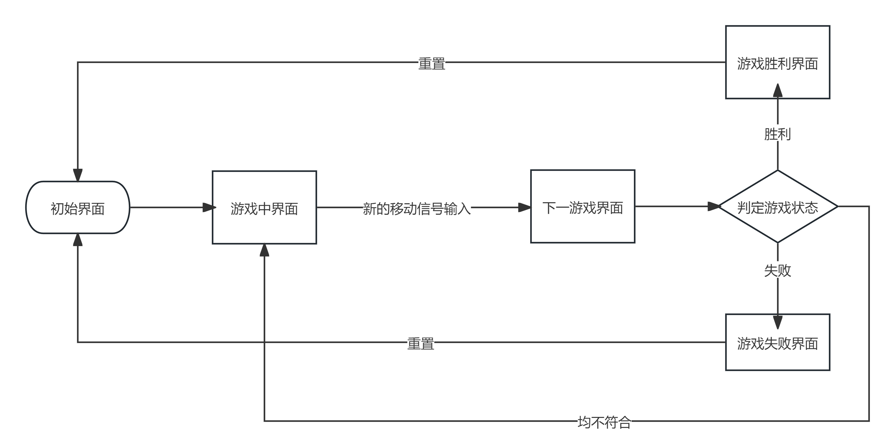

#### 4. 按键输入交互流程

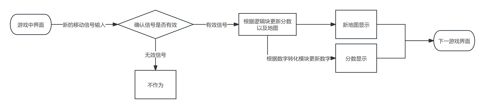

#### 5. 模块工作流程

##### （1）vga显示模块
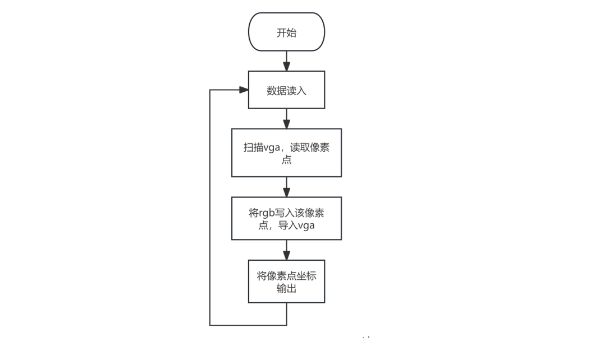

##### （2）游戏逻辑模块
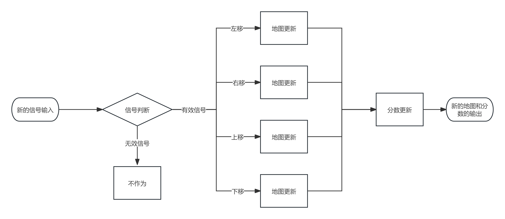

##### （3）胜负判定模块
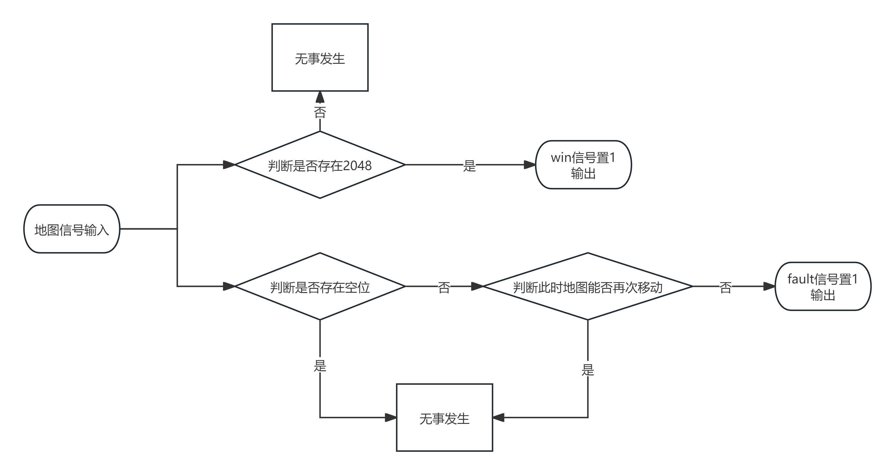


# <span id="jump7">第三章 2048 游戏设计实现</span>

## <span id="jump8">3.1 实现过程</span>

### 3.1.1 素材生成部分

#### 3.1.1.1 png 图片格式转 coe 文件
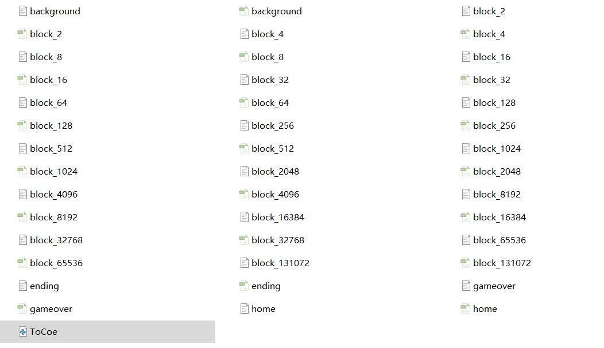

该部分使用 python 完成，实现语言具体如下：

```python
import numpy as np
from PIL import Image

# 定义图像路径
img_paths = ['gameover.png']

# 读取并处理每个图像，提取RGB值
def gen_img_data():
    img_data = []
    for idx, path in enumerate(img_paths):
        img = Image.open(path).convert('RGB')  # 转换为RGB模式
   # print(img_data)

    return img_data

# 十进制转十六进制字符串，保证一位数表示
def to_hex(dec):
    return format(dec >> 4, 'x')  # 右移4位，减少到4位

# 将所有图像的RGB值合并到一个.coe文件中，并转换为十六进制
def gen_coe(img_data):
    with open('gameover.coe', 'w') as f:
        f.writelines('memory_initialization_radix = 16;\nmemory_initialization_vector =\n')

        for img in img_data:
            for i in range(img.shape[0]):
                for j in range(img.shape[1]):
                    r, g, b = img[i][j]
                    f.write(f"{to_hex(r)}{to_hex(g)}{to_hex(b)}, ")

                f.write('\n')


# print('1')
img_data = gen_img_data()
gen_coe(img_data)
```

#### 3.1.1.2 coe 文件生成 IP 核
具体操作如下：
1、创建 ip 核，命名。
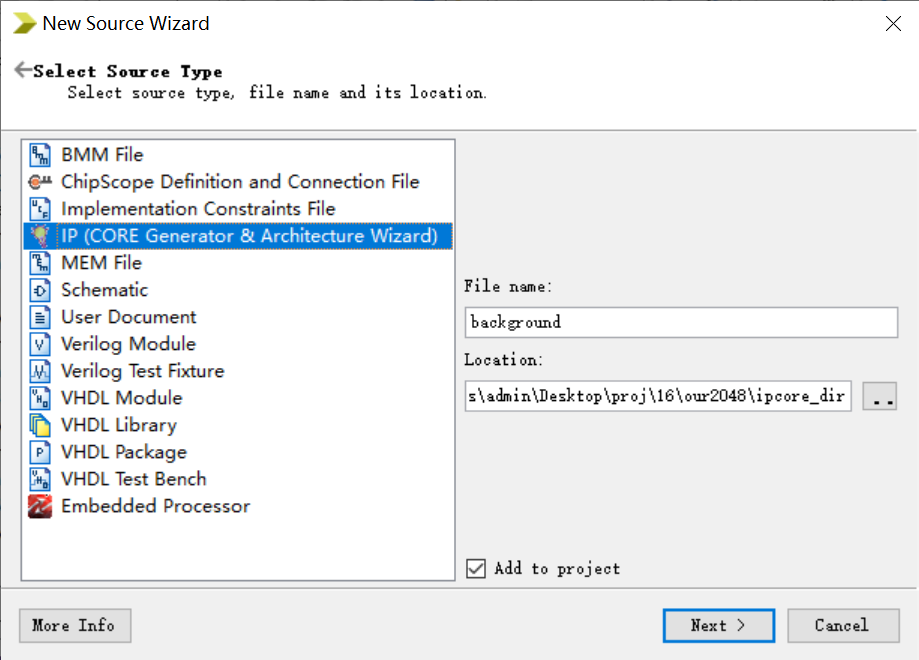
2、选择 Block Memory Generator，点击 next。
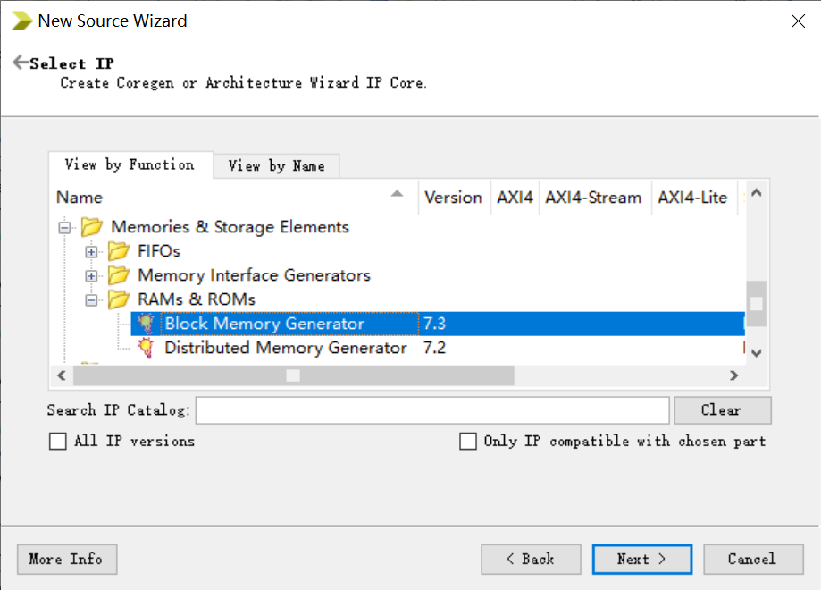
3、选择内存类型为ROM
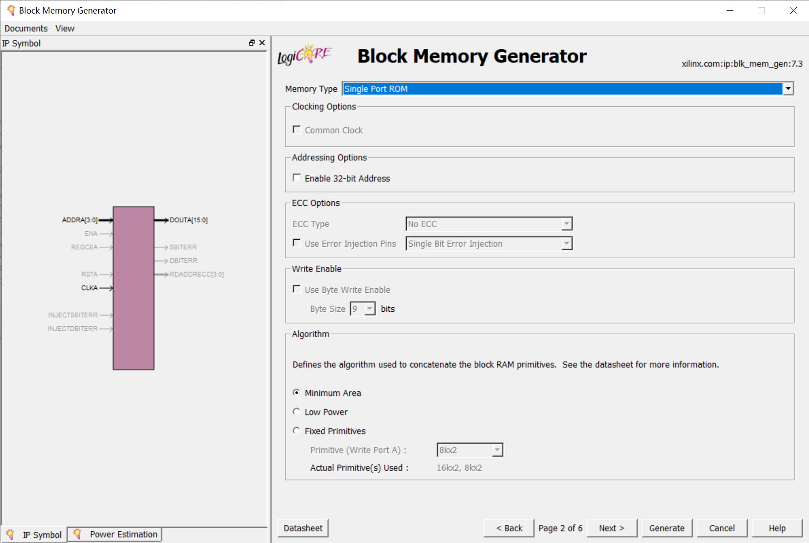
4、调整合适的参数。其中 Write Width 是输出的位数，由于 vga 是 12 位输出，所以我们选择 12。Wirte Depth 是图片的大小，由于 vga 的显示屏大小是 640*480，所以我们填入的参数是 307200（640*480）。由左边的symbol 可以看出，ADDRA 是 ip 核的输入，也就是图片的地址，CLKA 是扫描频率，DOUTA是输出。
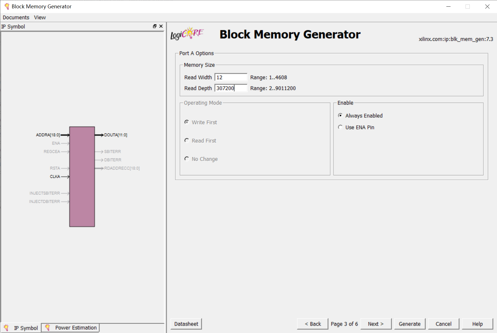
5、在page4选择想要显示的图片的coe文件。
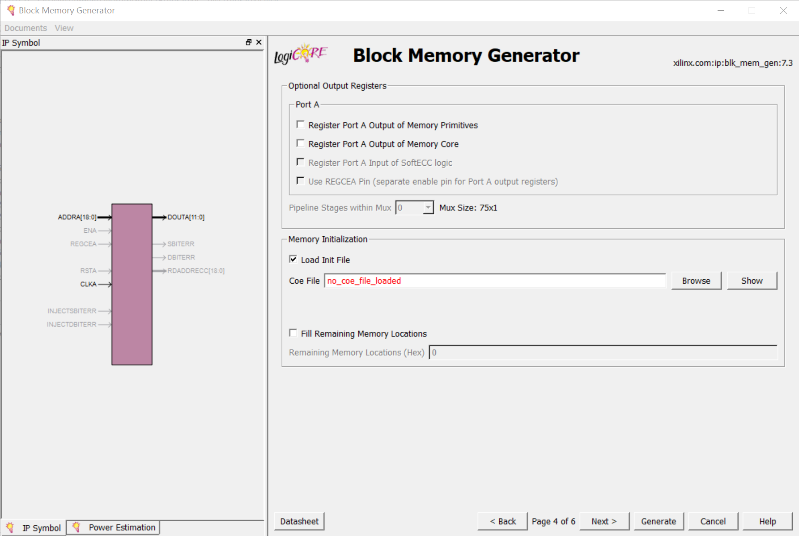
6、选择完毕后，点击generate即可生成ip核，ip核会根据coe文件的大小来加载，所以图片越大，加载的时间越长，画面未响应的现象是非常正常的。
7、成功生成后，会出现这样的图标
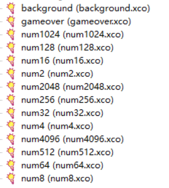


### 3.1.2 游戏主体部分

#### 3.1.2.1 逻辑实现部分（logic_part.v）

由于源代码过长，这里我们使用伪代码进行代码描述。

```verilog
// Inputs
var clk, rst, keycode, keydown
var btn[3:0]

// Outputs
var mmap[63:0], num[31:0]

// Internal variables
var count, rand, i, j, temp, place
var map[15:0]
var judge, thisnumber, loop
var lastkey, lastbtn

// Initialization
map[2:15] = 0
map[0] = 1
map[1] = 1
place = 0
judge = 1
thisnumber = 1
num = 0

// Game Logic
on clock edge:
    if (rst or (keydown and keycode == 8'h4d)):
        // Reset
        map[2:15] = 0
        map[4] = 1
        map[6] = 2
        map[8] = 3
        map[9] = 2
        map[12] = 3
        map[13] = 3
        map[0] = 0
        map[1] = 1
        place = 0
        judge = 1
        thisnumber = 1
        num = 0
        lastkey = 0
        lastbtn = 0
    else:
        if btn[0] == 1 and lastbtn != 4'b0001 or (keydown and keycode == 8'h6b and keycode != lastkey):
            // Move left
            for i in range(4):
                temp = 0
                for j in range(1, 4):
                    if map[4*i+j] != 0:
                        if map[4*i+temp] == 0:
                            map[4*i+temp] = map[4*i+j]
                            map[4*i+j] = 0
                        else if map[4*i+temp] == map[4*i+j]:
                            map[4*i+temp] = map[4*i+temp] + 1
                            map[4*i+j] = 0
                            for loop in range(map[4*i+temp]):
                                thisnumber = thisnumber * 2
                            num = num + thisnumber
                            thisnumber = 1
                            temp = temp + 1
                        else:
                            map[4*i+temp+1] = map[4*i+j]
                            if temp+1 != j:
                                map[4*i+j] = 0
                            temp = temp + 1
            // Generate random number at an empty location
            for rand in range(16):
                if map[place] == 0:
                    map[place] = 1
                    place = (place + 1) % 16
                    judge = 0
                else:
                    place = (place + 1) % 16
            judge = 1
            lastbtn = 4'b0001
            lastkey = 8'h6b
        else if btn[1] == 1 and lastbtn != 4'b0010 or (keydown and keycode == 8'h74 and keycode != lastkey):
            // Move right
            // (similar logic as above, with adjustments for right movement)
        else if btn[3] == 1 and lastbtn != 4'b1000 or (keydown and keycode == 8'h72 and keycode != lastkey):
            // Move down
            // (similar logic as above, with adjustments for down movement)
        else if btn[2] == 1 and lastbtn != 4'b0100 or (keydown and keycode == 8'h75 and keycode != lastkey):
            // Move up
            // (similar logic as above, with adjustments for up movement)
```

#### 3.1.2.2 结果判定部分 (win.v)

```verilog
// Inputs
var clk, rst, keycode, keydown
var mmap[63:0]

// Outputs
var win, fault

// Internal variables
var map[15:0]
var count, temp, i

on each rising edge of clk:
    if rst or (keydown and keycode == 8'h4d):
        // Reset
        win = 0
        fault = 0
    else:
        temp = 0
        count = 0

        // Extracting 4-bit values from mmap
        for i in range(16):
            map[i] = mmap[i*4 +: 4]

        // Check for win condition (presence of 2048)
        for i in range(16):
            if map[i] == 11:
                win = 1

        // Check for potential moves (matching adjacent tiles)
        for i in range(4):
            if map[i] == map[i+4] or map[i+4] == map[i+8] or map[i+8] == map[i+12]:
                temp = 1

        for i in range(0, 13, 4):
            if map[i] == map[i+1] or map[i+1] == map[i+2] or map[i+2] == map[i+3]:
                temp = 1

        // Check for a fault (no empty positions for new numbers and no potential moves)
        if count == 0:
            if temp == 0:
                fault = 1

```

#### 3.1.2.3数字转化部分

```verilog
// Inputs
var clk
var num_in[31:0]

// Outputs
var num_out[31:0]

// Internal variables
var num, out_num[7:0]

on each rising edge of clk:
    // Copy input to internal variable
    num[31:0] = num_in[31:0]

    // Extract digits from num
    out_num[0] = num % 10
    num = num / 10
    out_num[1] = num % 10
    num = num / 10
    out_num[2] = num % 10
    num = num / 10
    out_num[3] = num % 10
    num = num / 10
    out_num[4] = num % 10
    num = num / 10
    out_num[5] = num % 10
    num = num / 10
    out_num[6] = num % 10
    num = num / 10
    out_num[7] = num % 10

    // Assign digits to output in reverse order
    num_out[3:0] = out_num[0]
    num_out[7:4] = out_num[1]
    num_out[11:8] = out_num[2]
    num_out[15:12] = out_num[3]
    num_out[19:16] = out_num[4]
    num_out[23:20] = out_num[5]
    num_out[27:24] = out_num[6]
    num_out[31:28] = out_num[7]

```

### 3.1.3 输入输出部分

#### 3.1.3.1 PS2键盘（PS2.v）

PS2键盘传输的数据会在data_out中输出

```verilog
module PS2(
	input clk,
	input rst,
	input ps2_clk, //键盘时钟输入
	input ps2_data, //键盘数据输入
	output [9:0] data_out, //键盘扫描输出
	output ready
 );
	
	reg ps2_clk_flag0,ps2_clk_flag1,ps2_clk_flag2;
	wire negedge_ps2_clk;
	always@(posedge clk or posedge rst)begin //判断键盘输出时钟是否有连续低电平
		if(rst)begin //来应用请求发送
			ps2_clk_flag0 <= 1'b0;
			ps2_clk_flag1 <= 1'b0;
			ps2_clk_flag2 <= 1'b0;
		end
		else begin
			ps2_clk_flag0 <= ps2_clk;
			ps2_clk_flag1 <= ps2_clk_flag0;
			ps2_clk_flag2 <= ps2_clk_flag1;
		end
	end
	assign negedge_ps2_clk = !ps2_clk_flag1 &ps2_clk_flag2;
	reg [3:0] num;
	always @(posedge clk or posedge rst)begin
		if(rst)
			num <= 4'd0;
		else if(num==4'd11)
			num <= 4'd0;
		else if(negedge_ps2_clk)
			num <= num +1'b1;
		end
	reg negedge_ps2_clk_shift;
	always @(posedge clk) begin
		negedge_ps2_clk_shift <= negedge_ps2_clk;
	end
	reg [7:0] temp_data;
	always @(posedge clk or posedge rst)begin
		if(rst)
			temp_data <= 8'd0;
		else if(negedge_ps2_clk_shift) begin //键盘时钟连续低电平接收数据
 
			case(num) //存储八个数据位
			4'd2 : temp_data[0] <= ps2_data;
			4'd3 : temp_data[1] <= ps2_data;
			4'd4 : temp_data[2] <= ps2_data;
			4'd5 : temp_data[3] <= ps2_data;
			4'd6 : temp_data[4] <= ps2_data;
			4'd7 : temp_data[5] <= ps2_data;
			4'd8 : temp_data[6] <= ps2_data;
			4'd9 : temp_data[7] <= ps2_data;
			default : temp_data <= temp_data;
			endcase
		end else
			temp_data <= temp_data;
		end
	reg data_break,data_done,data_expand;
	reg [9:0] data;
	always @(posedge clk or posedge rst)begin
		if(rst) begin
			data_break <= 1'b0;
			data <= 10'd0;
			data_done <=1'b0;
			data_expand <= 1'b0;
		end
		else if(num == 4'd11)begin
			if(temp_data == 8'hE0)
				data_expand <= 1'b1; //键盘扩张键
			else if(temp_data == 8'hF0)
				data_break <= 1'b1;
			else begin
				data <= {data_expand,data_break,temp_data};
				data_done <= 1'b1; //键盘数据已准备好输出
				data_expand <= 1'b0;
				data_break <=1'b0;
			end
		end
		else begin
			data <= data;
			data_done <= 1'b0;
			data_expand <= data_expand;
			data_break <= data_break;
		end
	end
 
	assign data_out = data;
	assign ready = data_done; //输出键盘数据
endmodule
```

#### 3.1.3.2 vga显示输出（vgac.v和get_vgadata.v）

##### （1）get_vgadata.v模块
VGA的显示分为三个步骤
1、我们首先调用生成的ip核的模块。
```
background b1(.clka(clka), .addra(background_addr), .douta(background_rgb)); 
```
2、接着，我们根据vga扫描到的行和列的地址给ip核的输入地址进行赋值。
3、在给输入地址赋值完毕后，我们就可以根据vga扫描到的行和列的地址给vga显示数据赋值。即选择合适的ip核的输出赋给vga_data。


```verilog
module get_vgadata(
	input clk,
	input clka,
	input [8:0] row_addr, 
	input [9:0] col_addr,
	input [63:0] inmap,
	input rst,
	input keydown,
	input keycode,
	input win,
	input fault,
	output reg [11:0] vga_data
    );
	
	parameter block_width = 78;
	parameter block_mid = 14;
	parameter block_mid_left = 15;
	parameter block1_rowst = 63;
	parameter block1_colst = 239;
	
	wire [3:0] map [15:0];
	assign map[0] = inmap[3:0];
	assign map[1] = inmap[7:4];
	assign map[2] = inmap[11:8];
	assign map[3] = inmap[15:12];
	assign map[4] = inmap[19:16];
	assign map[5] = inmap[23:20];
	assign map[6] = inmap[27:24];
	assign map[7] = inmap[31:28];
	assign map[8] = inmap[35:32];
	assign map[9] = inmap[39:36];
	assign map[10] = inmap[43:40];
	assign map[11] = inmap[47:44];
	assign map[12] = inmap[51:48];
	assign map[13] = inmap[55:52];
	assign map[14] = inmap[59:56];
	assign map[15] = inmap[63:60];

	reg [18:0] start_addr;
	wire [11:0] start_rgb;
	reg [18:0] background_addr;
	wire [11:0] background_rgb;
	reg [18:0] gameover_addr;
	wire [11:0] gameover_rgb;
	reg [12:0] num2_addr;
	wire [11:0] num2_rgb;
	reg [12:0] num4_addr;
	wire [11:0] num4_rgb;
	reg [12:0] num8_addr;
	wire [11:0] num8_rgb;
	reg [12:0] num16_addr;
	wire [11:0] num16_rgb;
	reg [12:0] num32_addr;
	wire [11:0] num32_rgb;
	reg [12:0] num64_addr;
	wire [11:0] num64_rgb;
	reg [12:0] num128_addr;
	wire [11:0] num128_rgb;
	reg [12:0] num256_addr;
	wire [11:0] num256_rgb;
	reg [12:0] num512_addr;
	wire [11:0] num512_rgb;
	reg [12:0] num1024_addr;
	wire [11:0] num1024_rgb;
	reg [12:0] num2048_addr;
	wire [11:0] num2048_rgb;
	
	// IP核调用
	start s1(.clka(clka), .addra(start_addr), .douta(start_rgb));
	background b1(.clka(clka), .addra(background_addr), .douta(background_rgb));
	gameovers g1(.clka(clka), .addra(gameover_addr), .douta(gameover_rgb));
	num2 n1(.clka(clka), .addra(num2_addr), .douta(num2_rgb));
	num4 n2(.clka(clka), .addra(num4_addr), .douta(num4_rgb));
	num8 n3(.clka(clka), .addra(num8_addr), .douta(num8_rgb));
	num16 n4(.clka(clka), .addra(num16_addr), .douta(num16_rgb));
	num32 n5(.clka(clka), .addra(num32_addr), .douta(num32_rgb));
	num64 n6(.clka(clka), .addra(num64_addr), .douta(num64_rgb));
	num128 n7(.clka(clka), .addra(num128_addr), .douta(num128_rgb));
	num256 n8(.clka(clka), .addra(num256_addr), .douta(num256_rgb));
	num512 n9(.clka(clka), .addra(num512_addr), .douta(num512_rgb));
	num1024 n10(.clka(clka), .addra(num1024_addr), .douta(num1024_rgb));
	num2048 n11(.clka(clka), .addra(num2048_addr), .douta(num2048_rgb));
	
	// 获取IP核图像相对地址
	always @(posedge clk) begin
		if(col_addr>=block1_colst && col_addr<=block1_colst+block_width 
		&& row_addr>=block1_rowst && row_addr<=block1_rowst+block_width) begin // 第一个块（0，0）
			start_addr <= (col_addr>=0 && col_addr<=639 && row_addr>=0 && row_addr<=479) ?row_addr*640+col_addr :0;
			background_addr <= (col_addr>=0 && col_addr<=639 && row_addr>=0 && row_addr<=479) ?row_addr*640+col_addr :0;
			gameover_addr <= (col_addr>=0 && col_addr<=639 && row_addr>=0 && row_addr<=479) ?row_addr*640+col_addr :0;
			num2_addr <= (row_addr-block1_rowst)*block_width + (col_addr-block1_colst);
			num4_addr <= (row_addr-block1_rowst)*block_width + (col_addr-block1_colst);
			num8_addr <= (row_addr-block1_rowst)*block_width + (col_addr-block1_colst);
			num16_addr <= (row_addr-block1_rowst)*block_width + (col_addr-block1_colst);
			num32_addr <= (row_addr-block1_rowst)*block_width + (col_addr-block1_colst);
			num64_addr <= (row_addr-block1_rowst)*block_width + (col_addr-block1_colst);
			num128_addr <= (row_addr-block1_rowst)*block_width + (col_addr-block1_colst);
			num256_addr <= (row_addr-block1_rowst)*block_width + (col_addr-block1_colst);
			num512_addr <= (row_addr-block1_rowst)*block_width + (col_addr-block1_colst);
			num1024_addr <= (row_addr-block1_rowst)*block_width + (col_addr-block1_colst);
			num2048_addr <= (row_addr-block1_rowst)*block_width + (col_addr-block1_colst);
		end
		else if(col_addr>=block1_colst+block_width+block_mid_left && col_addr<=block1_colst+block_width*2+block_mid_left 
		&& row_addr>=block1_rowst && row_addr<=block1_rowst+block_width) begin // 第二个块（0，1）
			······
		end
		else if(col_addr>=block1_colst+block_width*2+block_mid_left*2 && col_addr<=block1_colst+block_width*3+block_mid_left*2 
		&& row_addr>=block1_rowst && row_addr<=block1_rowst+block_width) begin // 第三个块（0，2）
			......
		end
		else if(col_addr>=block1_colst+block_width*3+block_mid_left*3 && col_addr<=block1_colst+block_width*4+block_mid_left*3 
		&& row_addr>=block1_rowst && row_addr<=block1_rowst+block_width) begin // 第四个块（0，3）
			······
		end
		
		else if(col_addr>=block1_colst && col_addr<=block1_colst+block_width 
		&& row_addr>=block1_rowst+block_width+block_mid && row_addr<=block1_rowst+block_width*2+block_mid) begin // 第五个块（1，0）
			······
		end
		else if(col_addr>=block1_colst+block_width+block_mid_left && col_addr<=block1_colst+block_width*2+block_mid_left 
		&& row_addr>=block1_rowst+block_width+block_mid && row_addr<=block1_rowst+block_width*2+block_mid) begin // 第六个块（1，1）
			······
		end
		else if(col_addr>=block1_colst+block_width*2+block_mid_left*2 && col_addr<=block1_colst+block_width*3+block_mid_left*2 
		&& row_addr>=block1_rowst+block_width+block_mid && row_addr<=block1_rowst+block_width*2+block_mid) begin // 第七个块（1，2）
			······
		end
		else if(col_addr>=block1_colst+block_width*3+block_mid_left*3 && col_addr<=block1_colst+block_width*4+block_mid_left*3 
		&& row_addr>=block1_rowst+block_width+block_mid && row_addr<=block1_rowst+block_width*2+block_mid) begin // 第八个块（1，3）
			······
		end
		else if(col_addr>=block1_colst && col_addr<=block1_colst+block_width 
		&& row_addr>=block1_rowst+block_width*2+block_mid*2 && row_addr<=block1_rowst+block_width*3+block_mid*2) begin // 第九个块（2，0）
			······
		end
		else if(col_addr>=block1_colst+block_width+block_mid && col_addr<=block1_colst+block_width*2+block_mid_left
		&& row_addr>=block1_rowst+block_width*2+block_mid*2 && row_addr<=block1_rowst+block_width*3+block_mid*2) begin // 第十个块（2，1）
			······
		end
		else if(col_addr>=block1_colst+block_width*2+block_mid_left*2 && col_addr<=block1_colst+block_width*3+block_mid_left*2 
		&& row_addr>=block1_rowst+block_width*2+block_mid*2 && row_addr<=block1_rowst+block_width*3+block_mid*2) begin // 第十一个块（2，2）
			······
		end
		else if(col_addr>=block1_colst+block_width*3+block_mid_left*3 && col_addr<=block1_colst+block_width*4+block_mid_left*3 
		&& row_addr>=block1_rowst+block_width*2+block_mid*2 && row_addr<=block1_rowst+block_width*3+block_mid*2) begin // 第十二个块（2，3）
			······
		end
		else if(col_addr>=block1_colst && col_addr<=block1_colst+block_width 
		&& row_addr>=block1_rowst+block_width*3+block_mid*3 && row_addr<=block1_rowst+block_width*4+block_mid*3) begin // 第十三个块（3，0）
			······
		end
		
		else if(col_addr>=block1_colst+block_width+block_mid_left && col_addr<=block1_colst+block_width*2+block_mid_left 
		&& row_addr>=block1_rowst+block_width*3+block_mid*3 && row_addr<=block1_rowst+block_width*4+block_mid*3) begin // 第十四个块（3，1）
			······
		end
		else if(col_addr>=block1_colst+block_width*2+block_mid_left*2 && col_addr<=block1_colst+block_width*3+block_mid_left*2 
		&& row_addr>=block1_rowst+block_width*3+block_mid*3 && row_addr<=block1_rowst+block_width*4+block_mid*3) begin // 第十五个块（3，2）
			······
		end
		else if(col_addr>=block1_colst+block_width*3+block_mid_left*3 && col_addr<=block1_colst+block_width*4+block_mid_left*3 
		&& row_addr>=block1_rowst+block_width*3+block_mid*3 && row_addr<=block1_rowst+block_width*4+block_mid*3) begin // 第十六个块（3，3）
			······
		end

		else if(col_addr>=0 && col_addr<=639 && row_addr>=0 && row_addr<=479) begin// 其他位置
		   start_addr <= (col_addr>=0 && col_addr<=639 && row_addr>=0 && row_addr<=479) ?row_addr*640+col_addr :0;
			background_addr <= (col_addr>=0 && col_addr<=639 && row_addr>=0 && row_addr<=479) ?row_addr*640+col_addr :0;
			gameover_addr <= (col_addr>=0 && col_addr<=639 && row_addr>=0 && row_addr<=479) ?row_addr*640+col_addr :0;
		   num2_addr <= 0;
		   num4_addr <= 0;
		   num8_addr <= 0;
		   num16_addr <= 0;
		   num32_addr <= 0;
		   num64_addr <= 0;
		   num128_addr <= 0;
		   num256_addr <= 0;
		   num512_addr <= 0;
		   num1024_addr <= 0;
		   num2048_addr <= 0;
		end
	end

	// 获取vga_data
	always@(*) begin
		if(!rst || (keydown && keycode == 8'h4d)) begin
			if(col_addr>=0 && col_addr<=639 && row_addr>=0 && row_addr<=479) // 初始界面
				vga_data <= start_rgb;
		end
		else
		if(win || fault) begin
			if(col_addr>=0 && col_addr<=639 && row_addr>=0 && row_addr<=479) // 游戏结束界面
				vga_data <= gameover_rgb;
		end
		else
		if(col_addr>=block1_colst && col_addr<=block1_colst+block_width 
		&& row_addr>=block1_rowst && row_addr<=block1_rowst+block_width) begin // 第一个块 （0，0）
			case (map[0])
				4'h0: vga_data <= background_rgb;
				4'h1: vga_data <= num2_rgb;
				4'h2: vga_data <= num4_rgb;
				4'h3: vga_data <= num8_rgb;
				4'h4: vga_data <= num16_rgb;
				4'h5: vga_data <= num32_rgb;
				4'h6: vga_data <= num64_rgb;
				4'h7: vga_data <= num128_rgb;
				4'h8: vga_data <= num256_rgb;
				4'h9: vga_data <= num512_rgb;
				4'ha: vga_data <= num1024_rgb;
				4'hb: vga_data <= num2048_rgb;
			endcase
		end
		else if(col_addr>=block1_colst+block_width+block_mid_left && col_addr<=block1_colst+block_width*2+block_mid_left 
		&& row_addr>=block1_rowst && row_addr<=block1_rowst+block_width) begin // 第二个块 （0，1）
			······
		end
		else if(col_addr>=block1_colst+block_width*2+block_mid_left*2 && col_addr<=block1_colst+block_width*3+block_mid_left*2 
		&& row_addr>=block1_rowst && row_addr<=block1_rowst+block_width) begin // 第三个块 （0，2）
			······
		end
		else if(col_addr>=block1_colst+block_width*3+block_mid_left*3 && col_addr<=block1_colst+block_width*4+block_mid_left*3 
		&& row_addr>=block1_rowst && row_addr<=block1_rowst+block_width) begin // 第四个块 （0，3）
			······
		end
		
		else if(col_addr>=block1_colst && col_addr<=block1_colst+block_width 
		&& row_addr>=block1_rowst+block_width+block_mid && row_addr<=block1_rowst+block_width*2+block_mid) begin // 第五个块 （1，0）
			······
		end
		else if(col_addr>=block1_colst+block_width+block_mid_left && col_addr<=block1_colst+block_width*2+block_mid_left
		&& row_addr>=block1_rowst+block_width+block_mid && row_addr<=block1_rowst+block_width*2+block_mid) begin // 第六个块 （1，1）
			······
		end
		else if(col_addr>=block1_colst+block_width*2+block_mid_left*2 && col_addr<=block1_colst+block_width*3+block_mid_left*2 
		&& row_addr>=block1_rowst+block_width+block_mid && row_addr<=block1_rowst+block_width*2+block_mid) begin // 第七个块 （1，2）
			······
		end
		else if(col_addr>=block1_colst+block_width*3+block_mid_left*3 && col_addr<=block1_colst+block_width*4+block_mid_left*3 
		&& row_addr>=block1_rowst+block_width+block_mid && row_addr<=block1_rowst+block_width*2+block_mid) begin // 第八个块 （1，3）
			······
		end
		else if(col_addr>=block1_colst && col_addr<=block1_colst+block_width 
		&& row_addr>=block1_rowst+block_width*2+block_mid*2 && row_addr<=block1_rowst+block_width*3+block_mid*2) begin // 第九个块 （2，0）
			······
		end
		else if(col_addr>=block1_colst+block_width+block_mid_left && col_addr<=block1_colst+block_width*2+block_mid_left 
		&& row_addr>=block1_rowst+block_width*2+block_mid*2 && row_addr<=block1_rowst+block_width*3+block_mid*2) begin // 第十个块 （2，1）
			······
		end
		else if(col_addr>=block1_colst+block_width*2+block_mid_left*2 && col_addr<=block1_colst+block_width*3+block_mid_left*2 
		&& row_addr>=block1_rowst+block_width*2+block_mid*2 && row_addr<=block1_rowst+block_width*3+block_mid*2) begin // 第十一个块 （2，2）
			······
		end
		else if(col_addr>=block1_colst+block_width*3+block_mid_left*3 && col_addr<=block1_colst+block_width*4+block_mid_left*3 
		&& row_addr>=block1_rowst+block_width*2+block_mid*2 && row_addr<=block1_rowst+block_width*3+block_mid*2) begin // 第十二个块 （2，3）
			······
		end
		else if(col_addr>=block1_colst && col_addr<=block1_colst+block_width 
		&& row_addr>=block1_rowst+block_width*3+block_mid*3 && row_addr<=block1_rowst+block_width*4+block_mid*3) begin // 第十三个块 （3，0）
			······
		end
		else if(col_addr>=block1_colst+block_width+block_mid_left && col_addr<=block1_colst+block_width*2+block_mid_left
		&& row_addr>=block1_rowst+block_width*3+block_mid*3 && row_addr<=block1_rowst+block_width*4+block_mid*3) begin // 第十四个块 （3，1）
			······
		end
		else if(col_addr>=block1_colst+block_width*2+block_mid_left*2 && col_addr<=block1_colst+block_width*3+block_mid_left*2 
		&& row_addr>=block1_rowst+block_width*3+block_mid*3 && row_addr<=block1_rowst+block_width*4+block_mid*3) begin // 第十五个块 （3，2）
			······
		end
		else if(col_addr>=block1_colst+block_width*3+block_mid_left*3 && col_addr<=block1_colst+block_width*4+block_mid_left*3 
		&& row_addr>=block1_rowst+block_width*3+block_mid*3 && row_addr<=block1_rowst+block_width*4+block_mid*3) begin // 第十六个块 （3，3）
			······
		end
		
		else if(col_addr>=0 && col_addr<=639 && row_addr>=0 && row_addr<=479) // 其他位置
		   vga_data <= background_rgb;
		end
endmodule
```

##### （2）vgac.v模块
vgac 模块是 vga 显示的核心模块，实现了显示屏上的像素扫描，并给
出了实时位置坐标。
```verilog
module vgac (vga_clk,clrn,d_in,row_addr,col_addr,rdn,r,g,b,hs,vs); // vgac
   input     [11:0] d_in;     // bbbb_gggg_rrrr, pixel
   input            vga_clk;  // 25MHz
   input            clrn;
   output reg [8:0] row_addr; // pixel ram row address, 480 (512) lines
   output reg [9:0] col_addr; // pixel ram col address, 640 (1024) pixels
   output reg [3:0] r,g,b; // red, green, blue colors
   output reg       rdn;      // read pixel RAM (active_low)
   output reg       hs,vs;    // horizontal and vertical synchronization
   // h_count: VGA horizontal counter (0-799)
   reg [9:0] h_count; // VGA horizontal counter (0-799): pixels
   always @ (posedge vga_clk) begin
       if (!clrn) begin
           h_count <= 10'h0;
       end else if (h_count == 10'd799) begin
           h_count <= 10'h0;
       end else begin 
           h_count <= h_count + 10'h1;
       end
   end
   // v_count: VGA vertical counter (0-524)
   reg [9:0] v_count; // VGA vertical   counter (0-524): lines
   always @ (posedge vga_clk or negedge clrn) begin
       if (!clrn) begin
           v_count <= 10'h0;
       end else if (h_count == 10'd799) begin
           if (v_count == 10'd524) begin
               v_count <= 10'h0;
           end else begin
               v_count <= v_count + 10'h1;
           end
       end
   end
    // signals, will be latched for outputs
    wire  [9:0] row    =  v_count - 10'd35;     // pixel ram row addr 
    wire  [9:0] col    =  h_count - 10'd143;    // pixel ram col addr 
    wire        h_sync = (h_count > 10'd95);    //  96 -> 799
    wire        v_sync = (v_count > 10'd1);     //   2 -> 524
    wire        read   = (h_count > 10'd142) && // 143 -> 782
                         (h_count < 10'd783) && //        640 pixels
                         (v_count > 10'd34)  && //  35 -> 514
                         (v_count < 10'd515);   //        480 lines
    // vga signals
    always @ (posedge vga_clk) begin
        row_addr <=  row[8:0]; // pixel ram row address
        col_addr <=  col;      // pixel ram col address
        rdn      <= ~read;     // read pixel (active low)
        hs       <=  h_sync;   // horizontal synchronization
        vs       <=  v_sync;   // vertical   synchronization
        r        <=  rdn ? 4'h0 : d_in[11:8]; // 3-bit red
        g        <=  rdn ? 4'h0 : d_in[7:4]; // 3-bit green
        b        <=  rdn ? 4'h0 : d_in[3:0]; // 3-bit blue
    end
endmodule
```

## <span id="jump9">3.2 调试过程</span>

### 3.2.1 素材整理模块

> 问题：获取的 coe 文件转 IP 核后导入 sword 板发现正反倒置

* 问题的解决：认识到 sword 板是上下相反的，因此我们更改 top 文件中对 IP 核的使用方向。

> 问题：coe IP 核生成导入后发现图片颜色不准确

* 问题的解决：发现原本蓝色的图片变成了红色，认为是生成 coe 和获取 IP 核对 R,G,B 的使用顺序不一致，因此更改了 top 文件的对 IP 核的读取方式，调换了 R 和 B 的生成顺序，最后在 sword 板上得到了预期效果。

### 3.2.2 游戏主体模块

> 问题：移动之后生成的随机块大于一块

* 问题的解决：通过排查代码发现，出现这种错误的原因是生成随机块的代码的位置不对，放在了每次移动之后的位置，导致了每有一个块发生移动，都会有随机块的生成，后面通过移动代码位置解决了这个问题。

> 问题：每一行（列）中间的相同数字的块在移动时不会发生合并

* 问题的解决：检查代码后发现，原先每次有块移动之后，temp指向的块都会发生改变，导致了这个问题的发生，现在将其修改为除了该块位置原先为0而发生的情况下temp改变，成功解决了这个问题。

### 3.2.3 输入模块

> 问题：键盘产生的按键码未知

* 问题的解决：通过使用七段数码管辅助显示，将按键码以十六进制数的形式显示在七段数码管上，可以成功测试不同按键对应的键盘码。


# <span id="jump10">第四章 结果分析与用户反馈</span>

## <span id="jump11">4.1 结果检验与功能测试</span>

### 4.1.1 界面绘制模块

编写一个简单的 top 文件来检查对各个点的位置取值是否准确。

```verilog
    module get_vgadata(
	input clk,
	input clka,
	input [8:0] row_addr, 
	input [9:0] col_addr,
	//input [3:0] map [15:0],
	input [63:0] inmap,
	output reg [11:0] vga_data
    );
	
	parameter block_width = 78;
	parameter block_mid = 14;
	parameter block_mid_left = 15;
	parameter block1_rowst = 63;
	parameter block1_colst = 237;

	// IP核调用
	background b1(.clka(clka), .addra(background_addr), .douta(background_rgb));
	//test b1(.clka(clka), .addra(background_addr), .douta(background_rgb));
	
	// 给图片地址赋值 (ip核输入)
	always @(posedge clk) begin
		if(col_addr>=block1_colst && col_addr<=block1_colst+block_width 
		&& row_addr>=block1_rowst && row_addr<=block1_rowst+block_width) begin // 第一个块 （0，0）
			...
		end
		else if(col_addr>=block1_colst+block_width+block_mid_left && col_addr<=block1_colst+block_width*2+block_mid_left 
		&& row_addr>=block1_rowst && row_addr<=block1_rowst+block_width) begin // 第二个块 （0，1）
			...
		end
		else if(col_addr>=block1_colst+block_width*2+block_mid_left*2 && col_addr<=block1_colst+block_width*3+block_mid_left*2 
		&& row_addr>=block1_rowst && row_addr<=block1_rowst+block_width) begin // 第三个块 （0，2）
			...
		end
		else if(col_addr>=block1_colst+block_width*3+block_mid_left*3 && col_addr<=block1_colst+block_width*4+block_mid_left*3 
		&& row_addr>=block1_rowst && row_addr<=block1_rowst+block_width) begin // 第四个块 （0，3）
			...
		end
		
		else if(col_addr>=block1_colst && col_addr<=block1_colst+block_width 
		&& row_addr>=block1_rowst+block_width+block_mid && row_addr<=block1_rowst+block_width*2+block_mid) begin // 第五个块 （1，0）
			...
		end
		else if(col_addr>=block1_colst+block_width+block_mid_left && col_addr<=block1_colst+block_width*2+block_mid_left 
		&& row_addr>=block1_rowst+block_width+block_mid && row_addr<=block1_rowst+block_width*2+block_mid) begin // 第六个块 （1，1）
			...
	end


	// 获取vga_data
	always@(*) begin
		if(col_addr>=block1_colst && col_addr<=block1_colst+block_width 
		&& row_addr>=block1_rowst && row_addr<=block1_rowst+block_width) begin // 第一个块 （0，0）
			case (map[0])
				4'h0: vga_data <= background_rgb;
				4'h1: vga_data <= num2_rgb;
				4'h2: vga_data <= num4_rgb;
				4'h3: vga_data <= num8_rgb;
				4'h4: vga_data <= num16_rgb;
				4'h5: vga_data <= num32_rgb;
				4'h6: vga_data <= num64_rgb;
				4'h7: vga_data <= num128_rgb;
				4'h8: vga_data <= num256_rgb;
				4'h9: vga_data <= num512_rgb;
				4'ha: vga_data <= num1024_rgb;
				4'hb: vga_data <= num2048_rgb;
			endcase
		end
		else if(col_addr>=block1_colst+block_width+block_mid_left && col_addr<=block1_colst+block_width*2+block_mid_left 
		&& row_addr>=block1_rowst && row_addr<=block1_rowst+block_width) begin // 第二个块 （0，1）
			case (map[1])...
			endcase
		end
		else if(col_addr>=block1_colst+block_width*2+block_mid_left*2 && col_addr<=block1_colst+block_width*3+block_mid_left*2 
		&& row_addr>=block1_rowst && row_addr<=block1_rowst+block_width) begin // 第三个块 （0，2）
			case (map[2])...
            endcase
		end
		else if(col_addr>=block1_colst+block_width*3+block_mid_left*3 && col_addr<=block1_colst+block_width*4+block_mid_left*3 
		&& row_addr>=block1_rowst && row_addr<=block1_rowst+block_width) begin // 第四个块 （0，3）
			case (map[3])...
			endcase
		end
		
		else if(col_addr>=block1_colst && col_addr<=block1_colst+block_width 
		&& row_addr>=block1_rowst+block_width+block_mid && row_addr<=block1_rowst+block_width*2+block_mid) begin // 第五个块 （1，0）
			case (map[4])...
			endcase
		end
		else if(col_addr>=block1_colst+block_width+block_mid_left && col_addr<=block1_colst+block_width*2+block_mid_left
		&& row_addr>=block1_rowst+block_width+block_mid && row_addr<=block1_rowst+block_width*2+block_mid) begin // 第六个块 （1，1）
			case (map[5])...
			endcase
		end
		......
		
		else if(col_addr>=0 && col_addr<=639 && row_addr>=0 && row_addr<=479) // 背景图
		   vga_data <= background_rgb;
		end
endmodule
```
* 开始界面
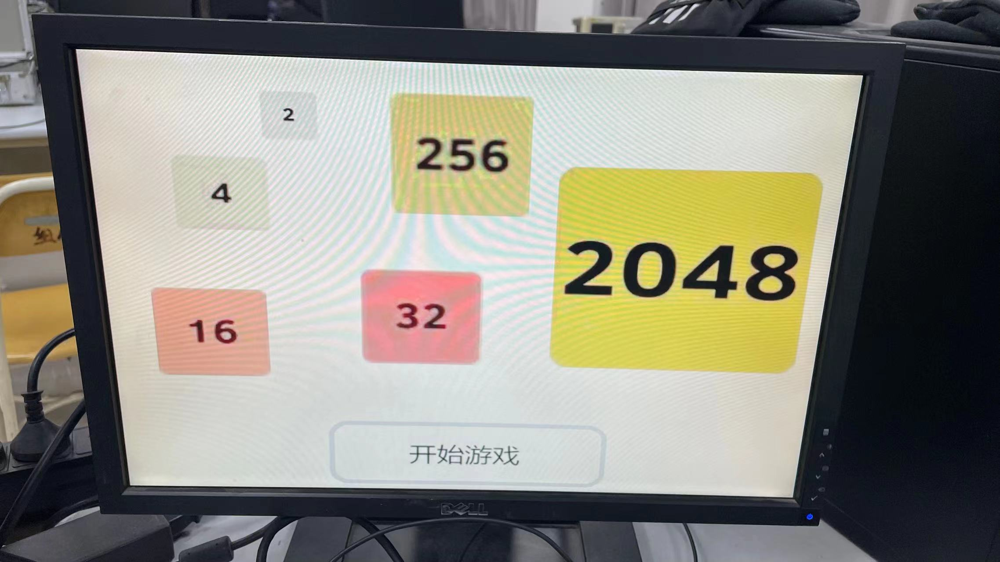
* 游戏界面
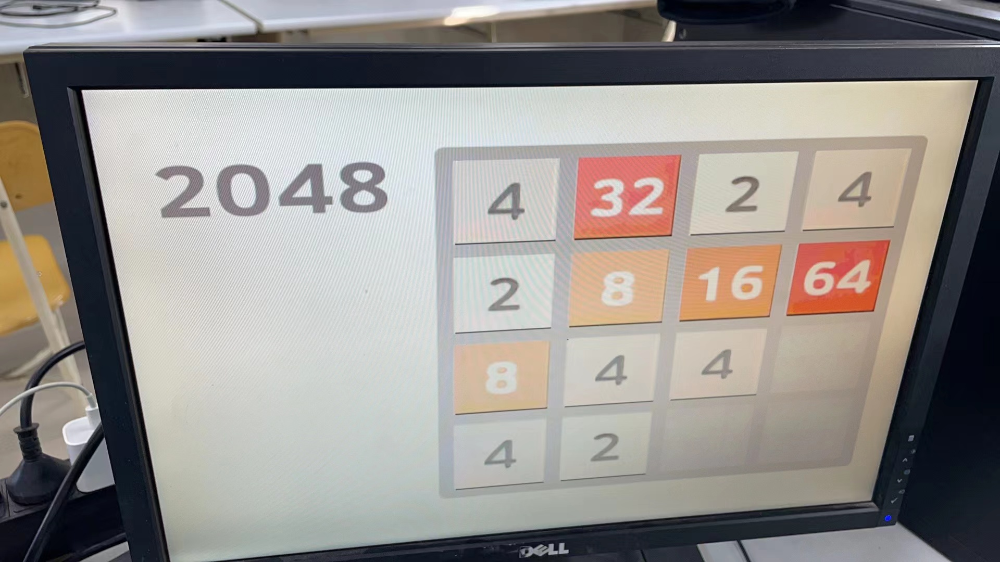
* 结束界面
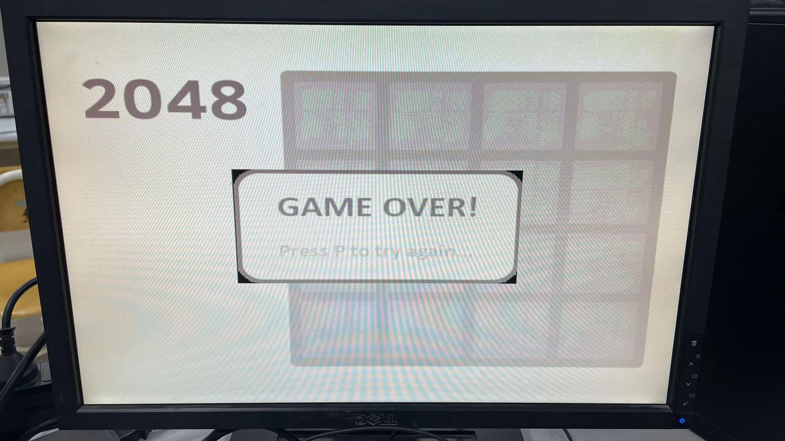

### 4.1.2 游戏主体模块

#### 4.1.2.1 logic_part部分仿真结果测试

（1）向左移动

* sim中的代码

```verilog
module logic_part_sim;

	// Inputs
	reg clk;
	reg rst;
	reg [3:0] btn;

	// Outputs
	wire [63:0] mmap;

	// Instantiate the Unit Under Test (UUT)
	logic_part uut (
		.clk(clk), 
		.rst(rst), 
		.mmap(mmap), 
		.btn(btn)
	);

		// Clock generation
initial begin
        clk = 0;
        // 用 forever 循环生成时钟
        forever #100 clk = ~clk;
    end	
	initial begin
		// Initialize Inputs
		//clk = 0;
		rst = 0;
		btn = 0;
		//mmap[63:0] = 0;
		//mmap[0] = 1;
		//mmap[4] = 1;

		// Wait 100 ns for global reset to finish
		#100;
		rst = 1;
		#100
		rst = 0;
		#100
		btn[0] = 1;
		#100
		btn[0] = 0;
		// Add stimulus here

	end
      
endmodule
```

* 地图初始化情况

```bash
[0]	[1]	[0]	[0]
[1]	[0]	[2]	[0]
[3]	[2]	[0]	[0]
[3]	[3]	[0]	[0]
```

* 仿真结果

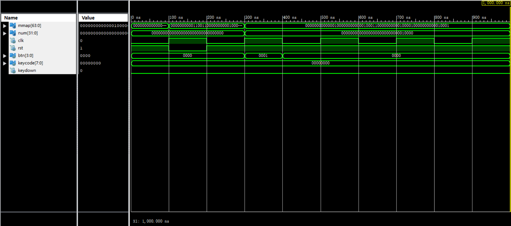

* 仿真结果显示的地图

```bash
[1]	[1]	[0]	[0]
[1]	[2]	[0]	[0]
[3]	[2]	[0]	[0]
[4]	[0]	[0]	[0]
```

由此可见，仿真结果显示的地图符合初始化的地图向左移动一次后对应的图形，同时，得分为16分，符合结果，因而结果是正确的。


（2）向右移动

* sim中的代码

```verilog
module logic_part_sim;

	// Inputs
	reg clk;
	reg rst;
	reg [3:0] btn;

	// Outputs
	wire [63:0] mmap;

	// Instantiate the Unit Under Test (UUT)
	logic_part uut (
		.clk(clk), 
		.rst(rst), 
		.mmap(mmap), 
		.btn(btn)
	);

		// Clock generation
initial begin
        clk = 0;
        // 用 forever 循环生成时钟
        forever #100 clk = ~clk;
    end	
	initial begin
		// Initialize Inputs
		//clk = 0;
		rst = 0;
		btn = 0;
		//mmap[63:0] = 0;
		//mmap[0] = 1;
		//mmap[4] = 1;

		// Wait 100 ns for global reset to finish
		#100;
		rst = 1;
		#100
		rst = 0;
		#100
		btn[1] = 1;
		#100
		btn[1] = 0;
		// Add stimulus here

	end
      
endmodule
```

* 地图初始化情况

```bash
[0]	[1]	[0]	[0]
[1]	[0]	[2]	[0]
[3]	[2]	[0]	[0]
[3]	[3]	[0]	[0]
```

* 仿真结果


* 仿真结果显示的地图

```bash
[1]	[0]	[0]	[1]
[0]	[0]	[1]	[2]
[0]	[0]	[3]	[2]
[0]	[0]	[0]	[4]
```

由此可见，仿真结果显示的地图符合初始化的地图向右移动一次后对应的图形，同时，得分为16分，符合结果，因而结果是正确的。


（3）向上移动

* sim中的代码

```verilog
module logic_part_sim;

	// Inputs
	reg clk;
	reg rst;
	reg [3:0] btn;

	// Outputs
	wire [63:0] mmap;

	// Instantiate the Unit Under Test (UUT)
	logic_part uut (
		.clk(clk), 
		.rst(rst), 
		.mmap(mmap), 
		.btn(btn)
	);

		// Clock generation
initial begin
        clk = 0;
        // 用 forever 循环生成时钟
        forever #100 clk = ~clk;
    end	
	initial begin
		// Initialize Inputs
		//clk = 0;
		rst = 0;
		btn = 0;
		//mmap[63:0] = 0;
		//mmap[0] = 1;
		//mmap[4] = 1;

		// Wait 100 ns for global reset to finish
		#100;
		rst = 1;
		#100
		rst = 0;
		#100
		btn[2] = 1;
		#100
		btn[2] = 0;
		// Add stimulus here

	end
      
endmodule
```

* 地图初始化情况

```bash
[0]	[1]	[0]	[0]
[1]	[0]	[2]	[0]
[3]	[2]	[0]	[0]
[3]	[3]	[0]	[0]
```

* 仿真结果

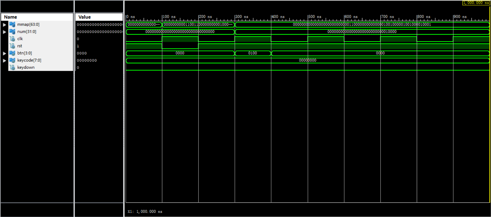

* 仿真结果显示的地图

```bash
[1]	[1]	[2]	[1]
[4]	[2]	[0]	[0]
[0]	[3]	[0]	[0]
[0]	[0]	[0]	[0]
```

由此可见，仿真结果显示的地图符合初始化的地图向上移动一次后对应的图形，同时，得分为16分，符合结果，因而结果是正确的。


（4）向下移动

* sim中的代码

```verilog
module logic_part_sim;

	// Inputs
	reg clk;
	reg rst;
	reg [3:0] btn;

	// Outputs
	wire [63:0] mmap;

	// Instantiate the Unit Under Test (UUT)
	logic_part uut (
		.clk(clk), 
		.rst(rst), 
		.mmap(mmap), 
		.btn(btn)
	);

		// Clock generation
initial begin
        clk = 0;
        // 用 forever 循环生成时钟
        forever #100 clk = ~clk;
    end	
	initial begin
		// Initialize Inputs
		//clk = 0;
		rst = 0;
		btn = 0;
		#100;
		rst = 1;
		#100
		rst = 0;
		#100
		btn[3] = 1;
		#100
		btn[3] = 0;
		// Add stimulus here

	end
      
endmodule
```

* 地图初始化情况

```bash
[0]	[1]	[0]	[0]
[1]	[0]	[2]	[0]
[3]	[2]	[0]	[0]
[3]	[3]	[0]	[0]
```

* 仿真结果


* 仿真结果显示的地图

```bash
[1]	[0]	[0]	[0]
[0]	[1]	[0]	[0]
[1]	[2]	[0]	[0]
[4]	[3]	[2]	[0]
```

由此可见，仿真结果显示的地图符合初始化的地图向下移动一次后对应的图形，同时，得分为16分，符合结果，因而结果是正确的。

#### 4.1.2.2 win 部分仿真结果测试

（1）胜利测试

* sim中代码

```verilog
module win_sim;

	// Inputs
	reg clk;
	reg [63:0] mmap;
	reg rst;

	// Outputs
	wire win;
	wire fault;

	// Instantiate the Unit Under Test (UUT)
	win uut (
		.clk(clk), 
		.mmap(mmap), 
		.rst(rst), 
		.win(win), 
		.fault(fault)
	);
	
	// Clock generation
	initial begin
        clk = 0;
        // 用 forever 循环生成时钟
        forever #100 clk = ~clk;
    end
	initial begin
		// Initialize Inputs
		mmap = 0;
		rst = 0;

		// Wait 100 ns for global reset to finish
		#100;
		rst = 1;
		#100;
		rst = 0;
		mmap[3:0] = 1;
		mmap[7:4] = 2;
		mmap[11:8] = 1;
		mmap[15:12] = 2;
		
		mmap[19:16] = 2;
		mmap[23:20] = 1;
		mmap[27:24] = 2;
		mmap[31:28] = 1;
		
		mmap[35:32] = 1;
		mmap[39:36] = 2;
		mmap[43:40] = 1;
		mmap[47:44] = 2;
		
		mmap[51:48] = 2;
		mmap[55:52] = 1;
		mmap[59:56] = 11;
		mmap[63:60] = 0;
      
		// Add stimulus here

	end
      
endmodule
```

* 仿真结果

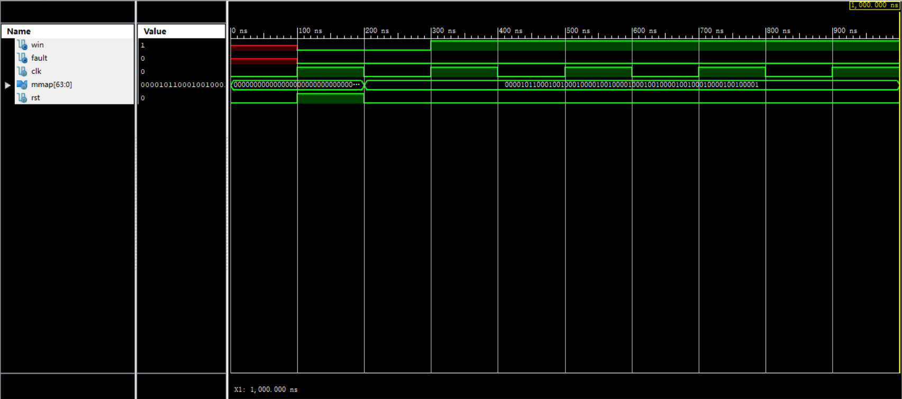

* 仿真中最后的地图

```bash
[1]	[2]	[1]	[2]
[2]	[1]	[2]	[1]
[1]	[2]	[1]	[2]
[2]	[1]	[11][0]
```

对于这份地图来说，成功生成2048，应该输出win为1，fault仍然保持为0，结果正确。


（2）失败测试

* sim中代码

```verilog
module win_sim;

	// Inputs
	reg clk;
	reg [63:0] mmap;
	reg rst;

	// Outputs
	wire win;
	wire fault;

	// Instantiate the Unit Under Test (UUT)
	win uut (
		.clk(clk), 
		.mmap(mmap), 
		.rst(rst), 
		.win(win), 
		.fault(fault)
	);
	
	// Clock generation
	initial begin
        clk = 0;
        // 用 forever 循环生成时钟
        forever #100 clk = ~clk;
    end
	initial begin
		// Initialize Inputs
		mmap = 0;
		rst = 0;

		// Wait 100 ns for global reset to finish
		#100;
		rst = 1;
		#100;
		rst = 0;
		mmap[3:0] = 1;
		mmap[7:4] = 2;
		mmap[11:8] = 1;
		mmap[15:12] = 2;
		
		mmap[19:16] = 2;
		mmap[23:20] = 1;
		mmap[27:24] = 2;
		mmap[31:28] = 1;
		
		mmap[35:32] = 1;
		mmap[39:36] = 2;
		mmap[43:40] = 1;
		mmap[47:44] = 2;
		
		mmap[51:48] = 2;
		mmap[55:52] = 1;
		mmap[59:56] = 2;
		mmap[63:60] = 1;
      
		// Add stimulus here

	end
      
endmodule
```

* 仿真结果

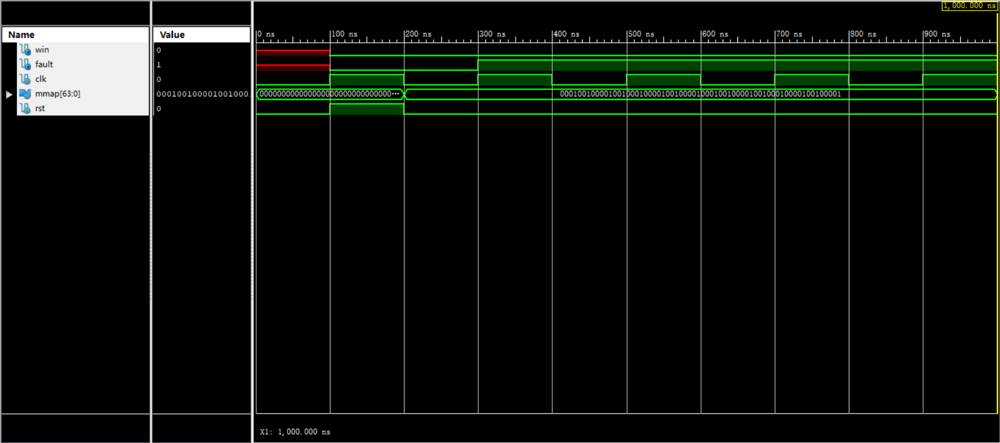

* 仿真中最后的地图

```bash
[1]	[2]	[1]	[2]
[2]	[1]	[2]	[1]
[1]	[2]	[1]	[2]
[2]	[1]	[2]	[1]
```

对于这份地图来说，已经没有可以移动的模块，应该输出fault为1，win仍然保持为0，结果正确。


#### 4.1.2.3 number_change 部分仿真结果测试

* sim中代码

```verilog
module number_change_sim;

	// Inputs
	reg clk;
	reg [31:0] num_in;

	// Outputs
	wire [31:0] num_out;

	// Instantiate the Unit Under Test (UUT)
	number_change uut (
		.clk(clk), 
		.num_in(num_in), 
		.num_out(num_out)
	);
	
	initial begin
        clk = 0;
        // 用 forever 循环生成时钟
        forever #100 clk = ~clk;
   end	
	initial begin
		// Initialize Inputs
		num_in = 0;

		// Wait 100 ns for global reset to finish
		#100;
		num_in =1026;
		#100;
		num_in =1111;
        
		// Add stimulus here

	end
      
endmodule
```

* 仿真结果

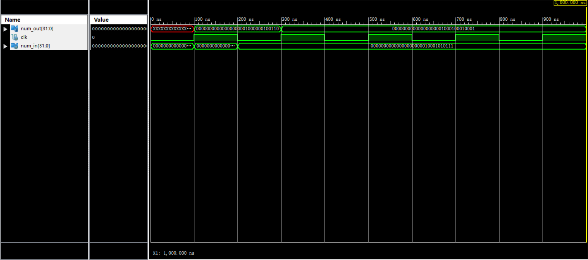

输入首先为1026，然后改变为1111，而输出也首先是BCD码形式的1026，然后改变为1111，结果正确。

### 4.1.3 PS2按键模块

编写一个简单的电路来显示不同按键对应的keycode。

```verilog
module Top(
	input clk, // 时钟信号
	input rst, // 复位信号
	input wire SW0,
	input ps2_clk,
	input ps2_data,
	
	output wire seg_clk, 
	output wire seg_sout, 
	output wire SEG_PEN, 
	output wire seg_clrn,
	
	output hs, // horizontal and vertical synchronization
	output vs, 
	output [3:0] r,
	output [3:0] g,
	output [3:0] b
    );
	 
	wire [31:0] clkdiv; // 时钟分频信号

	clkdiv myclkdiv(.clk(clk), .rst(1'b0), .clkdiv(clkdiv));
	
	wire key_down;
	wire [7:0] keycode;
	
	PS2(.clk(clk), .rst(1'b0), .ps2_clk(ps2_clk), .ps2_data(ps2_data), .data_out(keycode), .ready(key_down));
	
	reg [7:0] lastkey; 
	wire [31:0] displayscore;
	
	assign displayscore [7:0] = keycode;
	assign displayscore [15:8] = lastkey;
	
	SSeg7_Dev m4( .clk(clk), .rst(1'b0), .Start(clkdiv[20]), .SW0(SW0), .flash(1'b1), .Hexs(displayscore[31:0]),
			.point(8'b0000_0000), .LES(8'b0000_0000), .seg_clk(seg_clk), .seg_sout(seg_sout), .SEG_PEN(SEG_PEN), .seg_clrn(seg_clrn));

	wire [11:0] vga_data;
	wire [8:0] row_addr;
	wire [9:0] col_addr;

	vgac vga0(.vga_clk(clkdiv[1]), .clrn(1'b1), .d_in(vga_data), .row_addr(row_addr), .col_addr(col_addr), .r(r), .g(g), .b(b), .hs(hs), .vs(vs));

	get_vgadata gvd(.clk(clk), .clka(clkdiv[1]), .row_addr(row_addr), .col_addr(col_addr), .inmap(game_map), .vga_data(vga_data));
endmodule
```

* keycode显示（右方向键）
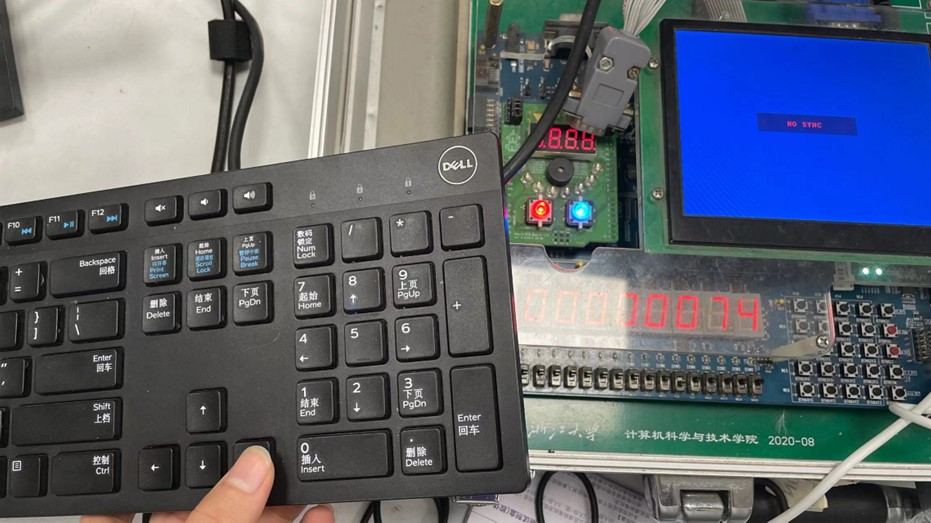

* keycode显示（左方向键）
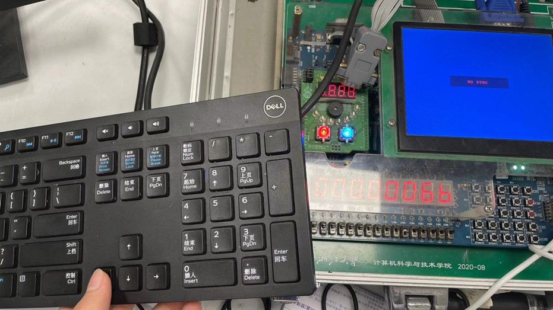

* keycode显示（上方向键）
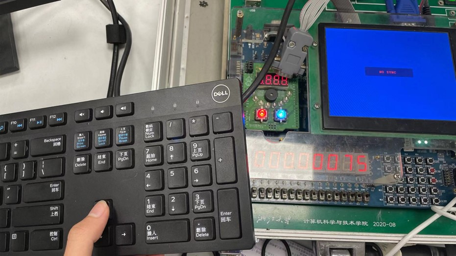

* keycode显示（下方向键）
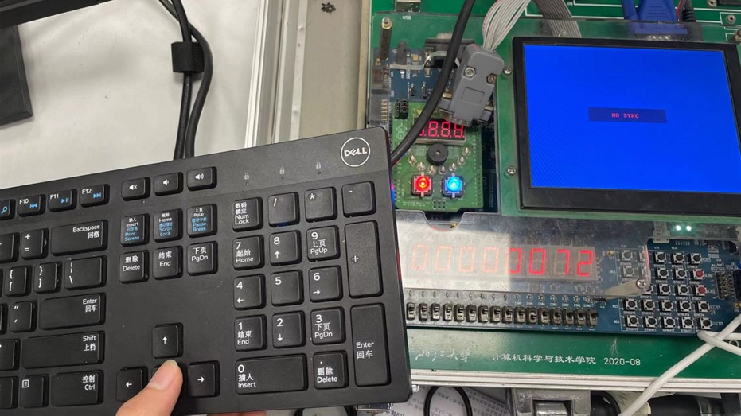

* keycode显示（p键）
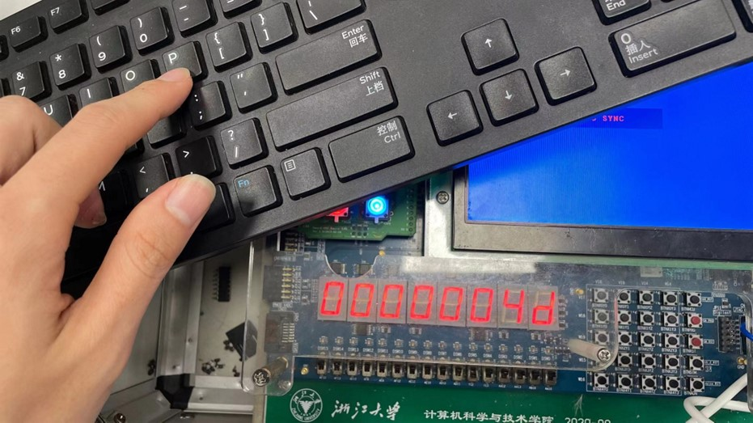

## <span id="jump12">4.2 操作说明与游戏演示</span>

### 4.2.1 操作说明
1. 首先关闭主板AF13开关，我们进入开始界面。然后，打开主板AF13开关进入游戏界面，或是按下键盘P键进入游戏界面，此时得分显示在七段数码管上，初始状态为0分。

2. 玩家可以开始游戏。
- 通过按下键盘上的左方向键，或是打开AA10开关，实现界面上方块的向左滑动；
- 按下键盘上的右方向键，或是打开AB10开关，实现界面上方块的向右滑动；
- 按下键盘上的上方向键，或是打开AA13开关，实现界面上方块的向上滑动；
- 按下键盘上的下方向键，或是打开AA12开关，实现界面上方块的向下滑动。
进行移动的操作后，相同的方块会进行合并，玩家会得到合并产生方块的数字。同时，会在随机位置上生成新方块。
当界面上的方块满了且无法消除时（失败），或玩家成功凑出2048方块后（胜利），屏幕会进入结束结算界面，此时七段数码管上的得分为最终得分。这是玩家可以按下键盘P键或重置AF13开关，来重新进入游戏。

### 4.2.2 游戏演示

#### 4.2.2.1 进入开始界面


#### 4.2.2.2 进入游戏初始界面
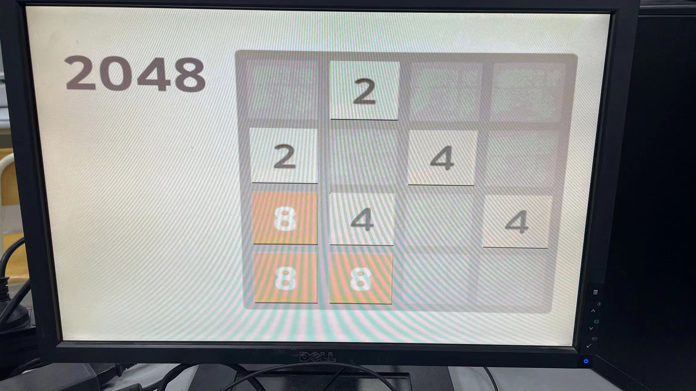

#### 4.2.2.3 游戏初始得分为0
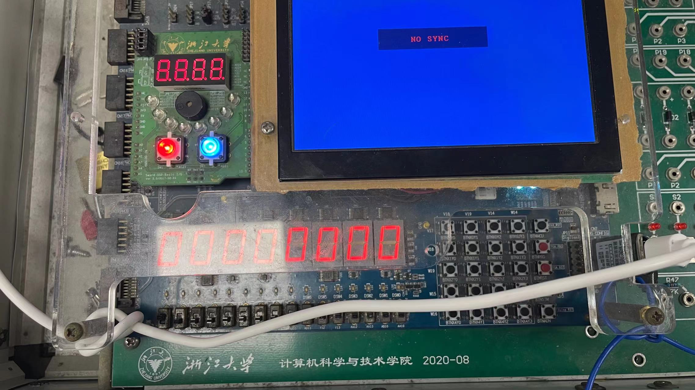

#### 4.2.2.4 游戏进行中
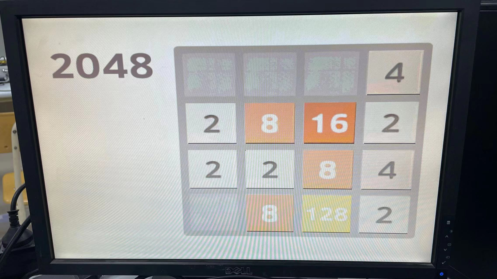

#### 4.2.2.5 游戏结束


#### 4.2.2.6 游戏最终得分
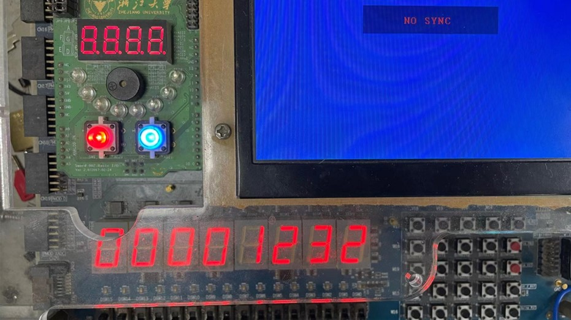

## <span id="jump13">4.3 用户体验与反馈</span>
项目制作完毕后，我们邀请同学进行体验游戏，由于该款游戏较为经典，且规则较为简单，因此同学们上手也很快。进行体验后，同学们认为游戏实现比较完整，游戏功能没什么问题，且操作反应灵敏度很高，玩起来很丝滑，总体来说游玩体验良好。
同时，非相关专业的同学还表示能在这种电路板和屏幕显示器上玩游戏，而不是平常熟悉的电脑手机上玩，感觉非常的新奇和有趣，还要求我们开发更多的玩法和游戏。他们也提出了一些可增加的玩法，如设置特定要求，形成闯关关卡，设置目标分数等。


# <span id="jump14">第五章 总结与致谢</span>

## <span id="jump15">5.1 总结</span>

* 彭一炜
本次实验我主要负责项目的统筹、输入输出相关的模块的编写和调试，以及后期在实验室debug和上板调试。担任组长要和组员讨论形成整体的框架规划，还要不断和组员们沟通和协调。本次担任组长就让我真切地感受到了和不同组员沟通协调，交换信息的重要性，这次经历也锻炼乐我许多。我感觉我更想是组员之间交流的桥梁。此外，输入输出模块在实际使用中也遇到了许多问题，有时候硬件电路并不像我们想的那样工作，而是遵循自己的一套逻辑，需要不断地熟悉和调整。后期的综合调试也是一项大工程，花费了我很多时间和精力，我有很多天泡在实验室里进行修改、上板验证、发现问题、再修改的过程，但好在最后成功地做出了这个工程。感觉还是很自豪的。总的来说，这次课程设计给我带来了很多收获。

* 陈奕萱
本次实验我主要负责了界面设计和定位。定位工程中需要很细致的像素点，但是我一开始并没有考虑到，我人为地量宽度算比例导致最后导在sword板上的图像存在一定误差。最后在队友的帮助下我用生成的coe文件读取像素分界点最后完成准确的定位。这次实验中我查询了键盘码并理解了ps2接入的操作。这次实验中我没有很多地参与代码以及硬件的设计，但在前期的资料搜寻中对项目搭建有了比较清楚的认知，让我学到很多。

* 赵佳乐
逻辑部分，遇到的最主要的问题是wire与reg的搭配，经常在这部分发生报错。最后还是跟着它报错的具体内容以及网上的教程，还有仿真时的偏差不断进行修改，最后才较好的将两者结合起来，从而帮助实现逻辑部分的功能。

## <span id="jump16">5.2 致谢</span>

最后
我们由衷地感谢在我们提问时极有耐心解答的同学们，谢谢大家的帮助！
由衷感谢王老师理论课上传授的知识以及人生经验！
由衷感谢实验室洪老师的关怀和指导，感谢他很晚才关实验室，让我们有更多的时间完成大作业！
也要感谢认真参与课程设计的我们，感谢一起完成大程序的我们！

# <span id="jump17">第六章 小组成员分工</span>

小组分工
* 彭一炜（组长）：项目整体的统筹，显示模块编写与调试，开关和键盘输入模块调试，top模块的编写，后期工程整合、debug和上板调试。
* 陈奕萱：素材寻找和整理、coe文件生成、游戏界面的设计。
* 赵佳乐：游戏逻辑模块、游戏胜负状态模块、十六进制转十进制模块。

贡献度
* 彭一炜：1/3
* 陈奕萱：32%
* 赵佳乐：35%


</font>