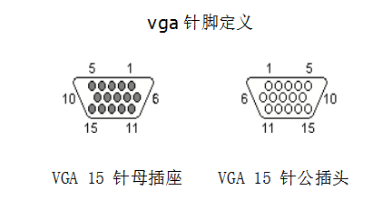
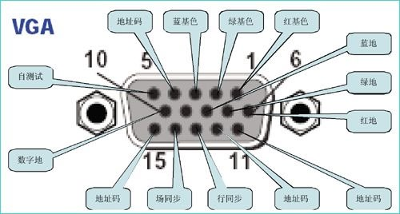
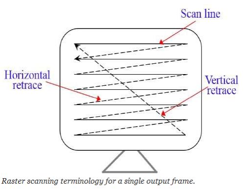
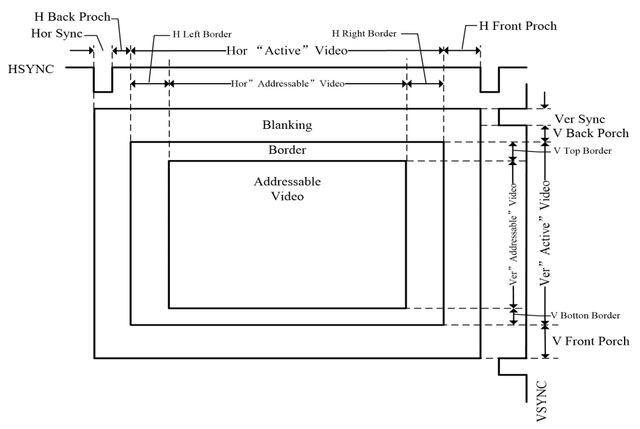
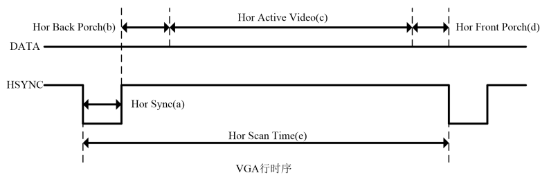
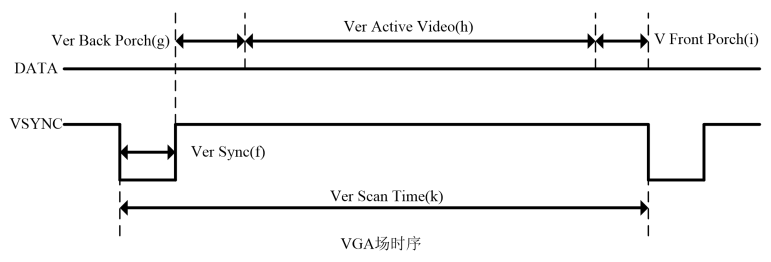
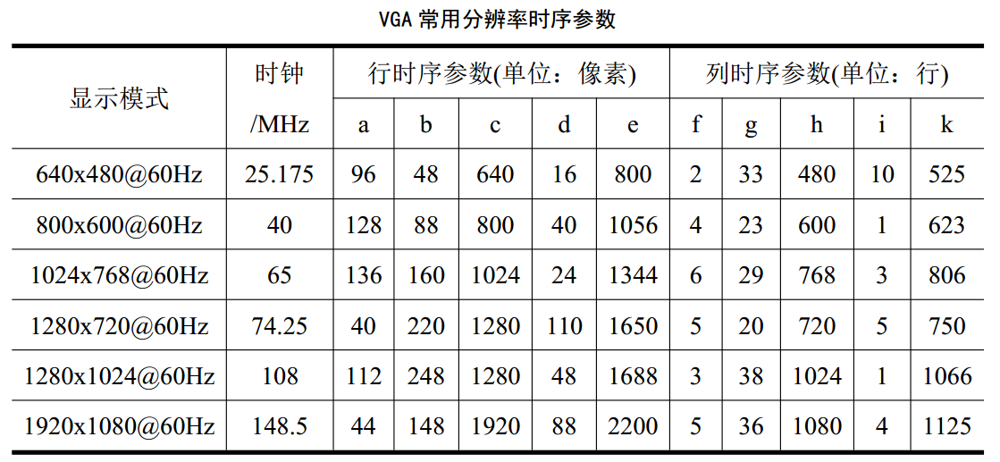

(封面等最后生成pdf的时候再插吧)

# 
摘要

本次课程设计题目为 "2048" ，由传统的 2048 游戏移至 FPGA 板设计而成。这款游戏极好地还原了网页版 2048 游戏的基本特征和游戏规则，使用 sword 板显示得分，使用 PS2 操作整体的左移、右移，具有很强的可玩性。

关键词：数字逻辑，游戏，2048，Verilog，IP Core，FPGA

# 目录

## [摘要](#jump0)
## [第一章 绪论](#jump1)
### [1.1 基于 FPGA 的游戏设计背景](#jump2)
### [1.2 主要内容和难点](#jump3)
## [第二章 2048 游戏设计思路与原理](#jump4)
### [2.1 基于 FPGA 的游戏设计相关内容](#jump5)
### [2.2 基于 FPGA 的 2048 游戏设计方案](#jump6)
## [第三章 2048游戏设计实现](#jump7)
### [3.1 实现过程](#jump8)
### [3.2 调试过程](#jump9)
## [第四章 结果分析与用户反馈](#jump10)
### [4.1 结果检验与功能测试](#jump11)
### [4.2 用户体验与反馈](#jump12)
## [第五章 总结与致谢](#jump13)

# 第一章 绪论

## 1.1 基于 FPGA 的游戏设计背景

Verilog HDL 是一种用于数字系统设计的语言。用 Verilog HDL 描述的电路设计就是
该电路的 Verilog HDL 模型也称为模块。Verilog HDL 既是一种行为描述的语言也是一种
结构描述的语言。这也就是说，无论描述电路功能行为的模块或描述元器件或较大部件互连
的模块都可以用 Verilog 语言来建立电路模型。如果按照一定的规矩编写，功能行为模块可以通过工具自动地转换为门级互连模块。Verilog 模型可以是实际电路的不同级别的抽象。一个复杂电路系统的完整 Verilog HDL 模型是由若干个 Verilog HDL 模块构成的，每一个模块又可以由若干个子模块构成。其中有些模块需要综合成具体电路，而有些模块只是与用户所设计的模块有交互联系的现存电路或激励信号源。利用 Verilog HDL 语言结构所提供的这种功能就可以构造一个模块间的清晰层次结构来描述极其复杂的大型设计，并对所作设计的逻辑电路进行严格的验证。Verilog HDL 作为一种高级的硬件描述编程语言，与 C 语言的风格有许多类似之处。其中有许多语句如：if 语句、case 语句等和 C 语言中的对应语句十分相似。

FPGA 即现场可编程门阵列，它是在 PAL、GAL、CPLD 等可编程器件的基础上进一步发展的产物。它是作为专用集成电路（ASIC）领域中的一种半定制电路而出现的，既解决了定制电路的不足，又克服了原有可编程器件门电路数有限的缺点。

## 1.2 主要内容和难点

### 1.1.1 主要内容

2048 是一款数字益智游戏。在一个 4x4 的方格中，每一轮都会出现一个数值为 2 或 4 的方块。玩家通过控制键盘上的 WADS 滑动方块，当两个相同数值的方块在移动的过程中碰撞到一起时，它们会合并成一个数值加倍的方块，直到获得一个总值为 4096 的方块，游戏获胜。游戏并不会在达到 4096 后立即结束，玩家可以继续进行合并操作，尝试获得更高的分数。当无法进行有效的合并操作并且无法再移动方块时，游戏结束。游戏结束后，七段数码管显示玩家的最高分数。玩家可以选择按键 P 来重复尝试，获得新高。游戏的难度在于，在每一次滑动过后，系统会在随机空白位置添加新的随机数方块，玩家需要考虑每一步的移动，以避免方块填满整个方格且无法继续合并。

### 1.1.2 技术要求

熟练掌握 Verilog 语言设计；掌握 SWORD 板的使用方法；掌握 VGA 显示原理和 PS2 键盘输入原理，理解并掌握状态机的设计。

### 1.1.3 实验目的

加深对模块化编程的理解，加强对硬件编程语言 Verilog 的掌握。

### 1.1.4 实验重点与难点

Coe 文件的生成与 IP 核的制作；键盘的输入；VGA 的正常显示。

# 第二章 2048游戏设计思路与原理

## 2.1 基于 FPGA 的游戏设计相关内容

### 2.1.1 VGA 显示

VGA(Video Graphics Array)，信号类型为模拟类型，显示卡端的接口为 15 针母插
座。VGA( Video Graphics Array)作为一种标准的显示接口得到了广泛的应用。VGA 在任何时刻都必须工作在某一显示模式之下，其显示模式分为字符显示模式和图形显示模
式。而在应用中，讨论的都是图形显示模式。

VGA 接口是一种 D 型接口，上面共有 15 针孔，分成三排，每排五个。其中比较重要
的是 3 根 RGB 彩色分量信号和 2 根扫描同步信号 HSYNC 和 VSYNC 针。其引脚编号图如下图所示：

VGA 显示器扫描方式从屏幕左上角一点开始，从左向右逐点扫描，每扫描完一行,电子
束回到屏幕的左边下一行的起始位置，在这期间，CRT 对电子束进行消隐，每行结束时，用行同步信号进行同步；当扫描完所有的行，形成一帧，用场同步信号进行场同步，并使扫描回到屏幕左上方，同时进行场消隐,开始下一帧。完成一行扫描的时间称为水平扫描时间，其倒数称为行频率；完成一帧（整屏）扫描的时间称为垂直扫描时间，其倒数称为场频率，即屏幕的刷新频率，常见的有 60Hz，75Hz 等等，但标准的 VGA 显示的场频 60Hz。其扫描示意图如下图所示：

VGA 的详细时序如下图所示：

总的来说，VGA 的时序主要包括行时序与场时序两个部分。

其中行时序主要包括：行同步(Hor Sync)、行消隐(Hor Back Porch)、行视频有效
(Hor Active Video)和行前肩(Hor Front Porch)这四个参数，行时序的时序图如下图所示：

而场时序主要包括：场同步(Ver Sync)、场消隐(Ver Back Porch)、场视频有效(Ver Active Video)和场前肩(Ver Front Porch)这四个参数，场时序的时序图如下图所示：

需要注意的有三点：
- 行时序是以”像素”为单位的，场时序是以”行”为单位的。
- VGA 工业标准显示模式要求：行同步，场同步都为负极性，即同步脉冲要求是负
脉冲。
- VGA 行时序对行同步时间、消隐时间、行视频有效时间和行前肩时间有特定的
规范，场时序也是如此。常用 VGA 分辨率时序参数如下表所示：

### 2.1.2 PS2 键盘输入

PS/2 通信协议是一种双向同步串行通信协议。通信的两端通过 CLOCK(时钟脚)同步，并
通过国 DATA(数据脚)交换数据。一般两设备间传输数据的最大时钟频率是 33kHz，大多
数 PS/2 设备工作在 10--20kHz。推荐值在 15kHz 左右，也就是说，CLOCK 高、低电平的持续时间都为 40us。每一数据帧包含 11-12 位，具体含义如下图所示：

| 数据 | 含义 |
| --------- | ------------ |
| 1个起始位 | 总是逻辑0 |
| 8个数据位 | (LSB)低位在前 |
| 1个奇偶检验位 | 奇校验 |
| 1个停止位 | 总是逻辑1 |
| 1个应答位 | 仅用在主机对设备的通信中 |

数据在 PS/2 时钟的下降沿读取，PS/2 的时钟频率为 10—16.7kHz。对于 PS/2 设备，一般来说从时钟脉冲的上升沿到一个数据转变的时间至少要有 5us；数据变化到下降沿的时间至少要有 5us，并且不大于 25us，这个时序非常重要应该严格遵循。主机可以再第 11 个时钟脉冲停止位之前把时钟线拉低，使设备放弃发送当前字节，当然这种情况比较少见。在停止位发送后设备在发送下个包前应该至少等待 50us，给主机时间做相应的处理。不过主机处理接收到的字节时一般会抑制发送(主机在收到每个包时通常自动做这个)。在主机释放抑制后，设备至少应该在发送任何数据前等 50us。

### 2.1.3 可编辑阵列逻辑

PAL 器件由可编程的与阵列、固定的或阵列和输出反馈单元组成。不同型号 PAL 器件有
不同的可编程阵列逻辑输出和反馈结构，适用于各种组合逻辑电路和时序逻辑电路的设
计，是一种可程式化的装置。PLA 具有一组可程式化的 AND 阶，AND 阶之后连接一组可
程式化的 OR 阶，如此可以达到：只在合乎设定条件时才允许产生逻辑讯号输出。
PLA 如此的逻辑闸布局能用来规划大量的逻辑函式，这些逻辑函式必须先以积项（有时
是多个积项）的原始形式进行齐一化。在 PLA 的应用中，有一种是用来控制资料路径，
在指令集内事先定义好逻辑状态，并用此来产生下一个逻辑状态（透过条件分支）。
举例来说，如果目前机器（指整个逻辑系统）处于二号状态，如果接下来的执行指令中
含有一个立即值（侦测到立即值的栏位）时，机器就从第二状态转成四号状态，并且也
可以进一步定义进入第四状态后的接续动作。因此 PLA 等于扮演（晶片）系统内含的逻
辑状态图（state diagram）角色。

### 2.1.4 硬件描述语言

Verilog HDL 是一种用于数字系统设计的语言。用 Verilog HDL 描述的电路设计就是
该电路的 Verilog HDL 模型也称为模块。Verilog HDL 既是一种行为描述的语言也是一种结构描述的语言。这也就是说，无论描述电路功能行为的模块或描述元器件或较大部件互连的模块都可以用 Verilog 语言来建立电路模型。如果按照一定的规矩编写，功能行为模块可以通过工具自动地转换为门级互连模块。Verilog 模型可以是实际电路的不同级别的抽象。一个复杂电路系统的完整 Verilog HDL 模型是由若干个 Verilog HDL 模块构成的，每一个模块又可以由若干个子模块构成。其中有些模块需要综合成具体电路，而有些模块只是与用户所设计的模块有交互联系的现存电路或激励信号源。利用 Verilog HDL 语言结构所提供的这种功能就可以构造一个模块间的清晰层次结构来描述极其复杂的大型设计，并对所作设计的逻辑电路进行严格的验证。Verilog HDL 作为一种高级的硬件描述编程语言，与 C 语言的风格有许多类似之处。其中有许多语句如：if 语句、case 语句等和 C 语言中的对应语句十分相似。

### 2.1.5 技术工具

#### 1. ISE 软件

ISE 是使用 XILINX 的 FPGA 的必备的设计工具。它可以完成 FPGA 开发的全部流
程，包括设计输入、仿真、综合、布局布线、生成 BIT 文件、配置以及在线调试等，
功能非常强大。ISE 除了功能完整，使用方便外，它的设计性能也非常好，以集成
的时序收敛流程整合了增强性物理综合优化，提供最佳的时钟布局、更好的封装和
时序收敛映射，从而获得更高的设计性能。

#### 2. SWORD 板

#### 3. 计算机

#### 4. WPS Office

用于对图片进行美术处理和加工，同时对图片像素进行适当裁剪以适应 VGA 显示。

#### 5. Python

通过编写 Python 爬虫程序，爬取[网页版游戏 2048](https://play2048.co/) 上相关资料与图片素材，以便后续处理使用。

通过编写 Python 程序，把 png 图片转为 3 位 16 进制 coe 文件，使之与 VGA 显示相适应。

### 2.1.6 课程设计方法

利用 Verilog HDL 硬件设计游戏，通过 WPS 设计游戏游戏画面和贴画，通过Python编写程序实现素材爬取和 coe 文件生成，实现用 PS2 键盘输入数据，用VGA 显示数据，使用 ISE 软件生成 bit 文件，利用可编程阵列逻辑烧在 SWORD 实验电路板上，最终实现人机互动游戏。

## 2.2 基于 FPGA 的 2048 游戏设计方案

### 2.2.1 技术需求

VGA 扫描显示欢迎界面，游戏界面以及结束界面；PS2 键盘输入数据处理为控制方块移动方向信号、界面切换信号；核心模块对输入信号用状态机进行逻辑处理，输出。

# 第三章 2048 游戏设计实现

## 3.1 实现过程

## 3.2 调试过程

# 第四章 结果分析与用户反馈

## 4.1 结果检验与功能测试

## 4.2 用户体验与反馈

# 第五章 总结与致谢