# Chap 1 Digital Systems and Information

## 信息表达

discrete.

voltage: HIGH, LOW(中间 undefined/floating)

输入输出对高低电平的判定范围：宽进严出

模拟信号->二进制高低电平的信号：transistors晶体管

## 计算机系统抽象层

algorithms, programmimg languages, operating systems, intruction set architecture, microarchitecture, register transfers, logic gates, transistor circuits

## 数字系统

一般一个 r 进制数会被写成这个形式：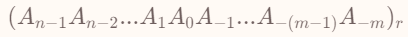

## BCD 码

将十进制的每一位分别用真值相等的 4 位二进制表示，`0`-`9` -> `0000`-`1001`

## 余三码（EXCESS 3）

在 BCD 码的基础上添加一个大小为 3 的偏移量，`0`-`9`->`0011`-`1100`

## 格雷码(Gray Codes)

优点：相邻的两个数在二进制下的表示只相差一位。（当在占满时，对于整个编码序列，环状满足该条件）

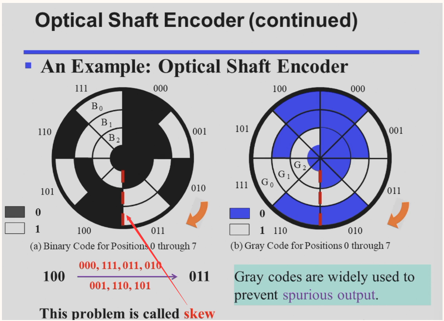

### 格雷码与二进制的转化

#### 二进制 to 格雷码

保留二进制码的最高位作为格雷码的最高位；格雷码的其余位为二进制码对应位与其上一位相异或。（xor）

#### 格雷码 to 二进制

保留格雷码的最高位作为二进制码的最高位；二进制码的其余位为格雷码对应位与二进制上一位相异或。（xor）

## 奇偶校验位

信号传输过程中出现信号抖动，因此我们需要进行错误检测。

一种错误检测方法叫做冗余Redundancy，加入额外信息检查是否正确。

冗余的一种为引入**奇偶校验位Parity Bit**。奇校验，偶校验。odd/even parity.通过引入额外的一位来保证整个信息串中 `1` 的个数是奇数/偶数。

# Chap 2 Combinational Logic Circuits

## 逻辑运算

这里注意**德摩根定律**就够了。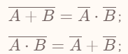

## 逻辑门

and 直 or 弯 not 三角圈

延时 delay （这里可能会考延时的计算）

### 通用门 Universal Gate

logically completed

指 NAND 和 NOR ，具体怎么凑andornot用通用够了

## 布尔代数

**一个重要的运算律：(X + Y)(X + Z) = X + YZ**

（比如说：(X + Y)(X + Yba) = X + YYba = X，或者 X + XbaY = (X + Xba)(X + Y)= X + Y）

### 对偶法则 Duality Rule

将原式的乘改为或，原式的或改为乘。（括号和加号的兑换）

但是不能改变计算优先级，，，必要的时候加括号

除非一个表达式是**自对偶 Self_dual** 的，那么他的表达式都与原表达式不同

如果 F 与 G 等价，那么两者的对偶也等价。

### 互补函数 Complement of a Function

一个函数的非 = 它的对偶函数 每个变量都取反

### 替代法则 Substitution Rules

一个原有等式，将这个等式中的一个变量全部替换为另一个变量或者是一个表达式，则等式依然成立

比如说：

对一个等式 X(Y + Z) = XY + XZ;

使用 X + YZ 替换所有的 X，则：(X + YZ)(Y + Z) = (X + YZ)Y + (X + YZ)Z；

### 一致性定理 Consensuc Theorem

XY + XbaZ + YZ = XY + XbaZ 

就是说这里把YZ直接舍去了。这里感觉可以直接舍去是因为前面乘 Y 和乘 Z 的分别刚好是 X 和 Xba。

## 标准形式 Standard Forms 与规范形式 Canonical Forms

midterm：

最小项之和 SOM （之和代表，对真值表结果为1的状态全部列出来相加（or），有1得1）

maxterm：

最大项之积 POM （之积代表，对真值表结果为0的状态全部列出来相乘（and）后取反，有0得0）

## 电路实现与优化

**卡诺图Karnauph map**

### 成本标准 cost criteria

三种标准：
- Literal cost(L) 字面成本
  - 一共出现了几个变量，AB + ACBba + AbaBbaC，这里 L = 8；
- Gate input cost(G) 门输入成本
- Gate input cost with NOTs (GN) 带not的门输入成本

比如：
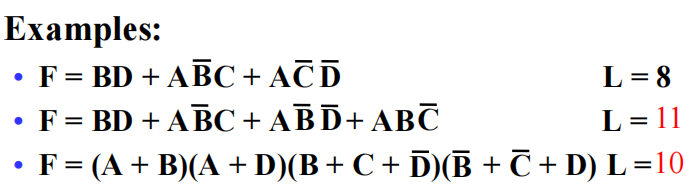
- G = 8 + 3(3个term) = 11, GN = G + 3(3个单个的取反) = 14
- G = 11 + 4 = 15， GN = G + 3(3个distinct的取反) = 18
- G = 10 + 4 = 14， GN = G + 3 = 17
- 注意，GN 计算的是 distinct 的取反的个数，G 取的是项数，项数不包括仅含单个字母的项。（这是对于 SOP 和 POS 来说的，因为他们才有项数概念）

### 卡诺图

对于这张图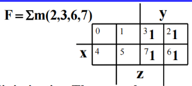。我们使用 SOM （其实也可以一眼看出）这个的结果等式应该是 F(x,y,z) = y.

#### 规范化的化简

我们引入 **质蕴含项 prime implication**。

一个质蕴含项是通过在图表中结合最大数的相邻的正方形方块成一个大的矩形而获得的乘积项，其中正方形的数量为2的幂。

Essential Prime Implicant如果这个质蕴含项是唯一能够覆盖几个minterms的质蕴含项。

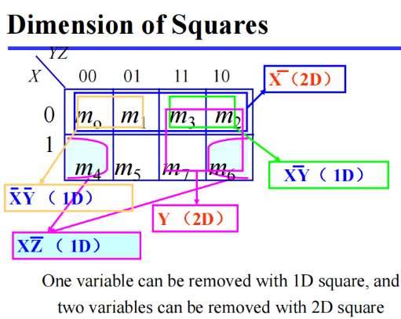

在操作过程中，我们要尽量减少质蕴含项之间的重叠，在最后的解决方案中，要确保所选的每个质蕴含项至少包括一个不包含在所选的任何其他质蕴含项中的小项。

一些实例：

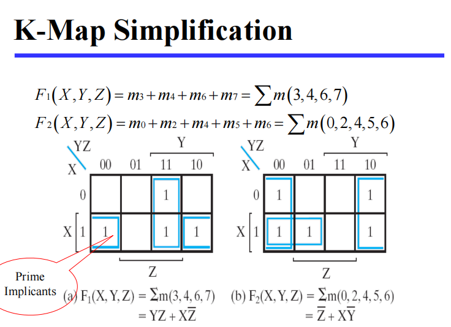

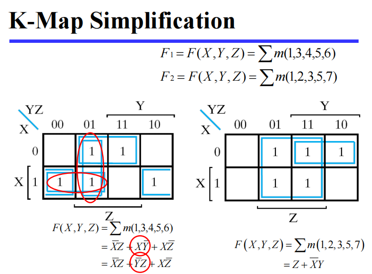

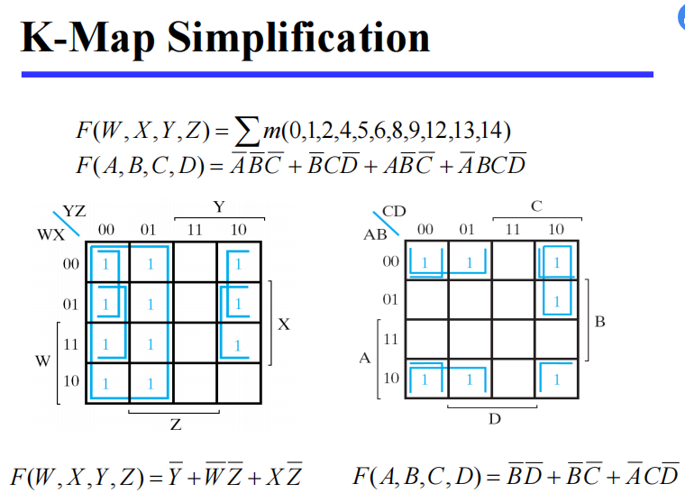

当1们选不出来很难划质蕴含项的时候，那就选择拿0们下手吧，下手就会变成了maxterms了：

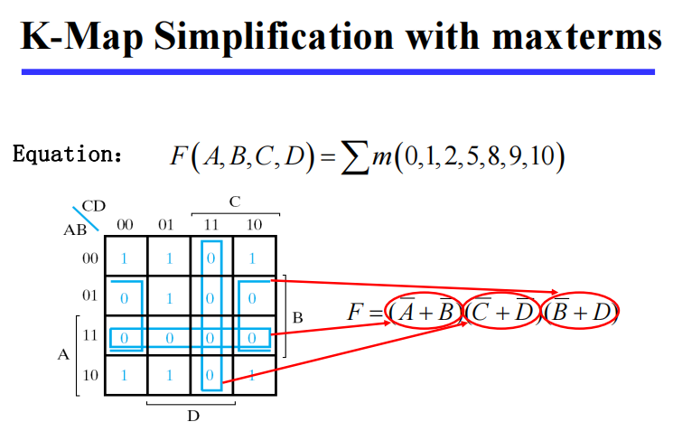

相比起来：

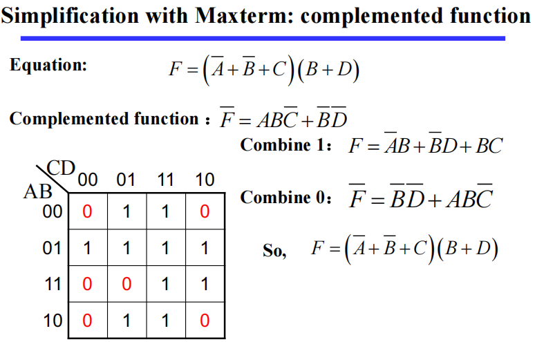

#### 不定项 Don't Cares in K-Maps：

我不懂但是他说的对

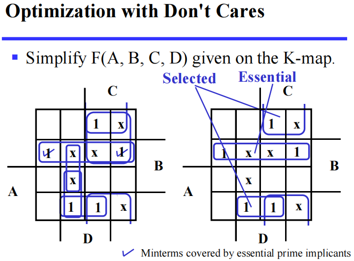

## 三态门

### 三态缓冲器3-state buffer

使能端 enable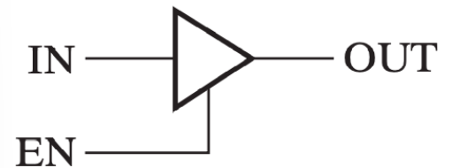

使能端置 1 时 读 1 输出 1 读 0 输出 0；使能端置 0 时输出为Hi-Z（浮动，高阻态）

### 复杂门

一般有很多个输入，长得丑看得懂就好了

# Chap 3 Combinational Logic Design

## 分层设计

Top-Down 和 Bottom-up，从需求开始和根据现有元件组合

## 技术参数

Fan-in, Fan-out, Propagation Delay 信号改变后从输入到输出所需的变化时间

### 扇入扇出

描述一个门能接受的最多输出量，通过标准负载来定义

#### 评估负载

transition time 过渡时间

当超出扇入后，门对输出的反应太慢了。

### 传播延迟

使用 tPHL 和 tPLH 来分别描述从高电平变化到低电平和从低电平变化到高电平。

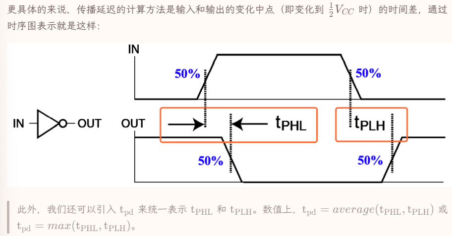

## 延时模型

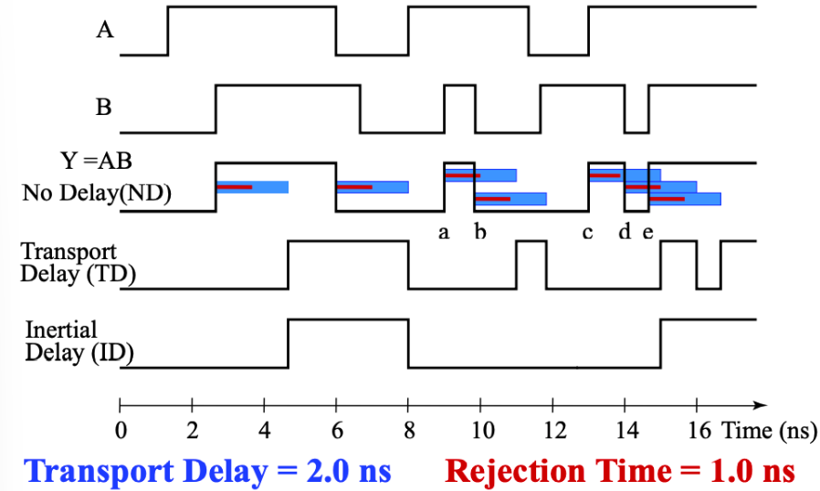

### 传输延迟 transport delay

输入和输出之间的延时是一个固定值

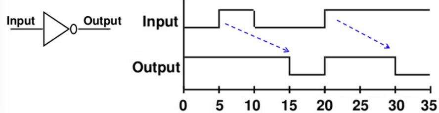

### 惯性延迟 intertial delay

**拒绝时间rejection time**：当输入达到一定能量后才会出发栅极输出（用来过滤噪音）

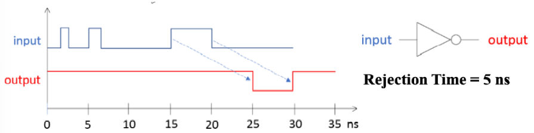

## 这里会考到一些延迟计算题

我们应该要考虑到一个电路的延迟由电路本身的固有延迟和不同负载导致的不同延时相合而成。

## 毛刺 Glitch

而因为系统存在延迟，因此我们得到的信号图很多情况华都会有一个毛刺，

（顺便实操做个题吧）

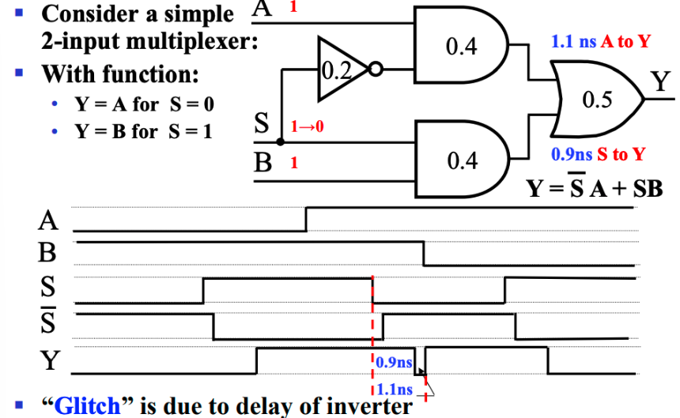

而这里面的毛刺我们可以用添加冗余项来解决。

比如说对这个式子我们可以添加冗余项 AB 就可以消除毛刺。

## 正逻辑和负逻辑

正逻辑以1为有效信号，负逻辑以0为有效信号。

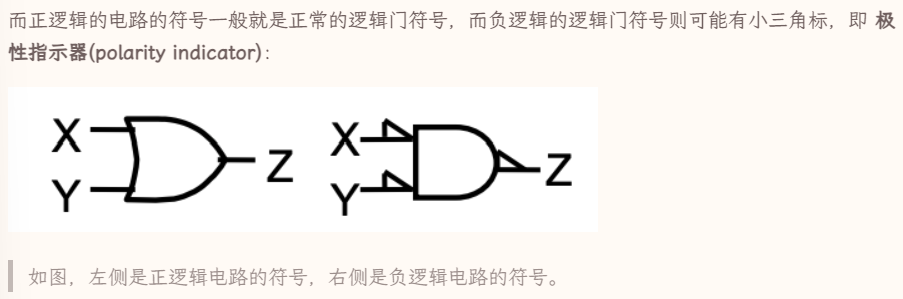

## 验证正确性

Manual Logic Analysis 和 Simulation

## 组合逻辑

### Decoder

### Encoder

### MUX

MUX 可以实现任意的逻辑函数：

将控制端当做输入，原来的输入当做结果，在原来的输入端写入逻辑函数的真值表以实现任意逻辑函数。

### half adder，full adder

有行波加法器

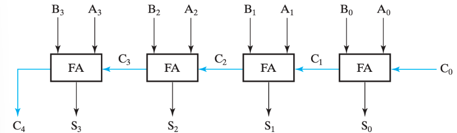

### 二进制减法

使用补码

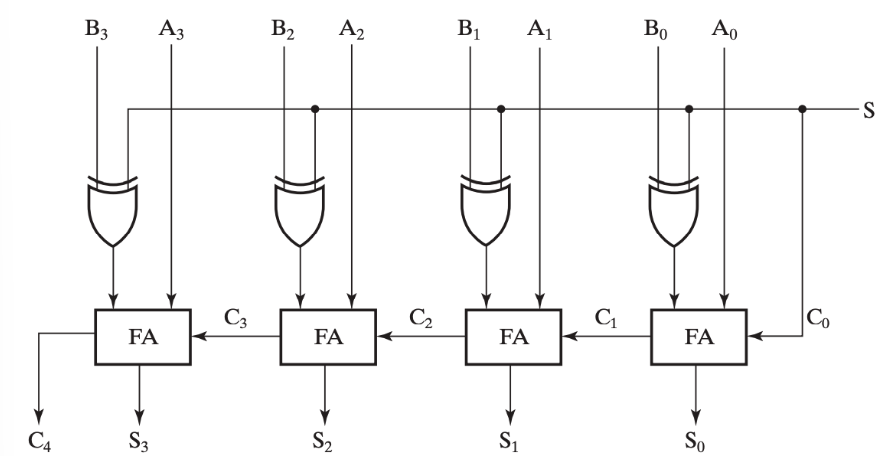

在输入中添加异或门来实现反码，再用C0来实现+1从而得到补码

# Chap 4 Sequential Circuits

同步 synchronous 和异步 asynchronous

而同步电路的使用更加广泛，通常这些离散的时刻都是由 **时钟发生器(clock generator)** 这种时序器件产生周期性的 **时钟脉冲(clock pulse)** 序列来实现的（这种电路一般被称为 **钟控时序电路(clocked sequential circuit)**，由于设计相对容易，鲁棒性强，所以被广泛应用）

**缓冲器buffer** 一般通过两个非门串联，并将输入连通输出实现，这样能够实现信息的存储，然而无法修改。而锁存器就是在缓冲器的基础上，将非门替换为或非门或与非门实现的。

## 锁存器

### SR 锁存器

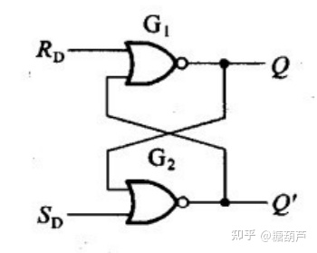

SR 锁存器使用或非门， S'R' 锁存器使用与非门，SR 当输入为 0 的时候保持状态，当输入为 1 的时候无效，S'R'相反。

### D 锁存器

带控制输入的SR锁存器，当 C 为 1 能写入，C 为 0 时锁存。
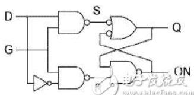

## flipflop 触发器

- 在有脉冲（高电平）时，修改第一个锁存器的值，保持第二个锁存器的值；在没有脉冲（低电平）时候保持第一个锁存器的值，修改第二个锁存器的值，更新触发器的状态，即 **主从式(master-slave)触发器**；
- 仅在时钟的边缘触发，即在特定时刻仅接受一个输入，即 **边沿触发式(edge-triggered)触发器**；
  
> 边沿触发式 D 触发器是目前使用最广泛的触发器。

### SR 主从触发器

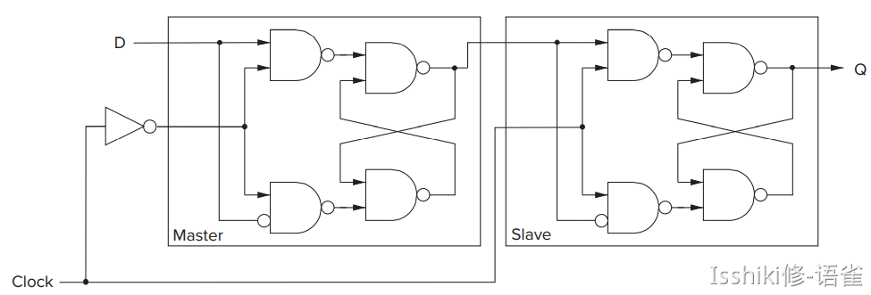

使用一对 gated D-latches，来记录和分隔*next* state 和 *current* state

- 当clock初置1时，master的we端口为1，slave的we端口为0，master 读入状态，slave 保持状态。

- 当clock又置为0时，slave的we端口为0，master的we端口为1，则slave记录了上一个阶段（clock为1时）的读入数据

**NOTE 1:** JK 触发器（注意是与非门）

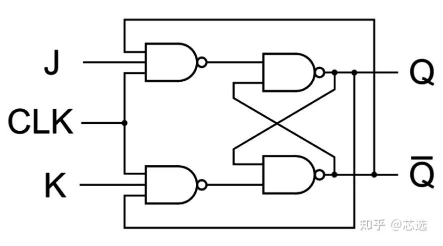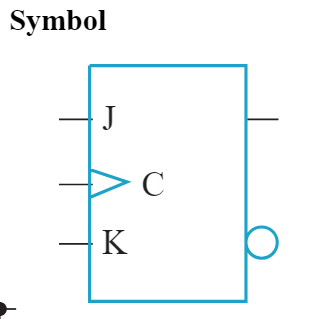

JK触发器是SR触发器基础上的改进，其中即使S=R=1也无关紧要

- 当 J 与 K 输入数据不同，那么输出 Q 会在下一个时钟沿取 J 的值
- 当 J 与 K 输入数据相同且都为高电位时，输出结果互换（0变1，1变0）
- 当 J 与 K 输入数据相同且都为低电位时，结果保持。

**NOTE 2:** T 触发器

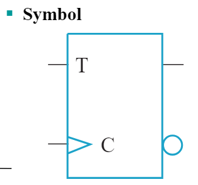

只有一个输入 T ，将 JK 触发器的 J 端和 K 端相接。

- 当 T = 0，输出保持
- 当 T = 1，输出结果反转（0变成1，,变成0）

### 边沿触发式触发器

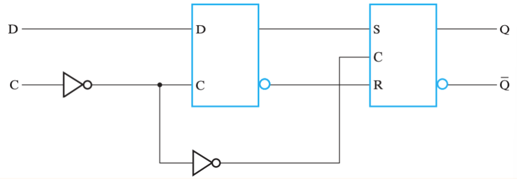

如图为上升沿触发的 D 触发器。

**NOTE:**

触发器的基本描述方法：
- 理论分析中：状态表(Characteristic Table, or State Table)用输入和当前状态来描述下一状态。
- 工程设计中：激励表(Excitation Table)用当前状态和下一状态来描述输入（展示从当前状态转移到下一状态所需要的输入）。

## 时序电路分析

### 触发器的输入方程 flip-flop input equation

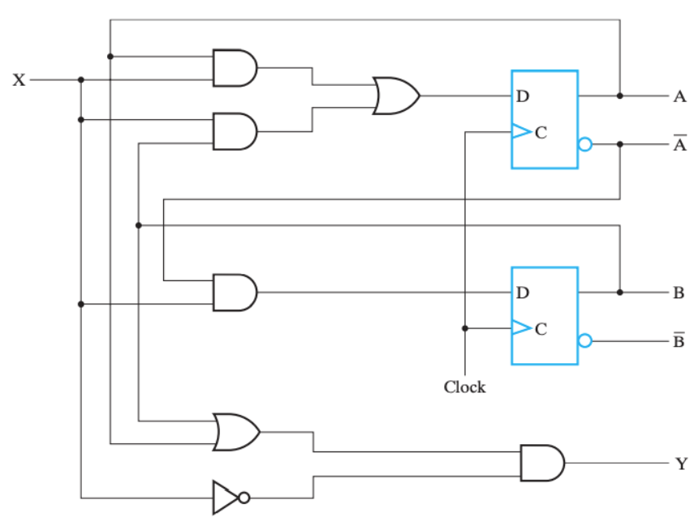

DA = AX + BX

DB = AbaX

Y = (A + B)Xba

### 状态表 state table

present state, input, next state, output

对 DA: A(t + 1) = DA = A(t)X + B(t)X

DB: B(t + 1) = DB = A(t)baX

于是我们可以画状态图：

| Present State | Input | Next State | Output |
| :--: | :--: | :--: | :--: |
| `AB` | `X` | `AB` | `Y` |
| `00` | `1` | `00` | `0` |
|`00`|`0`|`01`|`0`|
|`01`|`0`|`00`|`1`|
|`01`|`1`|`11`|`0`|
|`10`|`0`|`00`|`1`|
|`10`|`1`|`10`|`0`|
|`11`|`0`|`00`|`1`|
|`11`|`1`|`10`|`0`|

- **Mealy model circuit**：输出依赖当前状态与输入；
- **Moore model circuit**：输出不依赖输入只依赖当前状态。
  
### 状态表 state diagram

比如说这张图是上一张表（米勒型）对应的图：

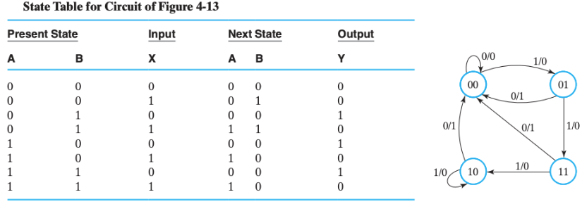

而摩尔型的状态图就非常简单：

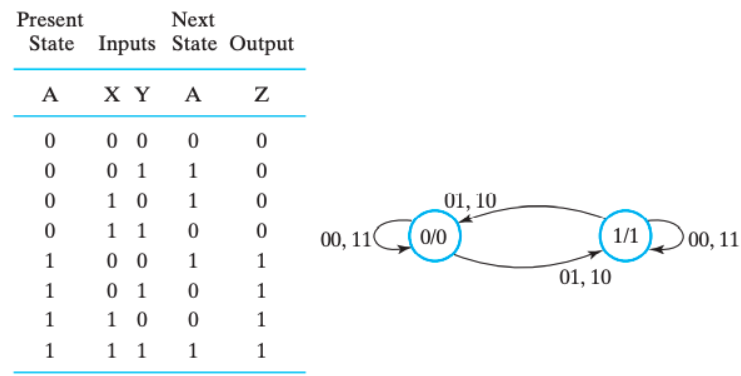

### 等价状态 equivalent state

> 对于两个状态，如果它们对于同一输入序列的响应是完全相同的（包括相同的输出和相同的状态转移），那么这两个状态是等价的。

#### 未简化的状态图

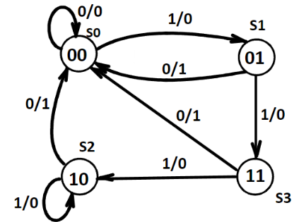

状态 S2 和 S3 对于输入 `0` 输出为 `1`，下一状态为 S0；对于输入 `1`，相应的输出都是 `0`，下一状态都是 S2。所以 S2 和 S3 是等价状态。我们可以把这两个等价状态简化成同一个状态，记为 S2。

更进一步地，我们注意到 S1 和新的 S2 也是等价状态，我们继续化简它们。

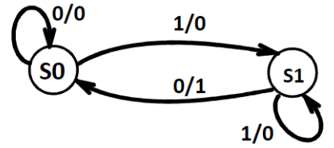

# Chap 5 Digital Hardware Implementation

## MOS 管

### NMOS PMOS

NMOS 画法前面没有取反的圆圈，表示它在X=1时接通；PMOS相反。

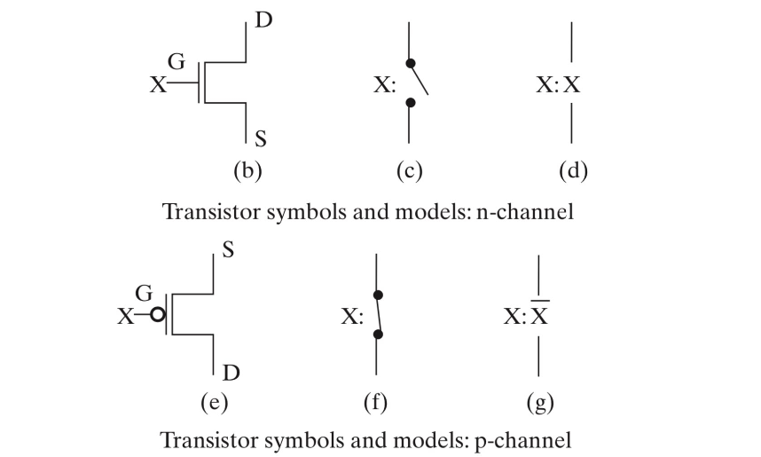

接下来我们可以使用 NMOS 和 PMOS 管来进行一些逻辑的设计。我们用并联表示相加，用串联表示相乘。

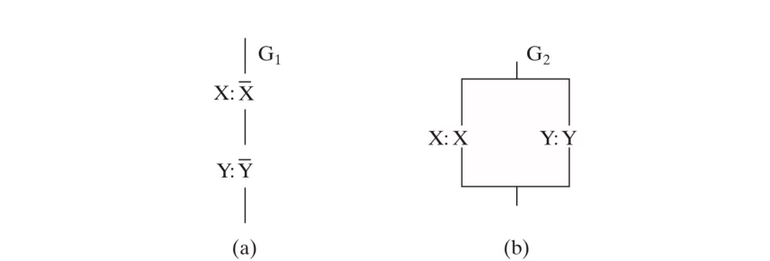

> 左图实现了 Xba*Yba，右图实现了X + Y

### CMOS 结构设计

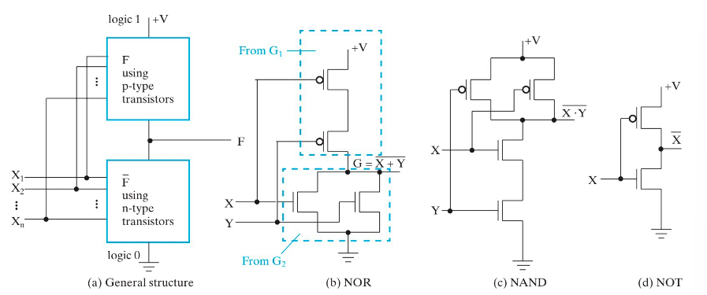

>首先让我们来看图(a)，这是 CMOS 的通用结构（可以被称作 static CMOS）。其可以分为上下两部分，上半部分接电源，由 PMOS 设计出 F 的逻辑；下半部分接地，由 NMOS 设计出 Fba 的逻辑。也就是说 CMOS 同时需要实现 F 和 Fba，这就是其名称 complementary 的由来。

**CMOS 在结构上的最大特征是，其 PMOS 的电路和 NMOS 的电路是对偶的，这使得我们只需要设计两者中的一个，就可以直接利用对偶得到另外一个。（但是建议从下面开始设计）**

## 可编程技术

### 在硬件层面的三种实现手段

- Control Connections
  - Mask programing
  - Fuse（高电压切断部分电路）
  - Anti-fuse(高电压联通部分电路)
  - Single-bit storage element
- Lookup Tables
  - Storage elements for the function
    - 比如使用一个 `MUX`，并将输入端接内存，通过修改内存的值来修改 `MUX` 的行为，进而实现函数重编程
- Control transistor switching 控制晶体管开关

### 分类

- permanent 永久编程技术：出厂后经过一次变成，便永久成型
  - Mask programming
  - Fuse
  - Anti-fuse
- reprogrammable 可重编程技术：允许重复编程
  - Volatile:断电后编成信息会消失
    - Single-bit storage element
  - Non-volatile:编程信息仅在擦除操作后才会消失，不受断电影响
    - FLASH （memory）

### 常见的可编程技术

#### 1. ROM 只读内存

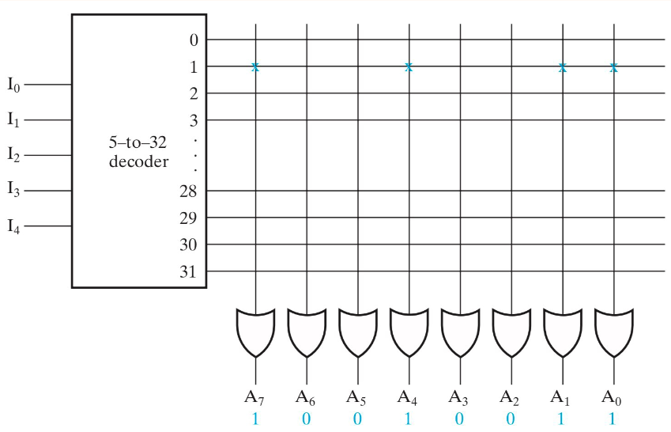

- $2^{N} * M$ ROM 由 N 个输入，M 个输出，以及 $2^{N}$ 个译码后的最小项组成。
- 固定的 AND 用于设计译码器，实现所有的 2的n次方个最小项
- 可编程的 OR 用于把这些最小项“或”起来并实现特定逻辑
- PROM 通过 fuse 或者 anti-fuse 等手段实现可编程，所以在出厂后仅可进行一次编程修改，属于永久编程技术
- ROM 的输入提供了一串地址，输出则是这组地址对应内存中存储的信息。

#### 2. PAL 可编程阵列逻辑 Array Logic

- 不需要列出所有最小项，是可优化的，但也因此不一定能表达所有逻辑
- 具有固定的 OR 和一批可编程的 AND
- 一种可行的处理方案是把一个既有的 PAL 输出当做输入，输入到另外一个函数中，来弥补项不足的问题
  
#### 3. PLA 可编程逻辑阵列 Logic Array

- PLA 与 ROM 类似，使用译码器 + OR
- PLA 不使用译码器获得所有的最小项，而是使用可编程的 AND 阵列来替代译码器
- PLA 具有可编程的 AND 和 OR，因此比起 PAL 和 ROM 更具灵活性。单音词他的优化会变得更加麻烦
- 同时 PLA 和 PAL 一样不能完全表达所有的逻辑，一种改进方法是，在输出的时候再做一次异或，就能够产生新的项来弥补逻辑不能完全表达的问题。（不用非门体现了可编程的思想）

# Chap 6 Register & Register Transfers

- 触发器 + 对应的状态控制电路 = 实现多位数据存储
- counter：随时钟周期按照固定的轨迹循环。
- 新数据被写入寄存器叫做 **Load**，载入操作在同一个时钟脉冲内完成叫做 **Parallel 并行**

## 保持

我们希望寄存器在不需要的时候保持而不是读入：

### Plan A: Clock gating 门控时钟

让它选择性地跟随时钟脉冲切换状态。

（下图中是或门）
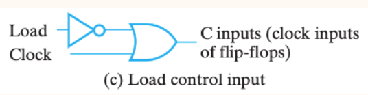

当 Load = 0时，始终有 control 信号为 1，脉冲消失，寄存器无法被载入

*NOTE: 但由于多添加了一个逻辑门，时钟脉冲到达 control 的时候会出现额外的传播延时，即时钟偏移 clock skew。实际设计中我们要尽量避免。*

### Plan B：在它不需要修改的时候不停地将它的输入载入。（保持）

通过一个 `MUX` 来选择，用 `EN` 使能端来控制载入新值还是保持旧值。

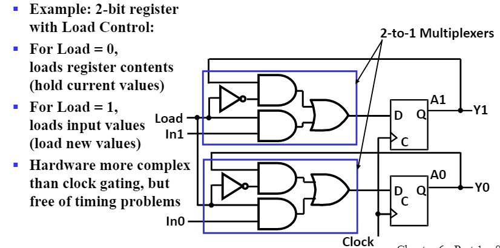

## 寄存器单元

Register Cell：FF + 实现其组合逻辑的组合电路

## Register transfer 寄存器传输

用一个控制单元来控制数据通路。control unit，datapath。

register transfer operations：load，clear，shift，count

3个基本部分：set of registers，operations，controlof operations

最基础的（elementary）部分叫做微操作，microoperation

## 寄存器传输语言 notation

- 子母和数字表示一个寄存器
- 括号表示寄存器位数
- 箭头表示数据传输
- 逗号代表并行操作
- 中括号（brackets）代表一个内存地址
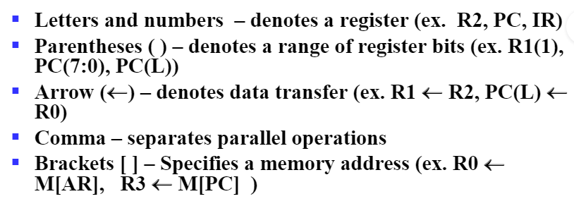

