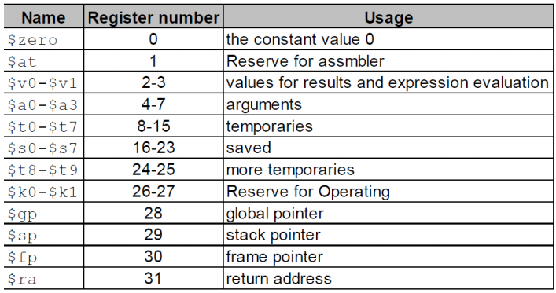
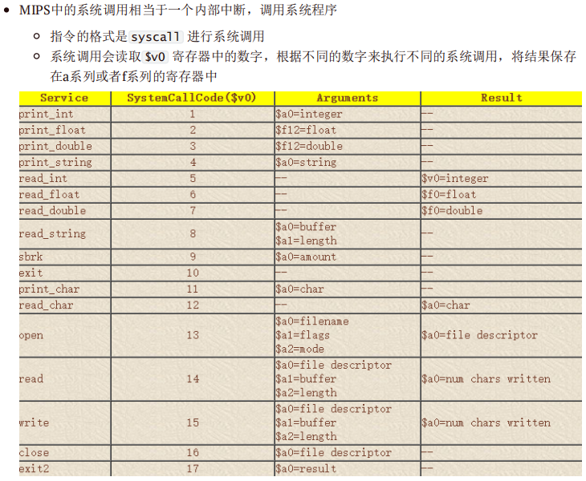
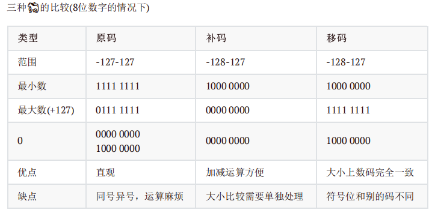
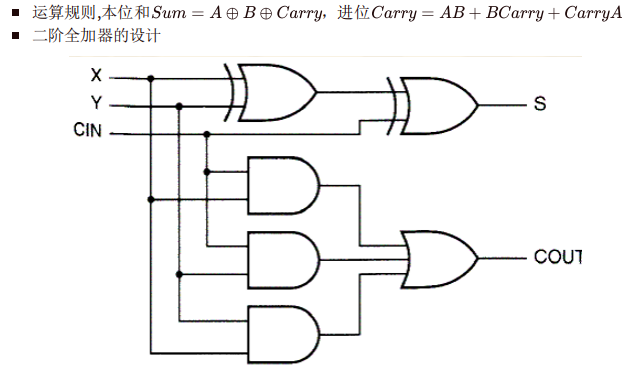
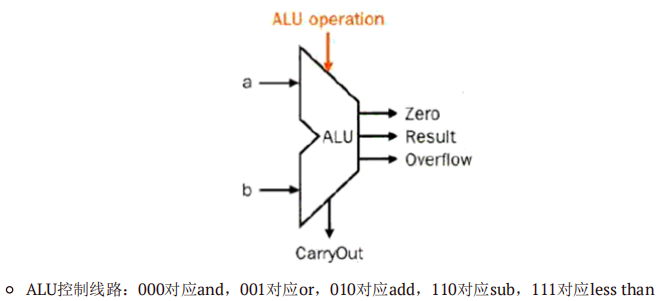
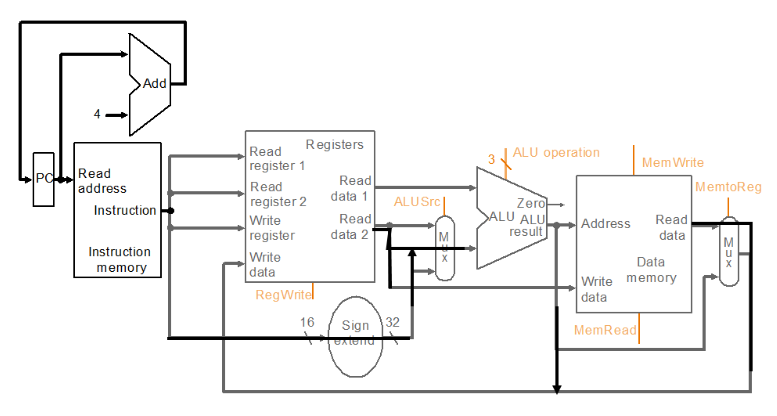
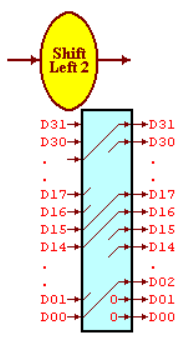
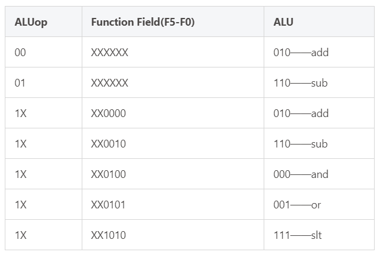
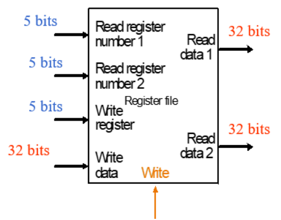

## A4

###  MIPS
- 寄存器

- MIPS中的地址偏移量和数组下标之间的关系是4倍，比如数组A的基地址在 $s3 中，要
获取A[8]，则需要指令 lw $t0,32($s3)
- 机器码格式：
  - OP是对应的操作码，RS,RT分别是第一个和第二个操作寄存器，RD是目标寄存器，shamt是偏移量，func是函数对应的编码
  - 所有的MIPS指令都是32位的，其中OP6位，寄存器都是5位，shamt是5位，funct是6位，address是16位
  - good design demands good compromises
  - R: `OP+RS+RT+RD+shamt+funct` 
  - I: `OP+RS+RT+address`
  - J: `OP+address`
- 计算机设计的两条原则：
  - 指令可以用数字表示
  - 程序可以存储在内存中，像数字一样读写
- 跳转指令 jr, 用法是 `jr $r` r的计算方式是当前所在地址+4*要跳转的行数
  - 一个函数结束时要写 `jr $ra` 来返回主函数，ra的作用类似于R7
- jal (jump and link) 用于跳转到一个函数中，后面的参数为要跳转的地址，使用 jar $ra 返回主函数
- $sp 一个栈指针，MIPS汇编中的栈从高地址往低地址扩展，支持Push和Pop两种操作
- 学习编写一个简单的函数调用：
```c
int leaf_example ( int g, int h, int i, int j )
{
int f;
f=(g+h)-(i+j);
return f;
}
```

```MIPS
Leaf: addi $sp,$sp,-12 #adjust stack to make room for 3 items
sw $t1,8($sp)
sw $t0,4($sp)
sw $s0,0($sp)
add $t0,$a0,$a1 #g+h
add $t1,$a2,$a3 #i+j
sub $s0,$t0,$t1 #f=(g+h)-(i+j)
add $v0,$s0,$zero #return value in v0
lw * 3 #restore register for caller
add $sp,$sp,12
jr $ra
```
- Caller-saved register 易失性寄存器：用于保存每个调用过程中不需要在各个调用之间保留的临时变量
- Callee-saved register 非易失性寄存器，用于保存需要在每个调用过程中保留的临时变量
    - MIPS在函数调用的过程中需要保留 $s0-$s7 和全局变量 $gp 和栈指针 $sp 还有 $fp
- 区分jr jal，jal 用于跳转到指令/呼叫函数，jr 用于从一个函数中跳出回到原函数jr $ra
- 寻址模式：
  - 立即数
  - 跳转寻址（J 指令后面跟要跳转到的地址）
  - 相对寻址（分支语句，pc+(1+offset)*4)
- 形参超过四个可以用栈来存储参数，在函数中弹出栈，返回值超过2个也要用堆栈，当然可以打破规则用闲置的寄存器传递参数
- 传递参数和获取返回值的寄存器a0-a3和v0-v1一般不直接参与运算
- 编译过程：compiling，assembling，linking
- 伪指令：没有基于硬件实现，而是用现有的指令组合而成的一些功能
  - move $rd, $rs ：值的拷贝， 实现的功能是rd=rs
  - blt $rs, $rt, RR 比较地址的大小，如果rt的地址比较大则进行跳转
- 系统调用（内部中断，调用系统程序）
  - syscall进行系统调用
  
```MIPS
li $v0, 1 # service 1 is print integer
add $a0, $t0, $zero # load desired value into argument register $a0, using pseudo-op
syscall
```
  
### 计算机运算

- 二进制数有符号数之间的比较：slt,slti；无符号数之间的比较：sltu,sltiu（i代表与立即数）
- 有符号数
  - 原码：符号位0或1+绝对值
  - 1's comlement反码：正数为本身，负数为符号位不变其他位按位取反
  - 2's complement补码：正数不变，负数为符号位不变按位取反+1
  - overflow：对于N位二进制数，不符合在范围[$-2^{N-1}$, $-2^{N-1} - 1$]内的，叫做溢出
  - biased-code移码：补码的最高位取反
  - 
- 标准的ASCII码只有7位（计算机处理方便），ASCII码中有128个字符，其中可打印字符96个，控制字符32个；后来因为128个字符不够又扩展了新的128个
- 汉字gb2312，输入码五笔/拼音，用8x8的点阵表示ASCII码，用16x16的点阵表示汉字，可以用16个16位的二进制数来表示一个汉字
- （加减法）MIPS中处理溢出的方式是interrupt，溢出指令的地址被保存在寄存器中，计算机跳到预定地址以为该异常调用适当的例程。中断的地址将被保存，以便在某些情况下程序可以在执行纠正代码后继续执行
- 简称
  - OF: overflow 判断是否溢出，最高进位和次高进位的异或
  - CF: CarryOut 进位的值
  - ZF：zero，当结果为0的时候ZF=1，否则是0
  - SF：符号位的判断，正0负1
  - PF：奇偶校验
- 半加器half adder不能跟carryout运算，sum = a xor b，carry = a or b
- 全加器full adder
  
- ALU

- 计算机组成结构
  - CPU
    - control unit
    - datapath
      - path
      - ALU
      - registers
  - memory
- mips路径

- 与门半椭圆，或门月牙，非门三角形加圆点
- 组合逻辑
  - decoder：n个输入，2^n个输出
  - MUX：n位信号控制2^n个输入
  - shift：空间换时间，固定的移位通过输入输出错位来实现 


  - SEXT：通过重复符号位的方式实现
- 寄存器单元
  - 输入：clk，rst，regwrite（是否写入），idat32位输入数据
  - 输出：odat32位输出
- ALU算术逻辑单元：3位控制信号
  - 输入：2个32位数据，ALUop 3位操作码ALUoper
  - 输出：result32位，zero（是否为0），carryout，overflow
- ALU control控制器：使用alu control 控制alu
  - 输入：ALUop 两位的控制信号，Func指令的功能字段
  - 输出：ALUoper（3位操作码）

- 存储器：多个寄存器集合，又decoder选定位置
  - ROM 只读 RAM 读写存储器。所有指令存储器rom，ram根据控制信号一次读/写一个32位数据
  - 读和写公用一个地址输入端
- 
  - MIPS采用32位地址线，寻址空间2^32=4GB，数据线也是32位
- 寄存器组：CPU的主要器件
  - 很多指令都有2-3个操作数，因此需要用寄存器组来实现多路同时读写
  - 
- 存储芯片：地址线（决定可寻址范围），数据线（决定数据的位数），控制线（电源、读写控制、片选）
- 字扩展：从一个最基本的一位存储单元通过双译码器得到一个一位的存储位阵列面，将同样地址线的若干相同的位平面，接不同的数据线，封装得到一个存储芯片
  - 地址高位交叉，同一芯片地址连续，读取连续的地址单元需要多次读写
  - 地址低位交叉，同一芯片的地址不连续，但读取连续地址单元只需要一次
- Assume an 8Kx8bits memory is composed of 2Kx4bit chips. The first address of the chip which contains the address 0B1Fh is (____).
A：0700h
B：0800h
C：0600h
D：0000h
b
- 上面这题中2K*4bit的芯片需要2片一起才能作为一个字，所以位扩展是2，又需要4个这样的组成8K*8bits的，所以字扩展是4
- 对字(4字节)或者半字(2字节，short)寻址的时候，最低位字节地址为整个字或者半字的地址
- 高位在前为大端，低位在前为小端,例如，一个字0x12345678的地址为10，即要将这个字写到地址10，11，12，13中
    - 大端 0x12,0x34,0x56,0x78
    - 小端 0x78,0x56,0x34,0x12
- 对齐：当系统要访问存储器的一个字，刚好在硬件存储中是一个字，就是对齐访问。（不对齐的话就需要多次读写）
- 何为cache（高速缓存）
- 程序运行的两个局部性原理
    - 时间局部性：如果每个数据或者指令被引用了，那么不久之后可能将被再次引用
    - 空间局部性：如果一个数据被引用了，那么邻近的单元也可能被引用
- cache的失配(miss)：指CPU要访问的数据不在cache中，此时需要将这个数据所在的整个block放入cache中
主要的失配种类
    - compulsory misses 强制失配，第一次启动时总是失配
        - 可以通过加大块的大小降低失配率
    - capacity misses 容量失配，cache的容量比主存小引起失配
        - 可以通过多级cache降低失配率
    - conflict misses 相联失配，由于映射关系影响命中率
        - 可以把组相联改成全映射
- 块越大则命中率越高，但是当cache容量较小的时候，块增大可能使得块数太少而减小命中率
    - 在cache总容量不变的时候，块越大则命中率更高，块的大小取决于硬件
- 保持cache-主存数据一致性的方式
  - 写回 Write-back 写数据的时候只写在cache中，在块替换的时候再将数据写道主存中（缺点是控制比较复杂，可以设置dirty位改进）
- 